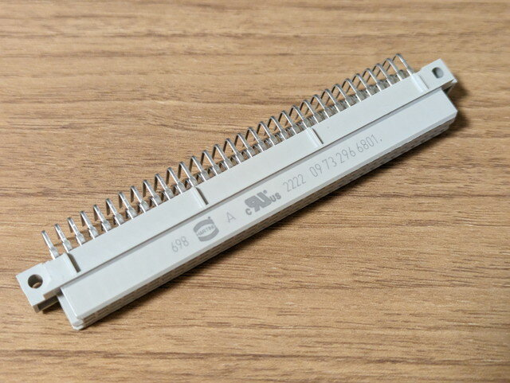
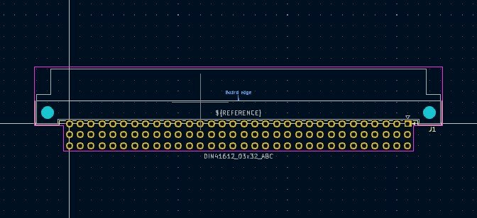
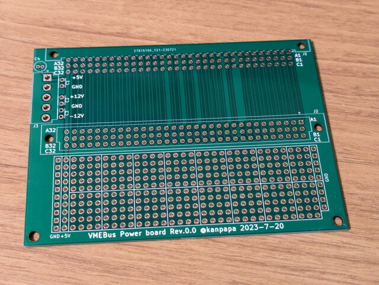

前回の[VMEボード入手編](https://kanpapa.com/2023/08/68000-vme-board1.html "68000 VMEボードで遊んでみました（１）入手編")の記事でも書いたようにVMEバスを使うのは今回が初めてです。まずはVMEバスについて調べてみました。

### VMEバスの仕様

まずはWikiPediaで確認しましたが、日本語版の内容はピン配列の情報すらも無かったので英語版を参照しました。

- [VMEbus](https://en.wikipedia.org/wiki/VMEbus "VMEbus")

これによると、68000系のバスをそのまま出したようなものとのことで、電源は+5V、±12Vが必要のようです。このCPUボードではP1のコネクタがVMEバスにあたります。P2のコネクタは拡張用のようなのであとで調べることにします。

他にも日本語で参考となるものは無いか探しましたが、インターフェース誌でいくつか特集記事がありました。

- [インターフェース　1985年8月号　VMEバスの徹底研究](https://www.cqpub.co.jp/interface/contents/1985/198508.htm "インターフェース　1985年8月号　VMEバスの徹底研究")
- [インターフェース　1987年2月号　VMEバス・システム完全マスタ](https://www.cqpub.co.jp/interface/contents/1987/198702.htm "インターフェース　1987年2月号　VMEバス・システム完全マスタ")
- [インターフェース　1993年4月号　最適なVMEシステムの構築](https://www.cqpub.co.jp/interface/contents/1993/199304.htm "インターフェース　1993年4月号　最適なVMEシステムの構築")

一番良さそうなのは「VMEバス・システム完全マスタ」で、書籍版もあるのですが入手困難のようです。

### VMEバス用コネクタの入手

VMEバスのコネクタはDIN41612 96pinコネクタです。ボード側はオスで、バックプレーン側がメスになります。

VMEバスのピン配列はわかったのでとりあえずはDIN41612 メス 96極 3列 2.54mmピッチのコネクタをマルツさん(Digi-Key)で探してオーダーしました。

- [バックプレーンコネクタ - DIN 41612 > CONN DIN RCPT 96POS PCB RA](https://www.marutsu.co.jp/pc/i/10157612/ "CONN DIN RCPT 96POS PCB RA")

到着したDIN41612 96pinコネクタです。

<!--more-->

通常のバックプレーンでは複数個のコネクタを取り付けて何枚かの基板をバス配線する構造ですが、今回はこのCPUボード１枚しかないので、電源の供給だけでなく、VMEバスの信号を取り出す作業がしやすいように水平に取り付けることにしました。

イメージとしてはこのような使い方です。

電源を接続するだけであればユニバーサル基板で製作はできるのですが、VMEバスの信号の引き出しやちょっとした回路も必要になるかもしれないのと、コネクタと基板をネジでしっかり固定したいこともあり基板を起こすことにしました。P1コネクタからの電源供給だけでなくP2コネクタの引き出し用に使うことも考えています。

### VMEコネクタ基板の設計

VME用のDINコネクタはKiCadのフットプリントにもありましたが、水平取り付け用はオスコネクタしかなかったので、メスコネクタ用にピン番号の配置を変更したフットプリントを作成しました。

また、GitHubにもVME基板の設計データがありました。こちらも参考にしました。

- [https://github.com/rhaamo/VME](https://github.com/rhaamo/VME "Dashie's VME things")

何パターンか基板を設計したのですが、最終的には以下のようなデザインにして発注しました。

念のため実際のコネクタで実寸確認も行いました。

設計データはGitHubに置いておきました。

- [https://github.com/kanpapa/VMEbus](https://github.com/kanpapa/VMEbus "VMEbus")

到着した基板です。一週間程度でこのような基板が製作できるのは素晴らしいです。

次回は[この基板を製作してVMEボードに電源を投入](https://kanpapa.com/2023/08/68000-vme-board3.html "68000 VMEボードで遊んでみました（3）電源投入編")してみます。
