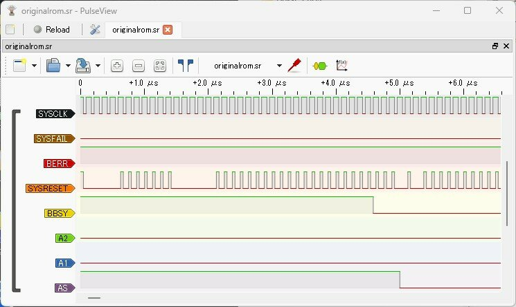
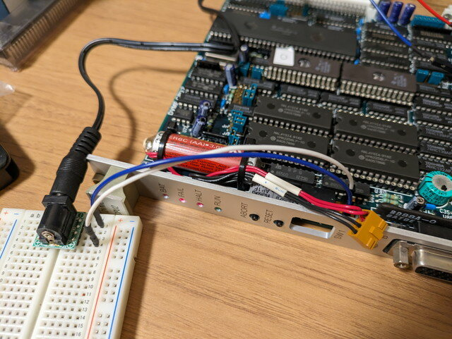
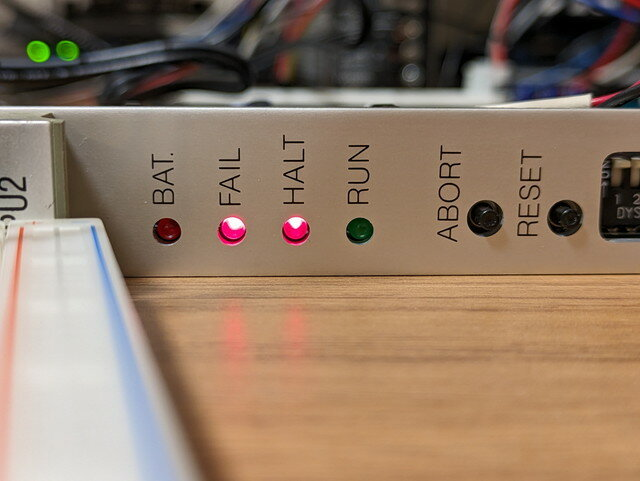
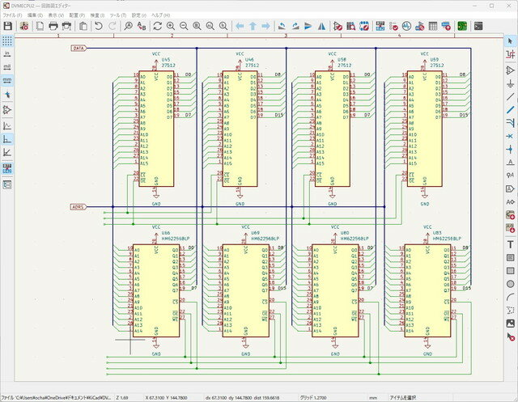

前回の[電源投入編](https://kanpapa.com/2023/08/68000-vme-board3.html "68000 VMEボードで遊んでみました（3）電源投入編")で68000 CPU VMEボードに電源をいれることができました。ただ、RUN LEDが消え、HALT LEDが点灯している状態ですから正常な動作はしていません。なぜ停止しているのかを調べていきます。なおこのVMEボードに関する資料はインターネットからは見つかっていないため、手探り状態で調べていきます。

### 類似VMEボードの調査

68000 CPUを使ったVME CPUボードで似たような製品を探したところ、モトローラの製品のマニュアルを見つけました。

- [MOTOROLA MVME110 VMEmodule Monoboard Microcomputer User's Manual　(MVME110/D2)](http://www.bitsavers.org/pdf/motorola/VME/MVME110/MVME110_D2_MVME-110-1_VMEmodule_Monoboard_Microcomputer_Users_Manual_Mar83.pdf "MOTOROLA MVME110 VMEmodule Monoboard Microcomputer User's Manual　(MVME110/D2)")

ROMやRAMがやや古いものに対応しているようですが、それ以外の構成は非常に似ています。入手したVMEボードはこのモトローラの製品を機能強化したもののように思えます。このマニュアルには回路図も含まれており参考になりそうです。

### ROMの情報からメモリマップを推測する

電源投入前に読み出したROMのイメージデータを解析してみます。


<!--more-->

最初に必要な情報はROMの先頭に書かれているSP, PCの初期値です。

```
000000 00 0F 00 00 00 00 10 00 00 00 00 00 00 00 00 00  ................ 
```

以下のようになっていました。

- SP: 000F0000
- PC: 00001000

この基板に実装されているROMは27512 x 2, RAMは62256 x 4 ですのでROM, RAMとも128Kバイトになります。

また、このROMの0001000番地からにはSPの設定やSRレジスタの設定などシステムの初期化を行うための特徴のあるコードが見られました。

```
00001000 : 4ff9 000f 0000 LEA      $000f0000,A700001006 : 46fc 2000      MOVE.W   #$2000,SR
```

もう少し読み進めていくと、モトローラのVMEボードと同じIOアドレスへのアクセスがありました。

```
0000100a : 207c 00fe 8021 MOVEA.L  #$00fe8021,A000001010 : 10bc 0000      MOVE.B   #$00,(A0) 
```

以上の情報から、以下のようなメモリマップが想像できます。

```
FFFFFF +-------+
       |       |
       |  I/O  | FE80xx I/O Address
       |       |
FE0000 +-------+
       |       |
       |   :   |
       |       |
0F0000 --------+ 0F0000 STACK POINTER
       |       |
       |  RAM  |
       |       |
0E0000 +-------+
       |       |
       |   :   |
       |       |
020000 +-------+
       |       |
       |  ROM  | 001000 START ADDRESS
       |       |
000000 +-------+
```

このメモリマップが正しいかはまだわかりませんが、IOアドレスが一致していることから、モトローラのVME 68000 CPUボード MVME110とある程度互換性があることが推測できます。

### VMEバスの確認

VMEバスにはある程度CPUの信号がそのまま出ているようです。たとえば以下のような信号です。

| **名称** | **信号名** | **出力形式** |
| --- | --- | --- |
| A01-A23 | Address Line | トライステート |
| D00-D15 | Data Line | トライステート |
| WRITE\* | Read/Write | トライステート |
| AS\* | Address Strobe | トライステート |
| DTACK\* | Data Acknowledge | オープンコレクタ |
| BERR\* | Bus Error | オープンコレクタ |
| SYSCLK | System Clock | トーテムポール |
| SYSRESET\* | System Reset | オープンコレクタ |
| SYSFAIL\* | System Fail | オープンコレクタ |

まずは手持ちの簡易ロジアナを接続してこれらの信号を見てみました。オープンコレクタの信号はプルアップ抵抗が必要になります。


ロジアナではこのように見えました。



クロックは正常に出ているようですが、リセット信号がHighになっていないとかおかしい点が目立ちます。ボードの問題なのか、VMEBusにかかわる何かがあるのかはっきりしません。やはり68000 CPUの信号を直接確認したいところです。

### バックアップバッテリーの調査

ボードの隅にある3.6Vのバックアップバッテリーが気になります。これは一次電池なので当然放電しきっているでしょう。テスターで測るとやはり0Vでしたので、バッテリーを取り外して、バッテリーコネクタに3.3V電源アダプターを接続してみました。



見事にBATアラートのLEDが消えました。正常な状態に見えているようです。



確か秋月電子に同じ電圧のリチウムバッテリーがあったと思うのでそれに交換することにします。

### ROM/RAM周りの調査

次にROM/RAMまわりの回路を確認しました。今後の調査のためにROM/RAMがどのようにCPUのデータバスやアドレスバスに接続されているのかを明確にしておく必要があります。テスターで接続を確認し、KiCadで回路図を起こしてみました。



一般的なメモリ接続方法のようです。これらのROM/RAMがメモリ空間のどこに割り付けられているかを調べていくことになります。

### ローカスバスの信号を確認したい

ロジアナでVMEバスに出力されている信号はある程度確認できますが、CPUの信号やROM, RAMなどのローカルバスの信号も確認したいところです。

そのためにはCPUやROM, RAMの足にテストクリップを取り付ける必要がありますが、これが見当たりません。秋月電子のテストクリップは2000円近くするので、もう少し手頃なものは無いかなと探していたところ、お手頃な16chのロジアナを見つけてしまいました。

- [Kingst LA1010 USBロジックアナライザー 最大16チャンネル（100M@3ch, 50M@6ch, 32M@9ch, 16M@16ch）](https://ja.aliexpress.com/item/32780046572.html "Kingst LA1010 USBロジックアナライザー")

今使っているロジアナは千円ちょいの安価なもので24MHz@8chです。これまでは結構は使えて支障はなかったのですが、やはり16chは魅力です。テストクリップも何個かは付属しているようですので、つい購入してしまいました。

次回はロジアナの到着を待って[プログラムを実行](https://kanpapa.com/2023/09/68000-vme-board5.html "68000 VMEボードで遊んでみました（5）プログラム実行編")させてみます。
