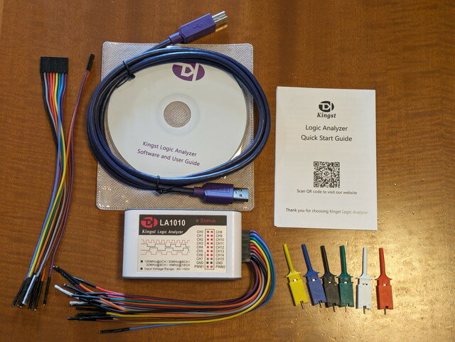
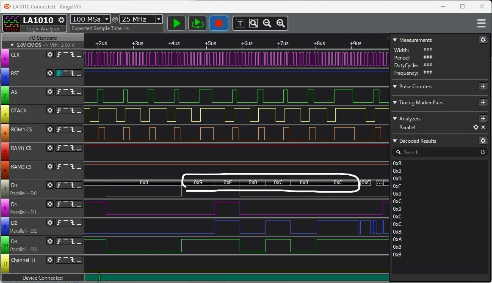
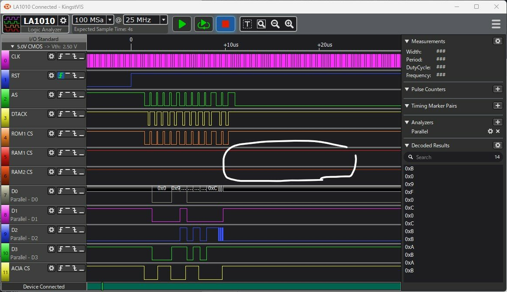
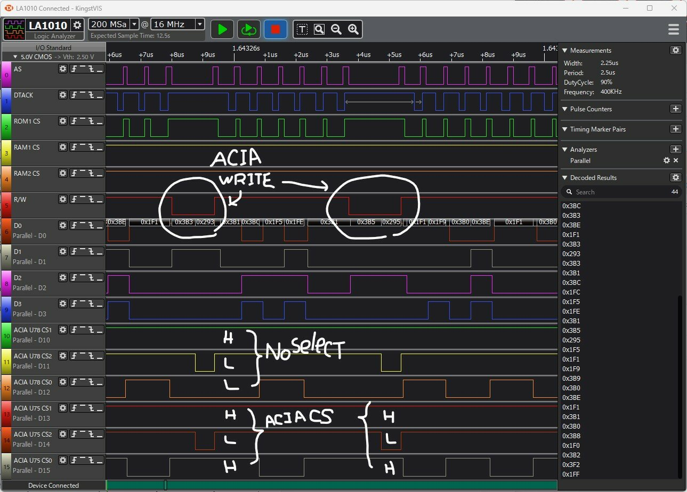

前回の[メモリマップ調査編](https://kanpapa.com/2023/08/68000-vme-board4.html "68000 VMEボードで遊んでみました（4）メモリマップ調査編")で68000 CPU VMEボードのメモリマップを推測しました。もし、ROMが$000000にマッピングされているのであれば、$001000にあるROMのコードが実行され、RUN状態になると思われるのですが、実際はHALT状態になっています。この原因をさぐるために、ロジアナでCPUの信号を確認してみます。

### 新しいロジアナが到着

ロジックアナライザをオーダーして約10日程度で到着しました。



早速CPUの信号を見てみます。


<!--more-->

まずはクロックを確認します。


以前のロジアナより高機能でパルス幅やサイクルがマウスを合わせるだけで確認できます。これは便利です。

### HALTの原因

ロジアナでCPUのCLK, RESET, AS, DTACK, A1, A2を見てみます。68000 CPUはリセット直後に$000000番地以降の8バイトからSP, PCの値を読み出します。その後読み出したPCのアドレスからコードを実行します。

ロジアナでは以下のように見えました。AS, DTACKが返ったあとにアドレスが増加していくのが確認できます。最初の４サイクルは問題なく動作しているようです。


もう少し広範囲にみたところ、しばらく時間が経過したあとにBERR, HALTを確認できました。


最初の４サイクルでROMからSP, PCの読み出しはできていますが、それ以降ROMのCSがLOWになることはありませんでした。プログラムの開始アドレスである$001000にはROMが割り当てられておらず、DTACKが返ってこないため、BERRとなりHALT状態になっているように見えます。

もし、$001000がRAMであった場合はRAMのCSがLOWになり、初期化されていないRAMの情報が実行されてしまいますが、RAMのCSもLOWになることはありませんでした。

モトローラのVMEボードの仕様によると、リセット後の最初の4サイクルは、ROMの実アドレスに関係なく、1番めのROMの先頭8バイトからデータが取り出されるため、ROMの先頭8バイトには、SSP(Supervisor Stack Pointer)レジスタにロードされるスタックポインタの初期値と、PC(Program Counter)にロードされるターゲットプログラムの開始アドレスを書き込む必要があるそうです。このボードもその仕様なのかもしれません。そうするとROMがどのアドレスにマッピングされているのかを調べなければなりません。

### モトローラのVMEボードのアドレスに合わせてみる

モトローラのVMEボード MVME110ではHIGHアドレスとして$F00000からROMが配置されているようです。ROMの実アドレスをこのアドレスと仮定してテストプログラムをROMに書き込んで動かしてみます。

テストプログラムはモトローラのVMEボードと同じIOアドレスと想定し、MCR(Module Control Register)のクリアによるFAIL LEDの消灯と、ACIAにHELLO WORLDを出力するものにしています。

今回作成したROMでは最初の８バイトを以下のようにして、PCを$F01000にしています。SPはオリジナルのROMと同じにしました。

```
000000 00 0F 00 00 00 F0 10 00 00 00 00 00 00 00 00 00  ................
```

実行コードも$F01000に配置される前提でORGを$F01000としています。

オリジナルのROMではSRレジスタに$2000を書き込んでいて、スーパーバイザーモードで割り込み許可となっていますが、CPUのIPL0～IPL2を確認したところ、IPL0とIPL2がLOWとなっていたため、割り込みが発生しないように$2700を書き込むことにしました。


最初にSTACKを使うプログラムを書いて動かしてみました。最初の４サイクル以降にもROMのCSがLOWとなり、ROMに書かれている68kの命令がバスに載っていることを確認しました。ROMの実アドレスは$F00000でした！



MCRに書き込みも行われFAIL LEDが消灯しましたが、STACKが使われるbsr命令でBERRとなってしまいました。RAMのCSもLOWにならないため、オリジナルのROMに書かれているSPの値も異なっているようです。



### RAMを使用しないプログラムを動かしてみる

ここまでの調査でROMのアドレスは判明しましたが、RAMのアドレスがわからないので、ROMだけで動くプログラムに書き直しました。STACKの値は仮に$FF0000としておきました。

作成したソースコードはGithub.comに置きました。アセンブラはEasy68Kを使っています。

- [https://github.com/kanpapa/VMEbus/blob/main/hardware\_test/DVMECPU2\_noram.X68](https://github.com/kanpapa/VMEbus/blob/main/hardware_test/DVMECPU2_noram.X68 "DVMECPU2_noram.X68")

このROMをVMEボードに取り付けて、電源を投入したところRUN LEDが点灯状態になり、FAIL LEDとHALT LEDは消灯しました。無事プログラムが動作しているようです。


ロジアナで確認すると処理を繰り返している状態が確認できました。



U75のACIAが選択されて、ACIAのレジスタの読み書きが行われていますが、送信可能ステータスになっていないようで、送信待ちのループから抜けれずにシリアル出力はできていないようです。これは今後調査していきます。

### 判明したメモリマップ

これらをまとめるとメモリマップは以下のようになります。

```
FFFFFF +---------+
       |         |
       |   I/O   |
       |         |
FE8031 |MSR      |
FE8021 |MCR      |
       |         |
FE8003 |ACIA1 DR |
FE8001 |ACIA1 CR |
       |         |
FE0000 +---------+
       |         |
       |    :    |
       |         |
F40000 +---------+
       |         |
       |  ROM2   | 空きソケット
       |         |
F20000 +---------+
       |         |
       |  ROM1   | F01000 START ADDRESS
       |         |
F00000 +---------+
       |         |
       |    :    |
       |         |
??0000 +---------+
       |         |
       |   RAM   | 実アドレスは不明
       |         |
??0000 +---------+
       |         |
       |    :    |
       |         |
000000 +---------+
```

まずはプログラムが動くことが確認できたので、ROMのメモリマップは確定しましたが、まだわかっていないRAMの実アドレスを調べていきます。RAMが使えないとスタックが使えず、データも置けないので大きな支障があります。

[次回は何らかの方法でRAMの実アドレスを探してみます。](https://kanpapa.com/2023/09/68000-vme-board6.html "68000 VMEボードで遊んでみました（6）アドレスデコーダ解析編")
