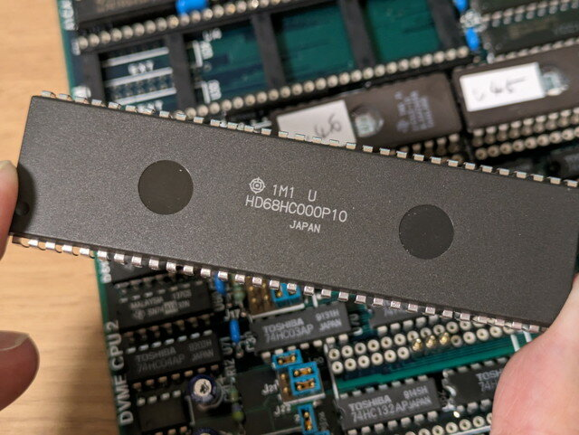
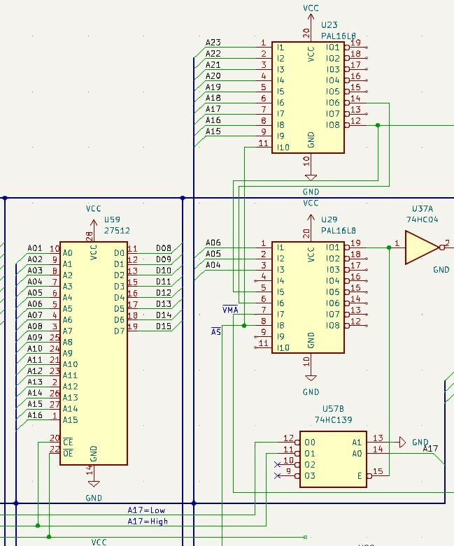
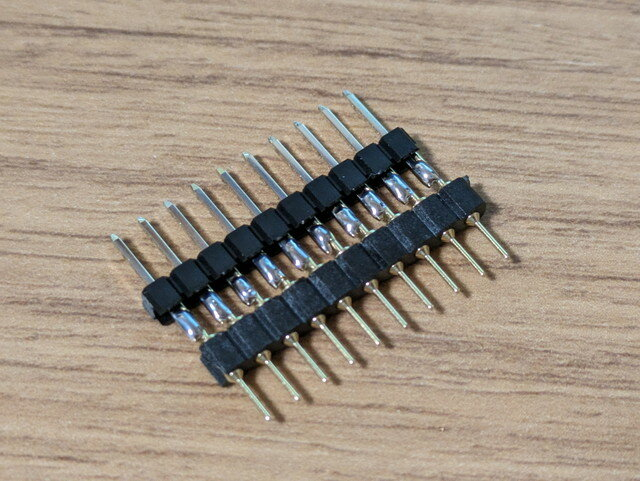
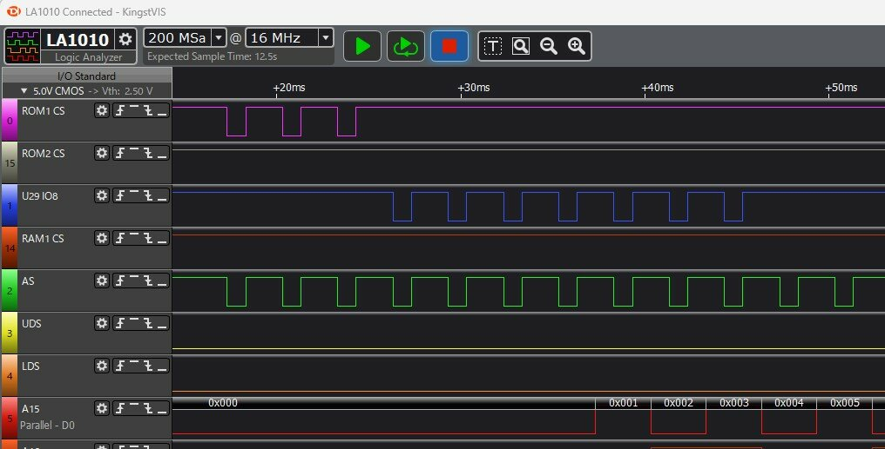
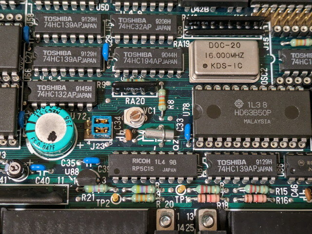

[前回までの調査でROMのプログラムを動かす](https://kanpapa.com/2023/09/68000-vme-board5.html "68000 VMEボードで遊んでみました（5）プログラム実行編")ことができましたが、RAMがまだ使えない状態です。今回はRAMの実アドレスを調べていきます。

### 基板の回路を追ってみる

基板のパターンを追って回路図を書いていきます。これは[MIC68Kワンボードコンピュータ](https://kanpapa.com/2017/10/mic68k-schematic.html "MIC68Kワンボードコンピュータで遊んでみた（２）解析編")の解析のときに行った手法です。ただし今回の基板は集積度が高く、基板のパターンだけでは追いきれないので外せるICはすべて外して、一部でテスタも使って探っていきます。

<!--more-->

CPUのアドレス信号を中心に回路図を書いていきます。

解析の結果、アドレスデコーダがPALで構成されているようで、実際にアドレス信号を入れてみないと動作がわかりません。

### マイコンでアドレス信号を生成してみる

CPUを取り外してCPUソケットから疑似アドレス信号を入れてみることでPALの動作がある程度はわかるはずです。

今回は[mbed LPC1768](https://os.mbed.com/platforms/mbed-LPC1768/ "mbed LPC1768")というマイコンを使いAD15-AD23、AS、UDS、LDS、R/Wの信号を制御します。

プログラムはGithub.comに置いておきました。

- [https://github.com/kanpapa/VMEbus/blob/main/mbed/mbed-os-m68kemu/main.cpp](https://github.com/kanpapa/VMEbus/blob/main/mbed/mbed-os-m68kemu/main.cpp "main.cpp")

### 丸ピンICソケットにケーブルを接続するためのツールを作る

CPUに使われている丸ピンICソケットにケーブルを接続する必要がありますが、ブレッドボード用ワイヤーは太すぎて刺せません、そのため丸ピンソケット用ヘッダと通常のヘッダをハンダ付けしたツールを作りました。これを使えば丸ピンICソケットにブレッドボード用のワイヤーを安定して接続できます。

### アドレス信号を入力し、ロジアナで確認する

CPUの丸ピンICソケットにmbedを接続し、アドレスバスに関連する信号を流していきます。同時にロジアナでも信号を観測します。

最初は全く動かなかったのですが、CPUが出力するステータス信号FC0-FC2をCPUが動作中の状態と同じになるように設定することでアドレスデコーダが動き出しました。

ROMのCS信号はすぐ確認することができました。ROM1はF00000-F1FFFF, ROM2はF20000-F3FFFFと確認できました。

しかし、RAMのCSは一向に出力されません。そこでPALの出力ピンを１つずつ確認したところ、ほぼ仕組みがわかってきました。

この結果からRAMは000000-01FFFFにデコードされている可能性が高いです。2個めのPALも同じように確認していきましたが、PALのU29のIO8にRAMのCSと思われる信号を見つけることができました。リセット後の４サイクルはHIGHですが、それ以降は000000-01FFFFの間LOWになる信号です。

これでRAMのCS信号は正常に生成されていることが確認できました。

しかし相変わらずRAMのCSはHIGHのままです。なぜCS信号がRAMに届いていないのかを考えると、途中に何等かのゲートロジックがあって、CSがHIGHのままに保持されているように思われます。このRAMはSRAMでメモリバックアップができる構造ですので、メモリバックアップ中はCSを常にHIGHにしておく必要があります。

その証拠にVMEバスの主電源を切断してもRAMのCS信号はHIGHのままです。これはバッテリーで動作しているICからHIGHの信号が届いていることになります。

この仕組みに何か問題が起こっている、例えば主電源が供給されているにも関わらず、PALからのCS信号を無視して、HIGHのままになっているのではと推測しました。

### バッテリーで動作しているICを確認する

VMEボードの主電源を切断した状態でVccに電圧がかかっているICを探したところ、以下の3つがありました。

| U72 | 74HC132AP | Quadruple Positive-NAND Gates With Schmitt-Trigger Inputs |
| --- | --- | --- |
| U86 U86U87 | 74HC139AP | High Speed CMOS Logic Dual 2-to-4 Line Decoders/Demultiplexers |
| U87 | RP5C15 | Real Time Clock Parallel 18-Pin |

この電源電圧は空気二重層コンデンサ(EDLC)から供給されているようです。このため、主電源切断後もしばらくの間は電圧が維持されるようです。

RTCの解析はいったんおいておきますが、あとはNANDとデコーダです。何となく回路が思い浮かびます。

このどれかのICがRAMのCSに接続されていて、PALで生成したCS信号もそのICに届いているはずです。

[次回はRAMを使えるようにしてモニタを実装していきます](https://kanpapa.com/2023/09/68000-vme-board7.html "68000 VMEボードで遊んでみました（7）モニタ・BASIC実装編")。
