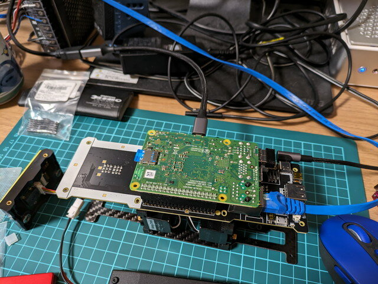
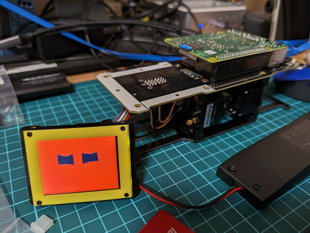

Mini Pupper 2のカスタム基板にはRaspberry Pi CM4が取り付けられています。私もRaspberry Pi CM4を見るのは初めてですが、組み込みにはちょうど良い大きさです。ただ、このRaspberry Pi CM4は日本国内では入手困難であり、さらにCM4本体に技適マークが無く、技適に対応しているものという確証がありません。このためRaspberry Pi 4 Model Bに載せ替えてみました。

### Raspberry Pi CM4をRaspberry Pi 4 Model Bに乗せ換える

Mini pupper 2のカスタム基板はRaspberry Pi 4 Model Bも利用できる設計にはなっています。ただし取付用のネジ穴はなく、さらにきちんと高さをとって取り付けないとカスタム基板と他のパーツが接触してしまう配置になっています。

<!--more-->

いろいろ考えたあげく、連結ピンソケット　２×２０（４０Ｐ）　ラズパイ用スタッキングコネクタを使ってみることにしました。

まずはCM4を外します。

やはりCM4には技適のマークはありません。聞いたところによるとCM4の外箱に技適のマークが印刷されているらしいのですが、外箱はついておらず技適対応品であるかは確認できません。

CM4の代わりにRaspberry Pi 4 Model Bを先ほどのスタッキングコネクタを使用して、とりつけると写真のような接続になります。

確かに取り付けはできていますが、ロボットの振動を考えると固定するための何かのフレームが必要に思います。しかし、いったんはこれで進めてみることにします。

### カスタム基板の仮付け

この状態でカスタム基板をフレームに仮付けしてみます。ディプレイパネルもついでに接続しました。

GitHubのmini\_pupper\_2\_bspのリポジトリの手順に従いRaspberry Pi用のmicroSDを作成します。

- [https://github.com/mangdangroboticsclub/mini\_pupper\_2\_bsp](https://github.com/mangdangroboticsclub/mini_pupper_2_bsp "mini_pupper_2_bsp")

Raspberry Pi にmicroSDをセットして電源を投入し、HDMIディスプレイとキーボードを使用してセットアップを行いました。

この状態でなにやらディスプレイパネルに顔らしきものが表示されました。

無事IPアドレスも表示されました。

この状態でブラウザで表示されたIPアドレスにアクセスしたところ、Mini Pupper ControllerのWeb UIが確認できました。ソフトウェアは問題なく動作しているようです。

### 同梱のCM4は技適対応品なのか？

Mini Pupper 2のカスタム基板はCM4の利用前提につくられているので、やはりCM4をつかって実験を進めたいところです。Raspberry Pi CM4は現在は技適番号は取得されているのですが、同梱されていたCM4が技適対応品であるかは確認できません。開発元にRaspberry Pi CM4の技適問題をDiscordにてお伝えし、外箱が残っていたら技適マークがついていないかを確認してもらったところ、技適マークがついているとのことでした。

ダメ元で不足していたパーツを送っていただくついでに、その外箱を１ついただけないかとお願いしたところ、送っていただけることになりました。この外箱があれば技適対応品としてCM4を使っても良さそうです。

作業はここまでにして、不足パーツとCM4の外箱の到着を楽しみに待つことにしました。
