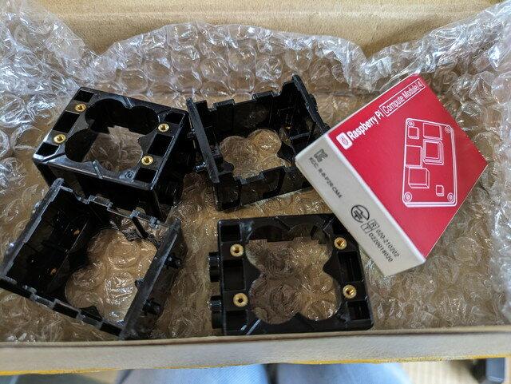
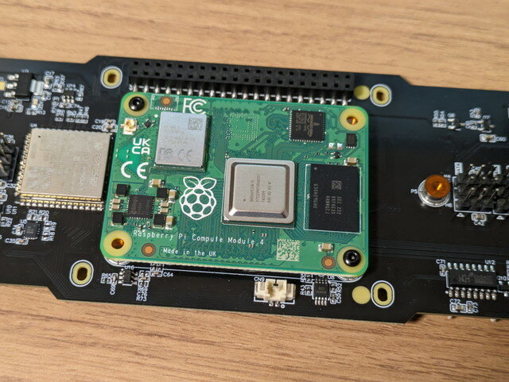
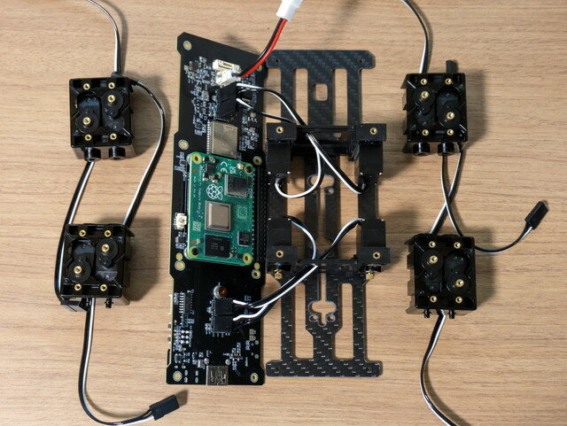
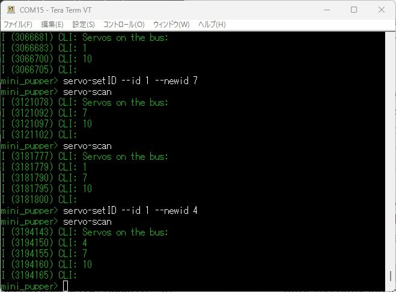
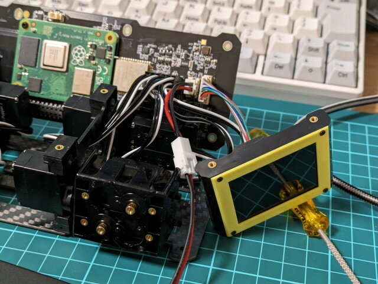
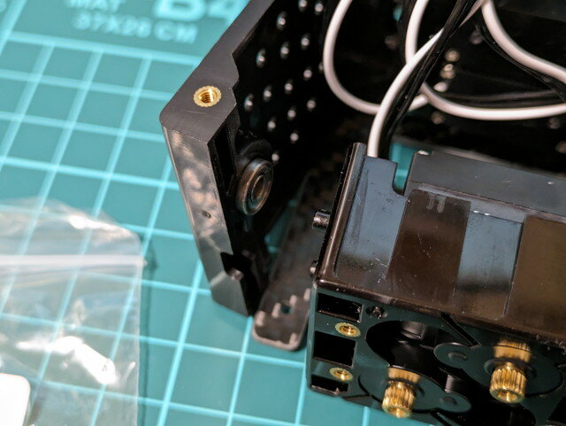
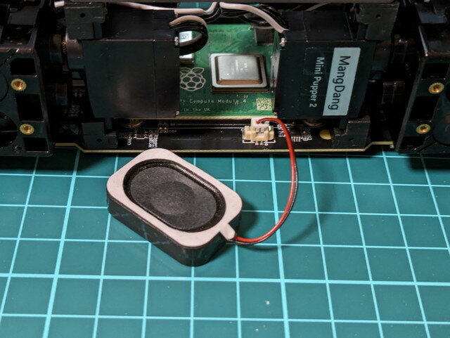

[前回の記事](https://kanpapa.com/2023/10/mini-pupper-2-3-raspberry-pi-cm4b.html "Mini Pupper 2 を組み立ててみました (3) Raspberry Pi CM4をModel Bに交換")では技適がらみであえてRaspberry Pi 4を使った環境構築や動作確認を行いました。そうこうしているうちに開発元から送っていただいた不足分のパーツが到着しました。ついでにCM4の外箱も送っていただきました。

### Raspberry Pi CM4の取り付け

送っていただいたCM4の箱には確かに技適マークが入っていました。

開発元で使用しているCM4は技適対応品であることが確認できたので、これまで取り外していたCM4を取り付けました。これで本来のMini Pupper 2の姿になりました。

### 腰のサーボモーターユニットの組み立て

中断していた腰の部分の組み立てに入ります。この４個が不足していたパーツです。

これで組み立てに必要なパーツが揃いました。

４個のフレームにそれぞれサーボモータを互い違いに２個ずつ取り付けます。

サーボモーターにはIDが記録されています。初期値はID=1となっているので、すべてのモーターのIDを位置にあったIDに設定しなければなりません。まずはフレームに取り付けている４個のサーボモーターのIDを１つずつ書き換えていきます。

書き換えはコマンドラインで行います。servo-scanを行って各モーターの設定値を確認し、servo-setIDで目的のモーターのIDを設定することを繰り返します。このUIはESP32のファームウェアに実装されており、ESP32にPCのシリアルターミナルを接続して操作します。

さらに、腰のサーボモーターユニットを４つ取り付け、取付位置に合わせて１つずつサーボモーターのID設定を行い、すべてのサーボモーターのID設定およびカスタム基板との配線が完了しました。

モーターのID設定も完了です。12個のモーターをすべて認識しています。

### ボディの組み立て

次に全面の表示パネルをカスタム基板に接続して、フレームにネジ止めし取り付けます。

後ろ側のパネルも同様に取り付けていきます。

フレームとカスタム基板をパネルにネジ止めし、ボディの形になりました。

あとは小型スピーカーをカスタム基板に接続します。

この小型スピーカーは両面テープでサーボモーターに固定します。

これでボディは完成です。

### ボディの動作確認

この状態で電源を投入してみます。microSDカードはRaspebrry Pi 4で使用していたものをそのまま差し替えました。

IPアドレスが表示されたので、WebUIを使ってモーターを動かしてみました。YouTubeに動画をアップロードしておきました。

https://youtu.be/WPyEhA8T7IM?si=4B07lqleXMaVf5la

ここまでは問題なさそうです。次は足の組み立てと取り付けを行います。
