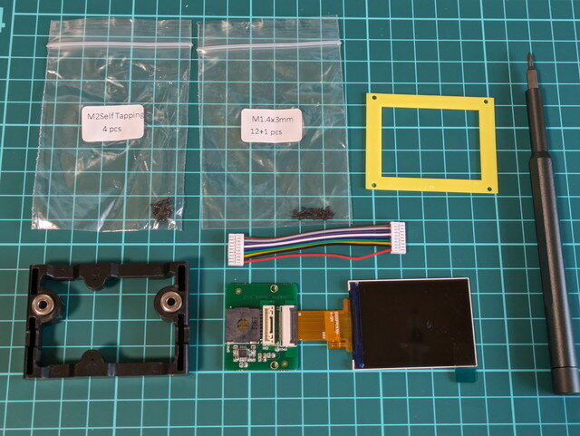
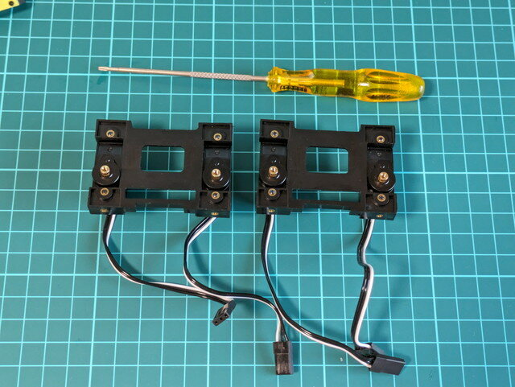
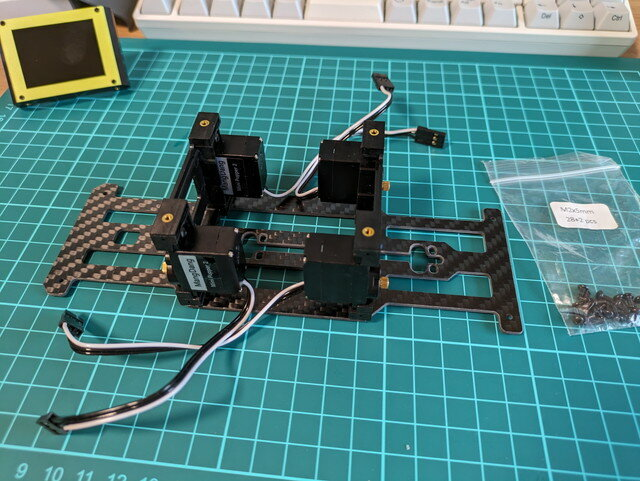
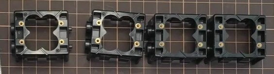

[Mini Pupper 2の組み立て準備](https://kanpapa.com/2023/10/mini-pupper-2-part1.html "Mini Pupper 2 を組み立ててみました (1) 組み立て準備編")ができましたので、実際に組み立ててみます。

### ディスプレイユニットの組み立て

まずは顔となるディスプレイを作ります。

<!--more-->

M2 self tappingネジで基板をフレームに固定します。

次に表示パネルをフレームで押さえて、M1.4✕3mmネジで固定して完成です。

これは比較的簡単に組み立てができました。

### サーボモータをフレームに取り付け

次はサーボモータをフレームに取り付けます。

YouTubeの組み立て動画にあるドライバよりは写真のような先が長いT6ドライバをおすすめします。先が短いとサーボモータにあたってネジが斜めになってしまいます。

４個のサーボモーターがフレームに固定されました。

次はフレームに取り付けたサーボに取り付けるサーボユニットを組み立てるのですが、なぜかそれに必要なパーツがみあたりません。このような形のものです。

どうやら最初から入っていなかったようで、あわててdiscodeでパーツが不足していることを連絡しました。送っていただけるとのことですが、これ以降の本体の組み立てはパーツが届いてからになります。

到着までに時間がかかりそうなので、次は[基板に取り付けられているRaspberry Pi CM4](https://kanpapa.com/2023/10/mini-pupper-2-3-raspberry-pi-cm4b.html "Mini Pupper 2 を組み立ててみました (3) Raspberry Pi CM4をModel Bに交換")について眺めてみようと思います。
