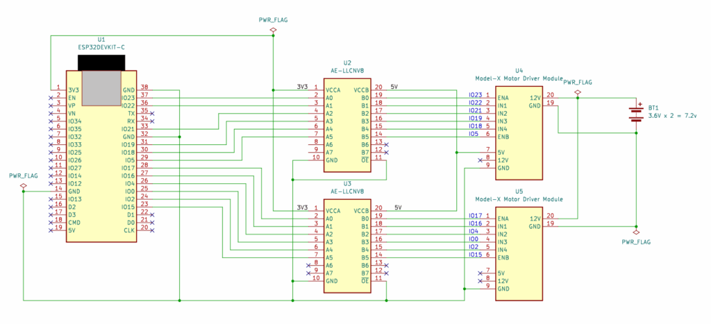
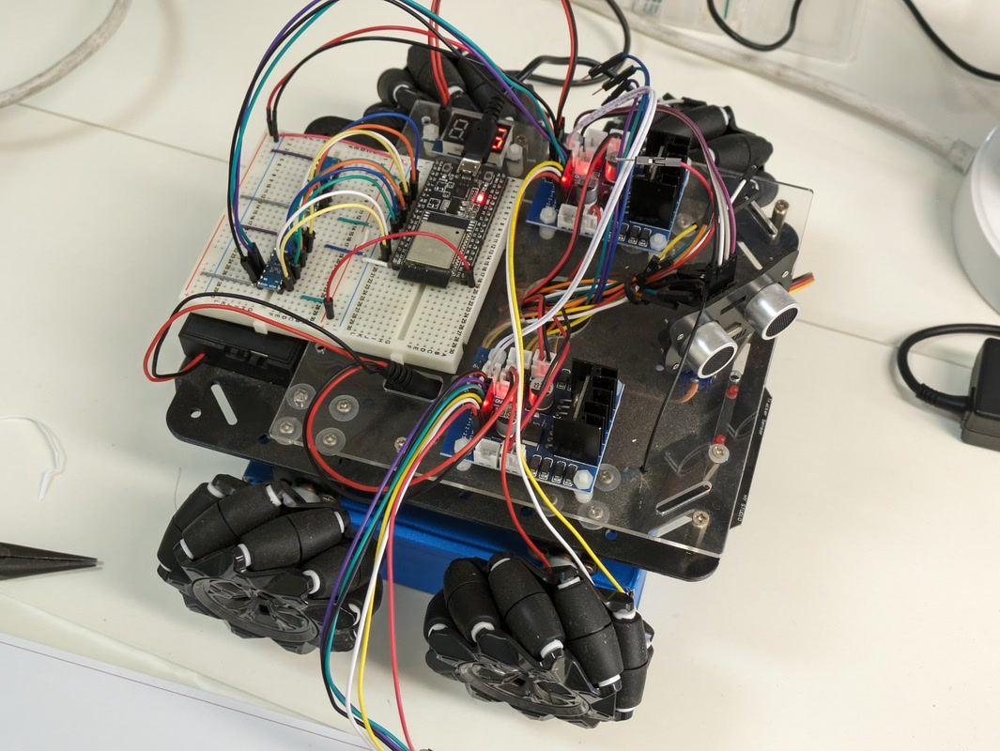

[おおたfab](https://ot-fb.com/event/)さんでは電子工作初心者勉強会を定期的に開催しています。

今回はESP32でモータードライバを制御してメカナムホイールを動かしてみます。まずは動くところまで実装し、その後にBluetoohなどでリモコンカーとして使えるようにしてみます。

## メカナムホイールとは

以前おおたfabさんで素人でもロボットを動かしたいという勉強会を行っていました。そのときに教材としてOYOSOメカナムホイールを購入して実験を行いました。


車輪が特殊な構造をしていて車輪の回転方向を組み合わせることで、前後、左右だけでなく、真横や斜めに動かすことができるものです。

https://osoyoo.com/2019/11/08/omni-direction-mecanum-wheel-robotic-kit-v1/

マニュアル：[https://osoyoo.com/manual/V1.2metal-mecanum.pdf](https://osoyoo.com/manual/V1.2metal-mecanum.pdf)　（おおたfabにあるのはv1.2と少し古いものです）

オリジナルはArduino Megaで動かすものでしたが、これをESP32に置き換えてみます。

## メカナムホイールの構造

メカナムホイールには車輪を動かすためのモーターが４個搭載されています。そのモーターを動かすための[モータードライバ基板](https://osoyoo.com/2017/08/15/osoyoo-model-x-motor-driver-module/)を介して、Arduino MEGAのGPIOに接続されています。GPIOでモータードライバに与える信号を以下の図のように設定すればモーターが時計回り、反時計回り、停止と制御できます。


マイコンモジュールであるESP32-DEVKITとArduinoの大きな違いは電源電圧です。Arduinoは5V系、ESP32は3.3V系です。メカナムホイールで使用されているモータードライバは5V系ですので、ESP32の3.3V系に接続できるように電圧レベルを変換しなくてはいけません。このための専用のデバイスを使います。今回は[秋月電子](https://akizukidenshi.com/)で販売されている８ビット双方向ロジックレベル変換モジュール 通販コード\[M-04522\]を使用しました。配線はブレッドボードで行います。

## ESP32との接続方法

回路図を以下に示します。（PDFは[こちら](images/otafab_esp32_car_r02-1.pdf)ESP32とモータードライバの間にレベル変換ICを接続しています。モーターの電源はメカナムホイールに搭載されている18650バッテリーを使います。ESP32の電源はESP32DEVKIT-CのUSBコネクタから供給します。



回路図に従って実際に配線したメカナムホイールです。

[](https://kanpapa.com/wp-content/uploads/2023/12/otafab-esp32-mecanum1-car1-1.jpg)

## モーターの動作テスト

モータードライバをESP32に接続したところで、モーターが制御できるかの確認を行います。まずは１つのモーターを動かしてみます。テストプログラムは以下のようにしました。

```
// otafab ESP32 Mecanum wheel car 2023/10/21

void setup()
{
  // 右後輪
  pinMode(22, OUTPUT); // IN1
  pinMode(21, OUTPUT); // IN2
  pinMode(23, OUTPUT); // ENA
}

void loop() 
{
  // Brake 停止
  digitalWrite(22, HIGH); // IN1=1
  digitalWrite(21, HIGH); // IN2=1
  digitalWrite(23, HIGH); // ENA=1

  delay(5000);  // delay of three second

  // Rotate Clockwise　前進
  digitalWrite(22, LOW);  // IN1=0
  digitalWrite(21, HIGH); // IN2=1
  digitalWrite(23, HIGH); // ENA=1

  delay(3000); // delay of three second

  // Rotate Conunterclockwise　後進
  digitalWrite(22, HIGH); // IN1=1
  digitalWrite(21, LOW);  // IN2=0
  digitalWrite(23, HIGH); // ENA=1

  delay(3000); // delay of three second
}
```

このプログラムをESP32に書き込むと車輪が回転、逆回転、停止を３秒おきに繰り返します。動画をYouTubeにアップロードしておきました。

https://youtu.be/bNPB8JlGAbE

これで１つの車輪の制御ができるようになりました。

## 次のステップ

次はプログラムを拡張して、４輪を制御して車として動くようにしてみます。
