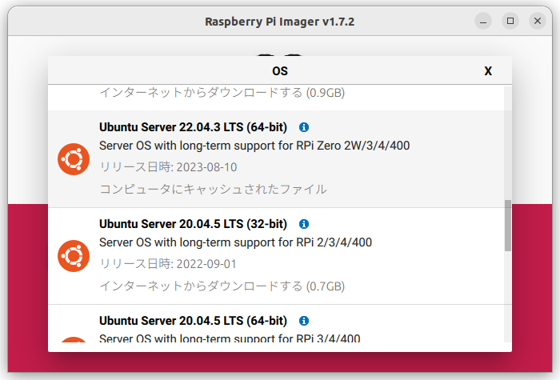
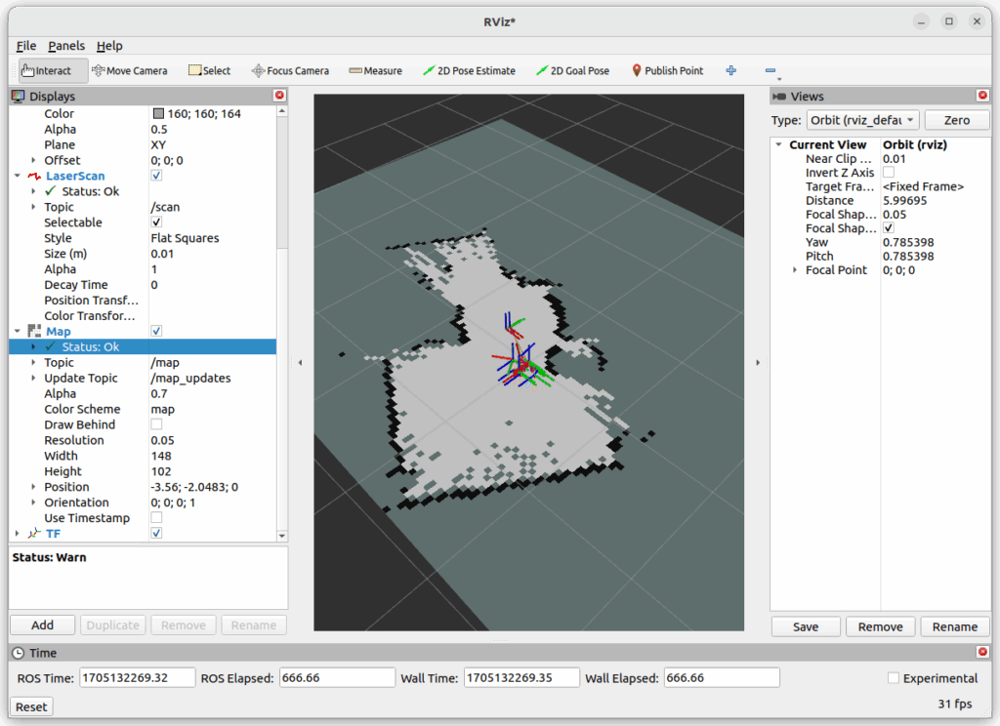

[ルンバで2024年の年越しカウントダウンをしてみました](https://kanpapa.com/2024/01/roomba-newyear2024.html)が、このときはROS2 Humbleが動作しているUbuntuデスクトップ環境にルンバを接続して動かしました。

ルンバのROS2ドライバがHumbleでも問題なく動いているので、ルンバの自律走行の実験に使用しているRaspberry Pi 4もROS2 Humbleに移行することにしました。基本はROS2 Foxyの時と同じ流れです。

## Ubuntu 22.04 LTS ServerをRaspberry Piにインストール

Raspberry Pi Imagerを使ってUbuntu 22.04 LTS Server (64-bit)をmicroSDカードに書き込みます。今回は32GBのmicroSDカードに書き込みました。



HDMIモニタとUSBキーボードを接続し、Imagerで作成したmicroSDカードをRaspberry Pi 4に取り付けて電源を接続します。ログインユーザ名とパスワードはubuntuです。パスワードは変更するように要求されますので、新しいパスワードを設定します。


ワイヤレスで制御したいので、WiFiネットワークに接続します。以下のように設定ファイルのwifis: 以降の記述を追記し、WIFI-SSIDとPASSWORDはWiFi環境に合わせて書き換えます。

```
$ sudo vi /etc/netplan/50-cloud-init.yaml
$ cat 50-cloud-init.yaml
network:
  ethernets:
    eth0:
      dhcp4: true
      optional: true
  version: 2
  wifis:
    wlan0:
      dhcp4: true
      access-points:
        WIFI-SSID:
          password: PASSWORD

$ sudo netplan apply
```

## ROS2 HumbleをRaspberry Piにインストール

Ubuntu 22.04 LTSのインストールが終わったら、ROS2 Humbleをインストールします。これはインストールスクリプトを使用しました。

```
$ cd ~
$ git clone https://github.com/Tiryoh/ros2_setup_scripts_ubuntu.git
$ cd ros2_setup_scripts_ubuntu
$ ./run.sh
```

https://github.com/Tiryoh/ros2\_setup\_scripts\_ubuntu

## ルンバのROS2ドライバをRaspberry Piにインストール

ルンバのROS2ドライバはAutonomyLab/create\_robotのhumbleブランチを使用しました。README.mdの通りでインストールできています。

```
$ sudo apt install build-essential cmake libboost-system-dev libboost-thread-dev
$ sudo apt install python3-rosdep python3-colcon-common-extensions
$ cd ~
$ mkdir -p create_ws/src
$ cd ~/create_ws/src
$ git clone -b humble https://github.com/autonomylab/create_robot.git
$ git clone https://github.com/AutonomyLab/libcreate.git
$ cd ~/create_ws
$ rosdep update
$ rosdep install --from-paths src -i
$ colcon build --symlink-install
$ sudo usermod -a -G dialout $USER
$ source ~/create_ws/install/setup.bash
```

https://github.com/AutonomyLab/create\_robot/tree/humble

## ルンバとRaspberry Pi を接続する

ルンバをRaspberry Pi とはシリアルケーブルで接続します。またRaspberry Pi を動かすためにモバイルバッテリーも必要です。私の場合はアクリル板をレーザーカッターで加工してルンバに載せることができる簡単なフレームを作っています。後述するLiDARもこのフレームに実装できるようにしています。シリアルケーブルの接続方法は後述のGitHubのページに簡単に記載しておきました。


## ルンバを動かしてみる

ルンバ単体での動作確認を行うため、 PCのターミナルからRaspberry Pi 4にsshでログインして、ルンバのROS2ドライバを動かします。以下のような表示が出れば動作しています。

```
$ ros2 launch create_bringup create_2.launch
[INFO] [launch]: All log files can be found below /home/ubuntu/.ros/log/2024-01-07-03-01-28-594771-ubuntu-1289
[INFO] [launch]: Default logging verbosity is set to INFO
[INFO] [create_driver-1]: process started with pid [1291]
[INFO] [robot_state_publisher-2]: process started with pid [1293]
[robot_state_publisher-2] Warning: link 'base_footprint' material 'Green' undefined.
[robot_state_publisher-2]          at line 84 in ./urdf_parser/src/model.cpp
[robot_state_publisher-2] Warning: link 'base_footprint' material 'Green' undefined.
[robot_state_publisher-2]          at line 84 in ./urdf_parser/src/model.cpp
[robot_state_publisher-2] [INFO] [1704596492.612562970] [robot_state_publisher]: got segment base_footprint
[robot_state_publisher-2] [INFO] [1704596492.612977790] [robot_state_publisher]: got segment base_link
[robot_state_publisher-2] [INFO] [1704596492.613054105] [robot_state_publisher]: got segment front_wheel_link
[robot_state_publisher-2] [INFO] [1704596492.613087809] [robot_state_publisher]: got segment gyro_link
[robot_state_publisher-2] [INFO] [1704596492.613115180] [robot_state_publisher]: got segment left_cliff_sensor_link
[robot_state_publisher-2] [INFO] [1704596492.613143569] [robot_state_publisher]: got segment left_wheel_link
[robot_state_publisher-2] [INFO] [1704596492.613173125] [robot_state_publisher]: got segment leftfront_cliff_sensor_link
[robot_state_publisher-2] [INFO] [1704596492.613202866] [robot_state_publisher]: got segment right_cliff_sensor_link
[robot_state_publisher-2] [INFO] [1704596492.613228941] [robot_state_publisher]: got segment right_wheel_link
[robot_state_publisher-2] [INFO] [1704596492.613254849] [robot_state_publisher]: got segment rightfront_cliff_sensor_link
[robot_state_publisher-2] [INFO] [1704596492.613280312] [robot_state_publisher]: got segment wall_sensor_link
[create_driver-1] [INFO] [1704596492.622407276] [create_driver]: [CREATE] "CREATE_2" selected
[create_driver-1] [INFO] [1704596493.771772005] [create_driver]: [CREATE] Connection established.
[create_driver-1] [INFO] [1704596493.772125509] [create_driver]: [CREATE] Battery level 99.63 %
[create_driver-1] [INFO] [1704596493.819757030] [create_driver]: [CREATE] Ready.
```

さらに別のターミナルからRaspberry Piにsshでログインし、車輪を動かすためのコマンドを入力します。

```
$ ros2 topic pub /cmd_vel geometry_msgs/Twist '{linear: {x: 0.1}, angular: {z: 0.3}}'
```

正常であれば、ルンバが少しずつ動き続けます。適当なところでCTRL-Cで中断してください。

https://youtu.be/0ymFAM4fuzc

## 自律走行の環境を設定する

ここまではRaspberry Piだけを使って、手動でルンバを動かすまでを行いましたが、リモートPCを使った自律走行の環境も作ります。自律走行を行う場合はLiDARというハードウェアセンサーが必要です。また環境地図を作成するためのSLAMと環境地図をもとに自律走行をおこなうNav2の設定が必要になります。

詳細はGitHubにまとめておきましたので、そちらを参考にしてください。

ルンバでSLAMを実行しているときのスクリーンショットをGitHubにいくつか追加しました。（2024/1/14追記）

https://github.com/kanpapa/RoombaControlls/blob/main/ROS2/instructions/setup-real-roomba-humble.md

SLAM実行中の画面です。



Nav2実行中の画面です。


自律走行中のルンバの動画も載せておきます。

https://youtu.be/DKrlxROV3JE

## まとめ

これでROS2 humbleを使ってルンバの自律走行ができるようになりました。あとはAIカメラであるOAK-D LITEを搭載し、画像認識で物体を追いかけるなど、試してみようと思っています。
