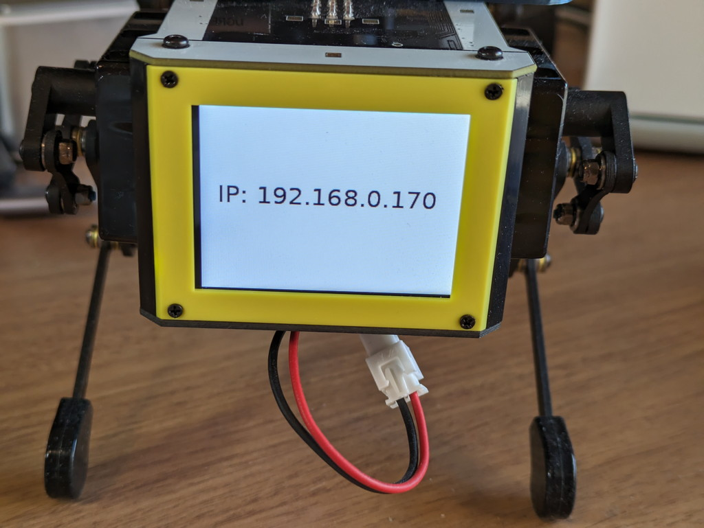
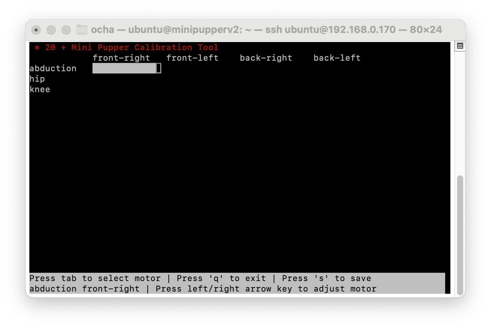
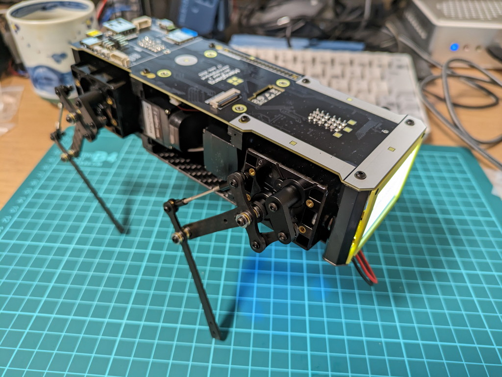
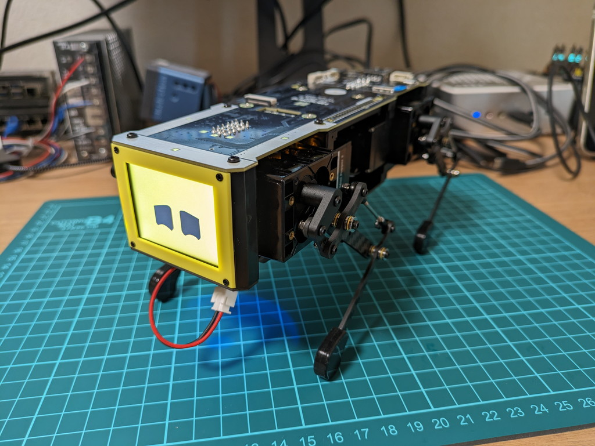

[Mini Pupper 2の脚の組み立て](https://kanpapa.com/2023/11/mini-pupper-2-5-legs-assembly.html)ができましたので、脚や腰を正しく動かすためにサーボモーターの調整を行います。

## microSDカードの準備とWiFi接続

組み立てマニュアルにイメージファイルの入手先が書かれています。

https://minipupperdocs.readthedocs.io/en/latest/guide/Assembly/MiniPupper2.html

作業手順は以下のようになります。

1. pre-built-imagesにあるv2\_stanford\_1.0.2.1\_20230820.img.zipをダウンロードします。
2. Raspberry Pi ImagerでSDカードに書き込みます。
3. Mini Pupper 2にHDMIモニタ、USBキーボードを接続し、SDカードをセットして電源を入れます。
4. HDMIモニタでUbuntu 22.04の起動が確認できたらログインします。
    - Default username: ubuntu
    - Default password: mangdang
5. WiFiに接続するため設定ファイルを追加します。
    - sudo vi /etc/netplan/99-custom-wifi.yaml
6. rebootします。
    - sudo reboot

/etc/netplan/99-custom-wifi.yamlには以下のように記述しました。

```
network:
  wifis:
    wlan0:
      access-points:
        YOUR-SSID:
          password: YOUR-PASSWORD
```

WiFiが正常に接続できれば、表示パネルにDHCPで取得されたIPアドレスが表示されます。



他のPCからこのIPアドレスにsshすればMini Pupper 2のRaspberry Pi 4にログインできます。

```
ssh ubuntu@192.168.0.170
```

## サーボモーターのキャリブレーション

Mini Pupper 2にsshでログインしてcalibrateツールをたちあげます。この画面でサーボモーターを1つずつ動かしながら脚と腰の位置を調整していきます。



この作業を行っている最中にバッテリー低下の警告が出てしまいました。一旦作業を中断して、Raspberry Pi 4をshutdownして、バッテリーの充電用USB端子から充電開始です。


バッテリーが充電されたのちに再びキャリブレーション作業をして、Mini Pupper 2が動き出しました。



## Web GUIでの動作確認

Mini Pupper 2のファームウェアに搭載されているGUIツールを使って動作確認を行います。電源投入時に表示されるIPアドレスにWebブラウザで接続します。プロトコルはhttpでポートは8080です。


一応うまく動作しているようです。





このあとROS2のセットアップを行います。
