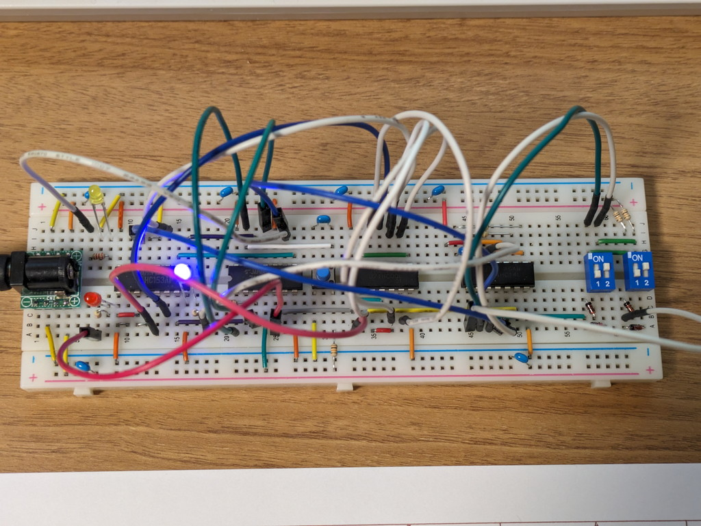
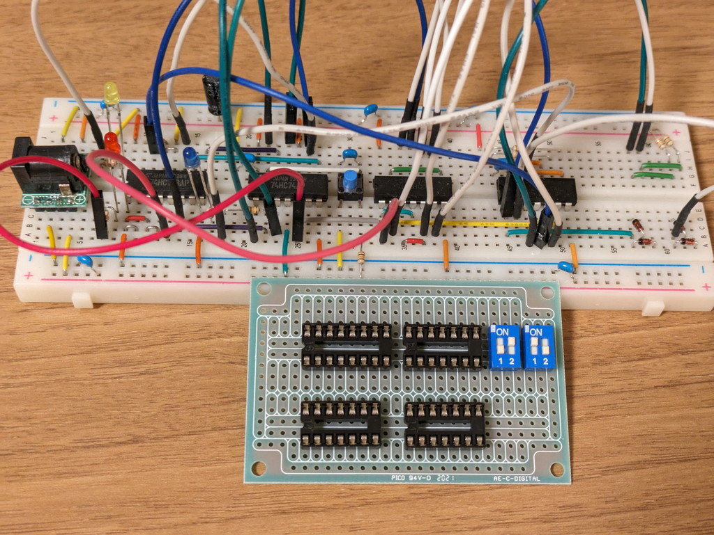

[1bit CPU組み立てキット](https://www.switch-science.com/products/9376?variant=42987286560966)がスイッチサイエンスさんで販売開始とのことで、これは何だろうと調べてみたところ開発者のnaoto64さんがドキュメントをGitHubに公開されていました。早速ドキュメントを確認してみました。

https://github.com/naoto64/1bit-CPU/tree/main

## 1bit CPUの概要

1bit CPUですが、4個の74HC系のICで構成されており、ROMはDIPスイッチです。命令セットは以下の２つしかありませんが、使用例のようにパラメタやアドレスで工夫することができます。

| 命令 | 機械語 | 使用例 |
| --- | --- | --- |
| ADD A, Im | 0 | 機械語で0 1とすればレジスタAに1加算。レジスタAの内容はビット反転する。   これでLEDの点灯・消灯ができる。（=Lチカ）   0 0とすれば0を加算なので何もしない(=NOP) |
| JMP Im | 1 | 機械語で1 0とすれば0番地にジャンプとなるが、   これを0番地で実行した場合は1番地に進まないので0番地で停止(=HLT)する。 |

３つのLEDが実装されており、それぞれCLOCK, PC(Program Counter), レジスタAの状態を示します。

- CLOCKはシステムクロックです。これは常に点滅を繰り返してCPUにクロックを供給し続けます。
- PCはプログラムカウンタで、0番地は消灯、1番地が点灯です。通常はCLOCKの１サイクルの間隔で、点滅を繰り返すことになります。JMP命令でPCを停止状態にもでき、その場合はPCが点灯したままになったり、消灯したままになります。
- レジスタAは1bitの汎用レジスタです。ADD命令で1を加算すると0/1が反転することになります。

ROM容量は4bitですので、動作は全部で16パターンになります。これらの一覧表がGitHubにまとまっています。

これはぜひ試してみたいものです。回路図を見たところ手持ちのパーツで製作できそうでしたので、まずはブレッドボードに載せてみました。

## ブレッドボードで実装してみる

ブレッドボードで実装したものは写真のようになりました。スイッチサイエンスさんで販売されているキットに合わせてLEDの色はClock: Blue, Green: PC, Red: Registerとしました。

配線はごちゃごちゃしていますが、GitHubにある命令パターンが正しく動作していることが確認できました。



## ユニバーサル基板に実装して小型化してみる

せっかくなのでブレッドボードのパーツをユニバーサル基板に乗せ換えてみました。使用したユニバーサル基板は秋月電子の[DIP-IC用パターン Cタイプ（72×47mm）](https://akizukidenshi.com/catalog/g/g115356/)です。今回の回路であれば十分実装できる大きさです。DIP-IC用のパターンとなっているので電源周りもシンプルにできそうです。このユニバーサル基板は初めて使ったのですが、使いやすい感じでした。

実際にユニバーサル基板に実装した1bit CPUです。コンパクトに収まりました。

裏面はいつものAWG30ラッピングワイヤーで配線です。やはり[組み立てキット](https://www.switch-science.com/products/9376?variant=42987286560966)のほうが楽だと思います。

ユニバーサル基板で製作したものも問題なく動作しました。



現在はピンヘッダから電源を供給していますが、今度秋月電子に行ったときに[USB電源供給用USB Type-Cコネクタ DIP化キット](https://akizukidenshi.com/catalog/g/g117123/)を買ってきて取り付ける予定です。（そのため左側を少し空けてあります。）

## まとめ

この1bit CPUはロジック回路の実験として面白い素材だと思いました。このようなアイデアを公開いただいたnaoto64さんに感謝です。
