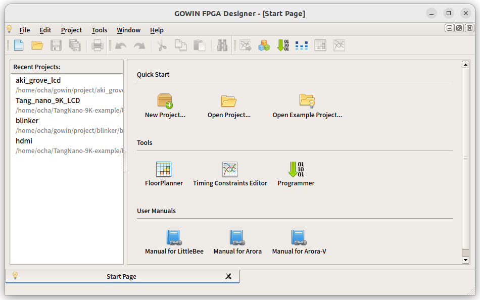
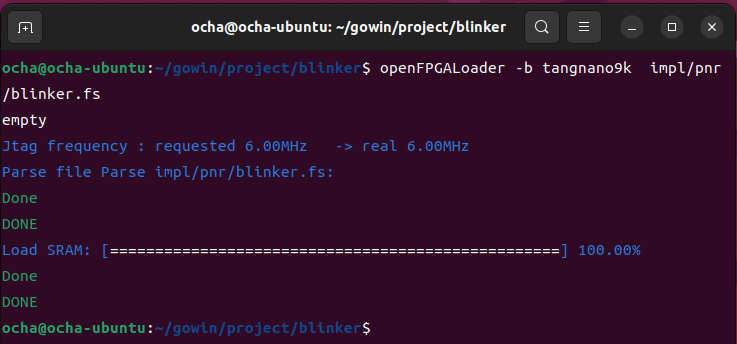
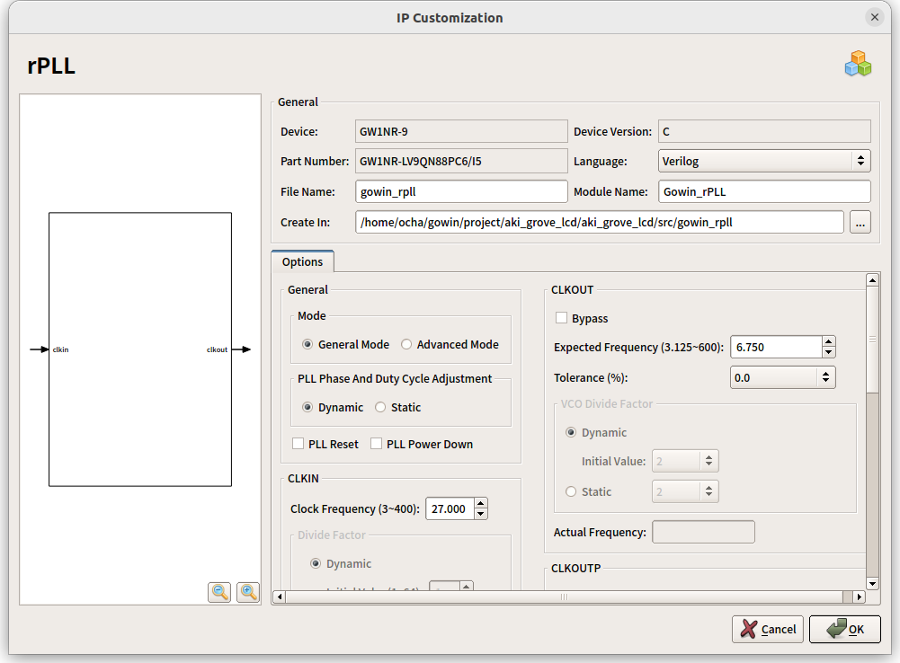

少し前にTang Nano 9KというSiPEED社のFPGA開発ボードを買いましたが、使う機会がなくそのままになっていました。今回ふと思いだしてLinux上での開発環境で使ってみました。

## Tang Nano 9Kの使い方

Tang Nano 9Kのドキュメントは以下にあります。

https://wiki.sipeed.com/hardware/en/tang/Tang-Nano-9K/Nano-9K.html

ここには開発に必要なマニュアルやピン配置、回路図などがあります。統合開発環境(IDE)もリンクされています。マニュアルは日本語化されているものもあり、日本向けにも力を入れているようです。

## 開発環境のインストール

開発環境であるGOWIN EDAをダウンロードするためには販売元のサイトにユーザ登録が必要です。このような登録を行う場合に会社名とかいろいろ聞かれることが多いのですが、メールアドレスと電話番号だけの登録だけで済みました。

Windows版とLinux版のソフトウェアがありましたので、私はUbuntu22.04 LTSにLinux版のGowin V1.9.9Beta-4 Education (Linux x86)をダウンロードしてホームディレクトリに展開しました。Education版（商用利用は不可）はライセンス登録が不要ですし、Tang Nano 9KはEducation版で問題なく利用できます。

展開したディレクトリにあるIDE/bin/gw\_ideを実行すればGOWIN FPGA Designerが起動します。

## Lチカのチュートリアルを試してみる

Tang Nano 9Kに搭載されているLEDを光らせるチュートリアルが準備されていたのでこれを試してみます。

https://wiki.sipeed.com/hardware/en/tang/Tang-Nano-9K/examples/led.html

大まかには以下の手順を踏みます。

1. プロジェクトを作成して、ターゲットデバイスはGW1NR-LV9QN88PC6/I5を選択します。
2. Designタブで、新規にVerilog Fileを作成してコードを書きます。
3. Processタブで、論理合成、配置配線を行い、ビットストリームファイルを生成します。
4. ビットストリームファイルをプログラマでターゲットデバイスに書き込みます。

チュートリアルに詳しい説明があるので、特にビットストリームを作るところまでは、特に問題はありませんでした。しかし、デバイスへのダウンロードがどうしてもできません。USBケーブルで接続していてもプログラマで認識されず以下のような画面になってしまいます。

udevで/dev/ttyUSBのアクセス権限が適切になるように設定したり、sudoでプログラマを起動してみるなど、Webサイトで見かけたことはすべて行ってみましたが、GOWIN IDEのProgrammerではデバイスへのダウンロードができませんでした。

## openFPGALoaderで書き込んでみる

このような問題を抱えているかたには、openFPGALoaderをおすすめしているようなので、そちらを利用してみることにしました。

https://github.com/trabucayre/openFPGALoader

インストールはマニュアルに沿って進めれば問題なく終わります。

https://trabucayre.github.io/openFPGALoader/guide/install.html

このopenFPGALoaderを使って、GOWIN EDAで生成したビットストリームを指定して書き込みを行ったところあっさり書き込めてしまいました。Tang Nano以外にも様々なFPGAをサポートしているようなので今後役立ちそうです。

LEDも問題なく点灯して動作しているようです。



## 秋月電子の球体液晶を動かしてみる

LED点滅だけだと面白くありませんので、以前[MAX10 FPGAで動かしたことがある秋月電子の球体液晶](https://kanpapa.com/2016/07/akizuki-globe-lcd.html)（現在は販売終了品）をTang Nano 9Kでも動かしてみることにしました。MAX10のときに使用したVerilogのソースを参考にします。

https://github.com/kanpapa/max10

LCD表示に必要なクロックを生成するために、GOWIN EDAのメニューにあるIP Core GeneratorからCLOCK→rPLLを選択し、システムクロックの27MHzから6.75MHzを生成するようにしました。システムクロックの27MHzがどこから供給されているかは、Tang Nano 9Kの回路図で確認できます。ボード上には27MHzのXTALがあり52番ピンに供給されていました。またボード上のプッシュスイッチは3番ピン、4番ピンで1.8V系に接続されていました。これも何かと使えそうです。

IP Core Generatorで作成されたrPLLのソースを組み込むことでLCDの動作に必要な6.75MHzのクロックが使えるようになります。

出力ピンはTang Nano 9Kから引き出すことができる3.3V系のピンに割当てを行いましたが、その他の部分は大きな変更はなくそのまま動かすことができました。ドームスクリーンにカラーストライプが投影されました。

作成したプロジェクトはGithubに登録しておきました。

https://github.com/kanpapa/TangNano/tree/main/aki\_grove\_lcd

## まとめ

久しぶりのFPGAでしたのでVerilogを思い出すのに時間が少しかかりましたが、MAX10より手軽に使えそうです。TANG NANO 9Kはエントリー向けですが、学習やちょっとした用途であれば十分使えるものだと思います。各種サンプルプログラムもGitHubで公開されていますので、いろいろ試しながらFPGAにも慣れておこうと思います。

https://github.com/sipeed/TangNano-9K-example
