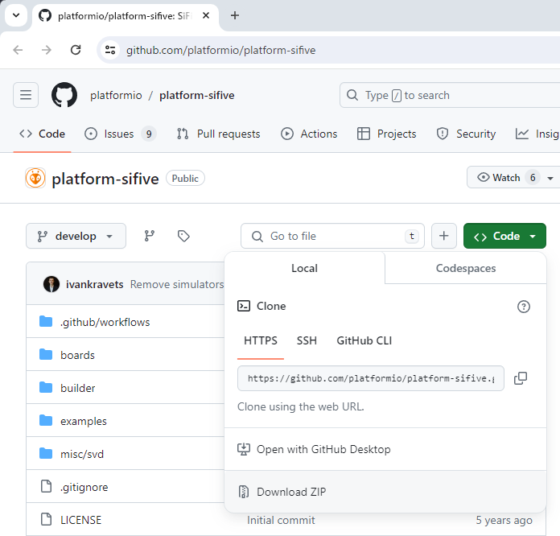
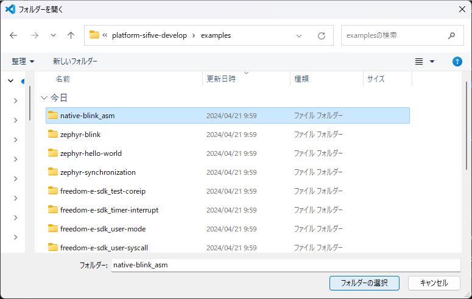
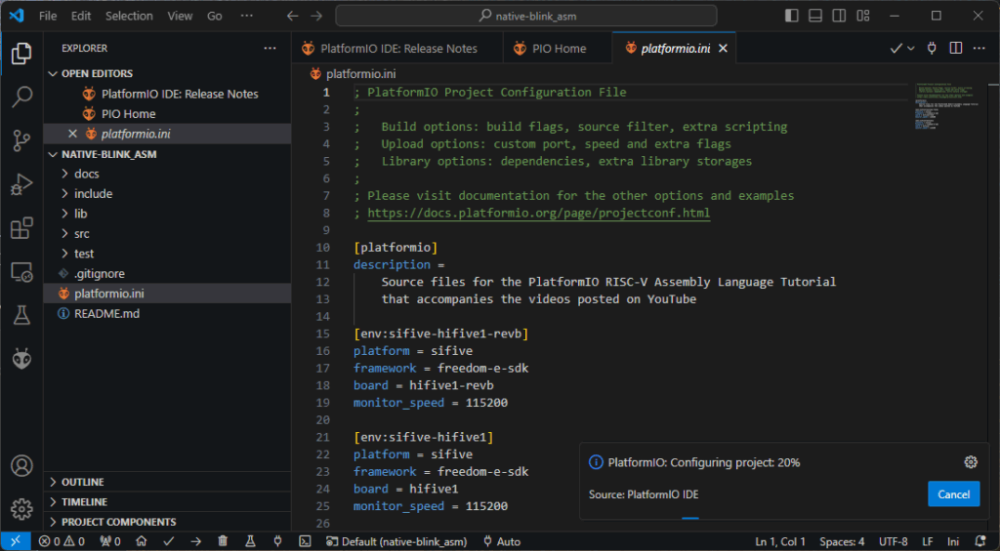
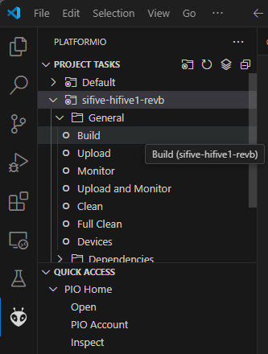

秋月電子の2階に寄ったところ、気になるマイコンボードを見かけました。HiFive1という評価ボードです。

店舗限定アウトレットセール品で、お値段はなんと980円というお手頃価格でCPUはRISC-Vのようです。秋月電子のサイトで確認したところすでに販売終了の商品となっていますが、以前は6600円で販売されていたようです。とりあえず1個購入しました。

https://akizukidenshi.com/catalog/g/g115014

公式サイトを確認したところ、Arduino IDEでも動かすことができるように見えましたが、今回入手したHiFive1 Rev BはArduino IDEはサポートしていないとGetting Started Guideに明記されていました。

https://www.sifive.com/boards/hifive1-rev-b

さらに調査したところ、PlatformIOであればサポートされているようでしたので早速試してみることにしました。

https://docs.platformio.org/en/stable/boards/sifive/hifive1-revb.html

## PlatformIO IDEで開発環境をつくる

PlatformIO IDEはVisual Studio Codeと組み合わせて使うと便利です。すでにインストールされているかたも多いと思うのですが、以下の手順でインストールします。今回はWindows11の環境を使用しました。

まずはVisual Studio Codeの公式サイトからWindows版をインストールします。

https://code.visualstudio.com

次にVisual Studio Codeの拡張機能のメニューからPlatformIO IDEをインストールします。

これでPlatformIO IDEが動くようになりました。

## サンプルプログラムを入手する

以下のGitHub.comからHiFive1のサンプルプログラムをダウンロードします。

https://github.com/platformio/platform-sifive

GitHubのCodeからDownload ZIPをクリックしてダウンロードし適当な場所で展開します。Gitがインストールされている場合はGitでCloneしても良いです。

ZIPファイルを展開して、Visual Studio Codeのエクスローラでexamplesフォルダを見るといくつかのサンプルプログラムがあります。それぞれ使用するフレームワークの名称（Freedom E SDKやZephyr）がフォルダ名に含まれています。今回はフレームワークを使わないnative-blink\_asmフォルダを選択します。

native-blink\_asmのフォルダを開くとフォルダに含まれているplatformio.iniファイルに従ってProjectのConfigrationが始まり、必要なツールのインストールが自動的に行われます。完了までは少し時間がかかります。

Configrationが終わるとビルドできる状態になります。エクスプローラーのsrcの下にプログラムのソースがありますので眺めておきましょう。関数がアセンブラで書かれているので楽しいです。

## サンプルプログラムを動かしてみる

左側の蟻の顔のようなアイコンをクリックするとPROJECT TASKSメニューが表示されます。ここでsifive-hifive1-revbをクリックし、GeneralメニューにあるBuildをクリックするとビルドがはじまります。

正常にビルドが完了すればTERMINAL画面に\[SUCCESS\]と表示されます。

次にUploadを選択すると、ビルド後にマイコンボードにプログラムが書き込まれTERMINAL画面に\[SUCCESS\]と表示されます。

正常に書き込めていればカラーLEDの点滅がはじまります。

## 強力なデバック機能を試す

PlatformIO IDEでは強力なデバック機能が使えます。左側の虫のようなアイコンをクリックして、緑の三角マーク Start Debugging(F5)をクリックするとデバック機能が開始され、右側のウインドウにソースコードが表示されて停止します。

この状態で上側にある以下のアイコンでデバック機能を制御します。

左側から以下のような機能があります。実際に動かしてみると機能がわかると思います。

- Continue (F5) ・・・ステップ実行ではなく継続実行されます。ここではLEDが点滅します。
- Step Over (F6)・・・関数ごとでステップ実行されます。
- Step Into (F7)・・・関数の内部もステップ実行されます。アセンブラレベルで確認できます。
- Step Out (Shift+F11)・・・関数の内部のステップ実行から抜けます。
- Restart (Ctrl+Shift+F5)・・・最初からデバックをやり直します。
- Stop (Shift+F5)・・・デバック機能が終了します。

左側のウィンドウでは様々な情報が表示され変数の値やスタック、レジスタなどデバックに役立つ情報が表示されます。Lチカのプログラムがどのように動いているのかを確認することができます。

## まとめ

980円のHiFive1 Rev BをPlatformIOで動かすことができました。今回はLチカだけでしたが、ビルドやデバック機能の練習には良い材料だと思います。サンプルプログラムには3種類のフレームワークを使った例がありますので、HiFive1 Rev Bの様々な機能を使いこなすこともできると思われます。
