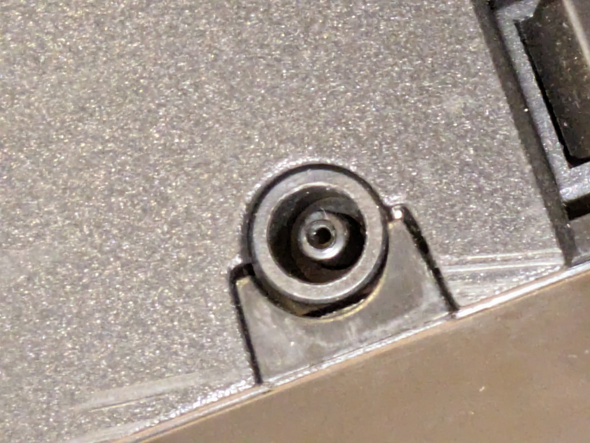
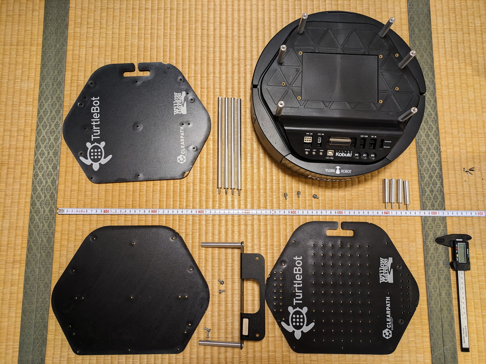

オークションサイトでTurtlebot2 kobukiを見つけて購入できました。すでにEOLとなっているものですが、まだまだ実験ができるのではないかと考えました。

## kobukiのドキュメントを集める

到着までにkobukiのドキュメントを集めておきました。かなり豊富な情報が揃っていますし、ROS2 Humbleでも動かしているかたもいるようです。

https://kobuki.readthedocs.io/en/devel/index.html

https://github.com/kobuki-base

https://idorobotics.com/2024/02/20/ros2-on-kobuki-turtlebot

## 到着したkobukiの確認

大きな段ボールに入ってそのままの形で到着しました。箱から取り出した直後の写真です。

写真では綺麗に見えますが、ベースの部分は傷が多く使い込まれている状態でした。実物のkobukiをみたのは今回が初めてです。

ルンバをベースとしたCreate2とは異なり、USBが直接接続できますし、拡張できるように様々な電源端子やステータス表示のLEDやプッシュスイッチなどがあり、実験に適したものになっているように感じました。これは期待できます。

気になるのはバッテリーです。ドキュメントによると裏面にバッテリーを格納する部分があり、コネクタで接続されているとのことです。裏面の蓋を開けたところ、残念ながらバッテリーは取り外されており、バッテリー接続端子が確認できました。ここに取り付けるバッテリーを用意しなくてはいけません。

また、バッテリーの充電用の電源アダプタを接続する端子も一般的な形では無く、手持ちの電源アダプタに対応したものはありません。何等かの変換プラグを準備する必要がありそうです。

## 分解してお掃除

一通りの確認は終わったので、ベースに取り付けられている板を一度外してお掃除をします。すべての板をはずしたところネジが１本足りないようでした。記録のために棚板の向きを正しい方向にして写真を撮っておきました。

今のところをKinectを使う予定はないので、不足しているネジはKinectの取り付けパーツで使用しているネジを流用しようと考えています。

## まとめ

オークションで購入したものですので動作するかどうかわかりません。もしかすると動作しないかもしれません。それを確認するためには何とかして電源を投入する必要があります。バッテリーが無いのであれば、バッテリー端子に電源直接を接続することを考えます。電源が入れば以下の確認ができます。

- ステータス表示LEDが点灯するかの確認
- セルフテスト機能を使ったモーターの動作確認
- PCとUSBで接続して何等かの情報が取れるかの確認

これらを行うためにバッテリー接続端子のコネクタを入手することにします。
