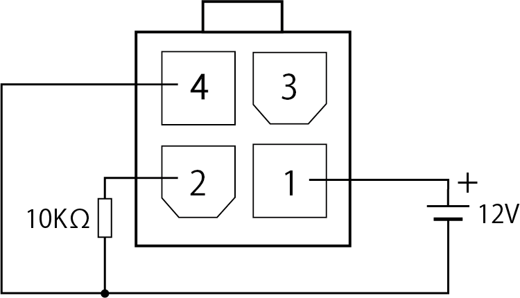
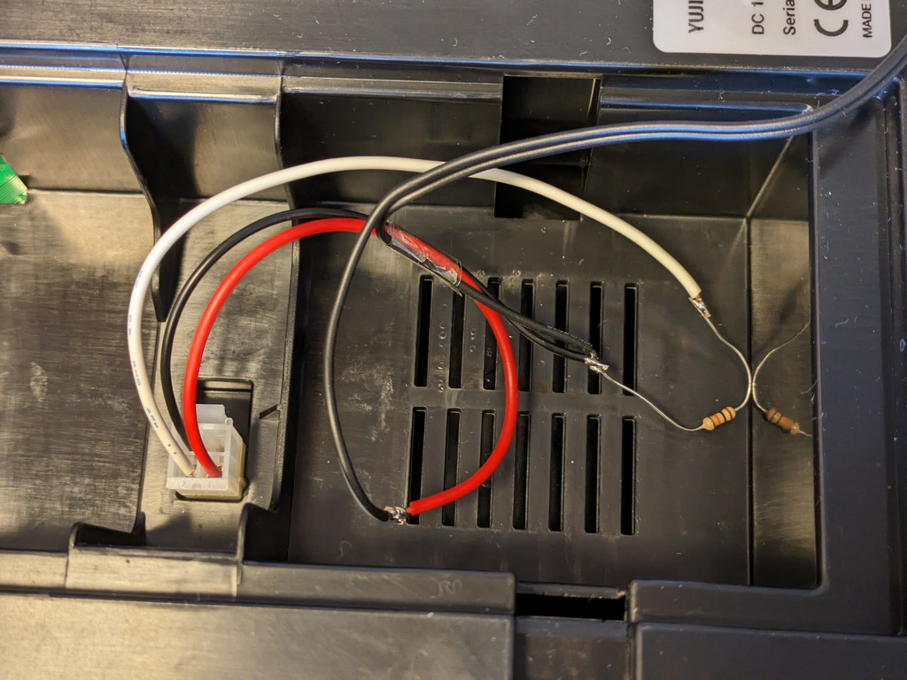

今回は[到着したkobuki](https://kanpapa.com/2024/04/turtlebot2-kobuki-1.html)に電源を投入して動作確認を行ってみます。残念ながらバッテリーは付属していませんでしたので、バッテリー端子に12Vの直流電源を接続することで電源を供給してみます。

## バッテリー端子のコネクタの入手

バッテリー端子から電源を供給する場合、バッテリー端子に接続するためのコネクタを調達する必要があります。[kobukiのドキュメント](https://kobuki.readthedocs.io/en/devel/index.html)には以下の情報がありました。

- 4S1P/4S2P バッテリーパックコネクタ: [Molex PN : 00390-12040](https://www.molex.com/en-us/products/part-detail/39012040)

確認してみるとマルツさんや千石電商さんで取り扱いがあるようです。現物をみて確認したうえで購入したかったので秋葉原に向かったのですが、残念ながら4Pのものは品切れで、結局通信販売で入手しました。

## バッテリー端子からの電源供給

バッテリー端子の各ピンの接続情報は見つかりませんでしたが、バッテリーパックは以下の仕様のようです。

- Lithium-Ion battery pack (4S1P, 2200mAh, 14.8V)
    - Red: battery (+), 9.6 V ~ 16.8 V
    - White: NTC thermistor to ground, 10 kΩ ± 1%
    - Black: battery(-), Ground

Kobukiのドキュメントにある[バッテリーパックの写真](https://kobuki.readthedocs.io/en/devel/anatomy.html#batteries)から見てkobuki本体のバッテリー端子とは以下の回路図のように接続されているようでした。今回はバッテリーの代用として、手持ちの12V電源を接続し、サーミスタの代用として10kΩの抵抗を接続します。

ただし、バッテリーパック4S1Pの写真だと3番ピンにもバッテリーの＋極が接続されているように見えるのですが、バッテリーパック4S2Pの写真だと3番ピンは使っていないように見え、3番ピンの扱いが不明な点があります。もしこのあたりの情報があればぜひお寄せください。

回路図に従って、実際に配線してみました。写真では接続部がむき出しですが、実際はビニールテープで絶縁しています。

この状態で12Vの電源を接続し、電源スイッチをONにしたところStatus LEDが点灯し、起動音がしました。

https://youtu.be/t5sWFd8MzXA

無事電源の投入はできたようです。

## First run

kobukiのドキュメントを確認したところ、以下の操作でランダムに走行するモードになるようです。これで動作確認ができそうです。

1. 電源ケーブルを外す。（今回は接続していない）
2. Kobukiの電源を入れて3秒以内にB0ボタンを2秒間押したままにする。

早速操作してみたところ、走行することが確認できました。

https://youtu.be/ervP9kuYo1o

残念ながらバッテリーではなく電源ケーブルがバッテリー端子につながっている状態なので、ケーブルが切れないようにすぐ停止させましたが、モーターやバンパーの動作は問題なさそうです。

## まとめ

kobuki本体の動作は問題なさそうなので、バッテリーを探して注文しました。kobukiのオリジナルは iclebo YCR-M05というロボット掃除機のようなので、このバッテリーが流用できると考えています。バッテリーの写真を見ると赤、黒、白の３本のケーブルがでていて、コネクタの形状は異なりますが、今回のコネクタを付け替えることでkobukiに接続することはできそうです。

バッテリーが到着する前に[ROS2 Humbleでの動作確認](https://kanpapa.com/2024/04/turtlebot2-kobuki-3-ros2.html)をしておきたいと思います。
