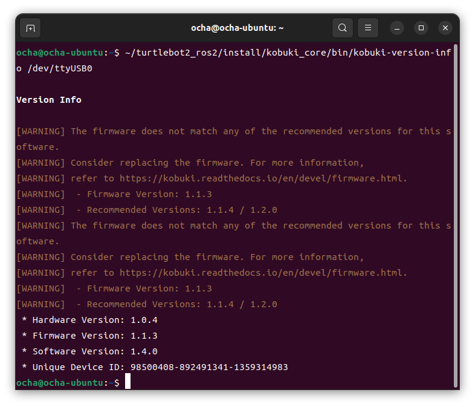
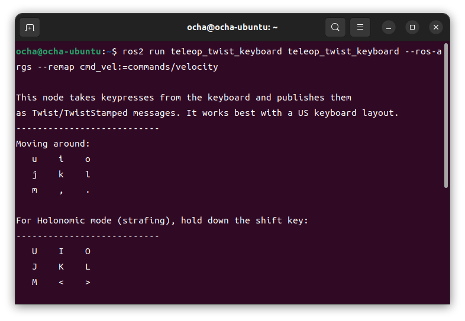

[kobukiの基本的な動作確認](https://kanpapa.com/2024/04/turtlebot2-kobuki-2.html)ができたので、いよいよPCに接続してROS2で制御できるようにしていきます。今回はUbuntu 22.04 LTSにROS2 Humbleをインストールしている環境で行いました。

## kobukiのROS2環境を作成する

kobukiのROS2環境のセットアップは以下のGitHubリポジトリのドキュメントに従って行いました。

https://github.com/idorobotics/turtlebot2\_ros2

特に問題なくkobuki用のworkspaceができました。

## kobukiをPCに接続する

kobukiとPCをUSBケーブルで接続し、バッテリー端子を電源に接続します。狭い机の上で不用意に車輪が回転しても大丈夫なように、工具箱をkobukiの下において車輪を浮かせるようにしました。

PCはデスクトップ機を使いましたが、動作確認ができたところでRaspberry Pi 4にもセットアップしてkobuki単体で動かせるようにする予定です。

## バージョン確認とファームウェアのアップデート

ROS2を動かす前に、kobuki\_coreに含まれているkobuki-version-infoというツールを使って各種バージョン情報の確認を行いました。

どうやら現在のファームウェア1.1.3は古いようで、1.1.4または1.2.0にアップデートしたほうが良さそうです。アップデートの手順は以下のドキュメントにありました。

https://kobuki.readthedocs.io/en/devel/firmware.html

ファームウェアのアップデートはstm32flashという書き込みツールが必要のようです。ドキュメントの手順に従ってツールをコンパイルし、ダウンロードした最新のファームウェア1.2.0を書き込みました。

再び電源を入れてファームウェアのバージョンを確認したところ、1.2.0に更新されたことが確認できました。

これでファームウェアが最新のものになりました。

## ROS2ドライバを動かしてみる

最新のファームウェアになったところで、kobukiのROS2ドライバを動かしてみます。kobuki\_nodeを動かすと起動音がしたあとにたくさんのメッセージが流れましたが、特にエラーはなさそうです。

## キーボードで車輪を動かしてみる。

この状態で別のターミナルを立ち上げて、teleop\_twist\_keyboardを動かしてみます。

無事キーボード操作で車輪が回転することが確認できました。

https://youtu.be/OYo0krMfjJQ

## まとめ

今回はファームウェアをアップデートしたあとにROS2 Humble環境でkobukiをコントロールできることを確認できました。キーボードで車輪が回転するというシンプルなものでしたが、今後はkobukiのROS2ドライバに実装されている機能を確認しつつ、SLAMやNavigationなど高度な制御にチャレンジしていきます。
