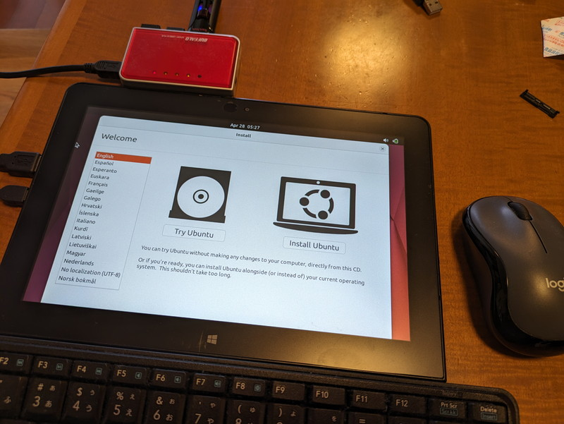
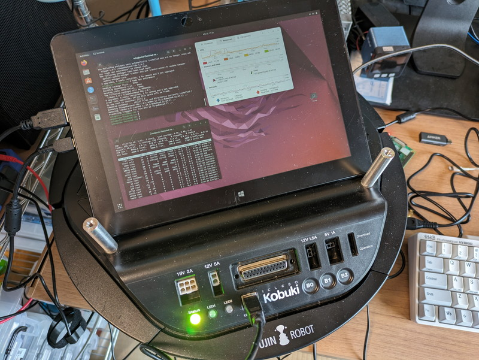

kobukiを自由に走行させるためにはkobuki本体に小型のPCを搭載して、その上でROS2が動作する必要があります。今回はこのPCの環境整備を行いkobukiに載せてリモートで制御できるようにします。

## 小型PCは何を使うか

Ubuntu 22.04が動作するPCでkobukiに載せられそうなものをあげてみます。

- ノートPCにUbuntuを載せたもの（バッテリー付きだがやや重い）
- WindowsタブレットにUbuntuを載せたもの（バッテリー付きで軽い）
- Raspberry Pi 4などのSBCにUbuntuを載せたもの（一番小型だがバッテリーが別に必要）

今回はWindowsタブレットとRaspberry Pi 4で試してみます。

## WindowsタブレットでROS2を動かす

私のWindowsタブレットはThinkpad10 tabletです。ATOMが載っているものでスペックは以下の通りです。

- CPU Atom Z3795
- メモリ 4GB
- 液晶 10.1型IPS
- 解像度 1920×1200ドット
- データストレージ 64GB eMMC
- USB TYPE-A 1ポート

決して性能が良いものではありませんが、バッテリーで長時間稼働し、Ubuntuも問題なく使えます。

USBポートが１つありますので、ここにUSBハブを接続してキーボード、マウス、UbuntuのブートUSBメモリを接続してUbuntu 22.04 LTS Desktopをインストールします。UbuntuのブートUSBメモリの作成はRufusを使い、USBメモリを接続した状態でBIOS画面からUSBブートを指定してUbuntuを起動します。



あとは内蔵のストレージにUbuntuのインストールを行い、ROS2 Humbleとkobuki ROS2ドライバを導入すれば完了です。

kobukiの上に載せた状態でkobukiとUSBケーブルで接続します。あとはタブレットにsshログインしてkobukiのROS2ドライバを起動します。



デスクトップPCでRviz2やrqtを起動すれば、WiFi経由でこれまでと同様にkobukiを制御することができました。後述のRaspberry Pi 4を使用する場合はモバイルバッテリーが必要になりますが、タブレットであればバッテリーも搭載されていますので、取り扱いが容易です。

## Raspberry Pi 4でROS2を動かす

次は定番のRaspberry Pi 4です。Ubuntu 22.04 LTS ServerをRaspberry Pi ImagerでmicroSDカードに書き込みます。ルンバでも使っていたので実績はありますが、kobukiのROS2ドライバがRaspberry Pi 4のARMアーキテクチャで動作するかが鍵になります。


実際にcolcon buildを試してみたところclass-memaccessのwarningがエラー扱いとなってしまい、colcon buildができませんでした。このため以下のようにオプションを指定しclass-memaccessをwarningとすることで回避しています。

```
$ colcon build --cmake-args -DCMAKE_CXX_FLAGS="-Wno-error=class-memaccess"
```

kobukiのUSBケーブルをRaspberry Pi 4のUSBに接続してkobukiのROS2ドライバを起動したところ無事起動音が鳴り、正常に動作しているようです。


## 実際に走行してみる

kobukiに電源ケーブルを接続した状態で机の上で動作確認を行っているため、大きな動きができません。とりあえず左右の動きを実際に動かして確認してみました。



車輪によってkobuki本体が実際に左右に動くと、IMUの情報からRviz2でも左右に動いて表示されることがわかります。

## まとめ

まだバッテリーが届かないので実際の走行ができない状態ですが、動かせない状態でも試せることを進めてみます。これまでルンバに搭載して実験していたLiDARをkobukiに搭載し、SLAMを試してみます。
