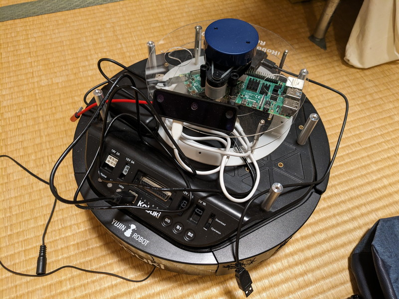

[前回](https://kanpapa.com/2024/05/turtlebot2-kobuki-6-ros2-slam.html)はLiDARを使用してSLAMを行いましたが、今回は手持ちの[OAK-D-LITE](https://docs.luxonis.com/projects/hardware/en/latest/pages/DM9095/)というAIカメラを使ってkobukiに目の機能を搭載してみます。以前にMini Pupper2の製作で物体を追尾する動作を行いましたのでそれを流用してkobukiでも同じような動きをさせてみます。

## OAK-D-LITEでの物体検出

OAK-D-LITEカメラは一般的な物体検出機能を持っており、MobileNet v2 SSD (Single Shot Multibox Detector) モデルを使用して、20種類の一般的なオブジェクトを認識することができます。

メーカーより提供されているROS2ドライバを使用することで、画像情報や検出したオブジェクトの種類やサイズ、位置情報をtopicに載せて配信してくれます。これをプログラムで受信してkobukiを動かしてみます。

## 物体追尾を行うプログラム

Mini Pupperと同じようにpythonで書きました。GitHubに登録しておきましたが、あくまでも実験用なので参考に留めてください。

https://github.com/kanpapa/oak\_detect/blob/main/oak\_detect/oak\_detect.py

プログラムで行っていることは、OAK-D-LITEカメラから/color/mobilenet\_detectionsという物体検知情報のトピックを受信し、ボトルが検知されていたらボトルの位置が画面の中央からどのぐらい離れているのかを計算し、その結果をtwist.angular.zに入れて/commands/velocityをpublishします。それをkobuki-nodeが受信して指示された方向に回転します。回転するとカメラが検知する物体の位置が変わりますから同様の動きを繰り返すことで最終的には物体の中央に向くことになります。

## OAK-D-LITEを搭載したkobukiを動かしてみる

OAK-D-LITEを固定するものはまだ作成していないので、フレームに載せただけの状態にしています。

kobukiにはRaspberry Pi 4を載せてUSB端子にkobukiとOAK-D-LITEカメラを接続し、モバイルバッテリーで稼働しています。

GitHubのREADME.mdに載せた手順に従ってプログラムを起動し、カメラの前でボトルをゆっくり動かしてみました。

https://github.com/kanpapa/oak\_detect



簡単なプログラムですが、思ったよりもスムーズな動きができています。

## まとめ

OAK-D-LITEが認識したペットボトルの情報に従ってkobukiをその方向に向かせるプログラムを作成しました。もう少し機能を追加すれば、ペットボトルについていくといった動作を行うこともできるでしょう。まだkobukiが電源ケーブルでつながっておりあまり動かせない状態なので、バッテリーが届いたらこれらの機能を追加しようと思います。
