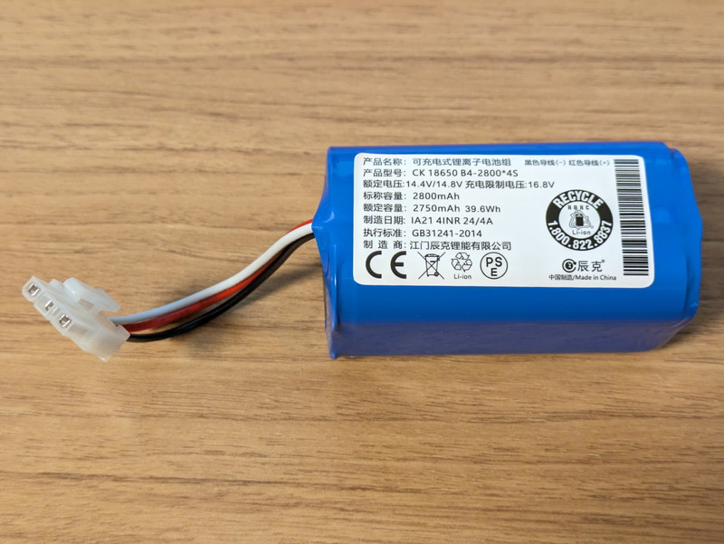
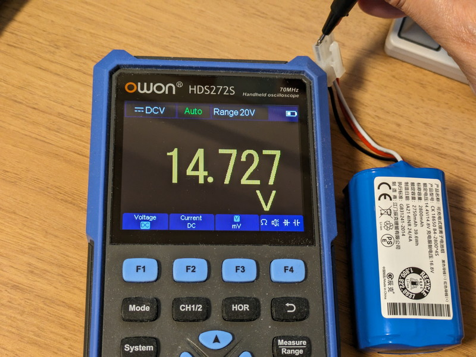

これまではkobukiのバッテリー端子から外部電源を供給して動作確認を行ってきました。以前オーダーしておいた互換バッテリーがようやく届きましたので、kobukiに接続してみます。

**警告：純正バッテリー以外の利用は危険を伴う可能性がありますので互換バッテリーの使用は自己責任でお願いします。**

## バッテリー仕様の確認

到着したバッテリーです。ラベルに記載されている定格は[kobukiのドキュメントにある仕様](https://kobuki.readthedocs.io/en/devel/anatomy.html#batteries)とほぼ同じです。PSEマークも表示されていました。



今回はkobukiのベースとなっているロボット掃除機iCleboのバッテリーと同じものと想定してYCR-M05用を購入しました。kobukiのドキュメントに記載されている標準バッテリーの仕様と購入した互換バッテリーの仕様を比較してみます。

| **Item** | **純正バッテリー** | **今回購入した互換バッテリー** |
| --- | --- | --- |
| MODEL | YCR-M05(kobuki) | iCrebo YCR-M05用 |
| Normal Capacity | 4S1P 2,200mAh(±50mAh) | 2750mAh 39.6Wh |
| Battery Model | HYB ICR18650NH-2,200mAh | CK 18650 B4-2800\*4S |
| Nominal Voltage | 14.4V - 14.8V | 14.4V - 14.8V |
| Charging Voltage | 16.8V | 16.8V |
| Discharge Halt Voltage | 9.6V Cut-off | 不明 |
| Normal Charging | 16.8V, 1.1A | 不明 |

互換バッテリーは純正バッテリーと同様に赤、黒、白の3本のケーブルがあるものです。赤は＋、黒はー、白は異常検知用のNTCサーミスタ（温度の上昇により電気抵抗値が減少する素子）が接続されています。純正品と比べて電圧仕様は全く同じですが、容量が若干多めになっています。

まずは電源電圧を確認したところ正常値を示しました。ほぼ満充電の状態のようです。



## コネクターの交換とkobukiとの接続

互換バッテリーの３ピン電源コネクタをkobuki用の４ピン電源コネクタ（[Molex PN : 00390-12040](https://www.molex.com/en-us/products/part-detail/39012040)）に交換します。ショートしないように１本ずつコンタクトに圧着しコネクタハウジングに取り付けました。コネクタの交換が完了したバッテリーをkobukiに取り付けます。


## 試験走行

kobukiの電源スイッチをONにしたところ、問題なく電源が投入できましたので、kobukiをテストモードにして走行させてみました。

https://youtu.be/eMpcx4jFiyU

元気よく部屋の中を走り回ってくれました。

## バッテリー関連のトピックを確認

ROSのトピックとしてバッテリーの情報が流れているので確認してみます。約50Hzの周期でトピックが受信できます。

```
$ ros2 topic echo /sensors/battery_state
header:
  stamp:
    sec: 1715481426
    nanosec: 826036603
  frame_id: base_link
voltage: 14.399999618530273
temperature: .nan
current: .nan
charge: .nan
capacity: .nan
design_capacity: .nan
percentage: 39.54545593261719
power_supply_status: 2
power_supply_health: 0
power_supply_technology: 2
present: true
cell_voltage: []
cell_temperature: []
location: ''
serial_number: ''
---
 :
```

voltageがバッテリー電圧で、この例では14.39Vのようです。percentage: 39.54とありますので残り容量は39.54%と認識しているようです。他にpower\_supply\_status, power\_supply\_health, power\_supply\_technology, presentなど気になる項目があるのでソースから追ってみたところ、次の仕様となっていました。

| **Variable name** | **Value** | **Memo** |
| --- | --- | --- |
| voltage | バッテリーの電圧\[V\] |  |
| percentage | バッテリー残り容量\[%\] | 電圧範囲を16.5V〜13.2Vと定義し、現在の電圧から残り容量を計算している。 |
| power\_supply\_status | POWER\_SUPPLY\_STATUS\_DISCHARGING = 2   POWER\_SUPPLY\_STATUS\_FULL = 4   POWER\_SUPPLY\_STATUS\_CHARGING = 1 | ドライバではこの3種類しか使用されていない。 |
| power\_supply\_health | POWER\_SUPPLY\_HEALTH\_UNKNOWN = 0 | 固定値でした。 |
| power\_supply\_technology | POWER\_SUPPLY\_TECHNOLOGY\_LION = 2 | リチウムイオン電池であることを示しており固定値でした。 |
| present | msg->present = true; | 常にtrueでした。 |

まずは、voltage, percentage, power\_supply\_statusを気にしておけば良さそうです。

## まとめ

kobukiにバッテリーを搭載することで、ようやく自由に走行ができるようになりました。あとはバッテリーが正常に充電できるかを確認する必要があります。今後SLAMやNAV2などの動作確認を行いながら、バッテリーをある程度消費させたのちに充電が正常に行われるかを慎重に見極めていきます。
