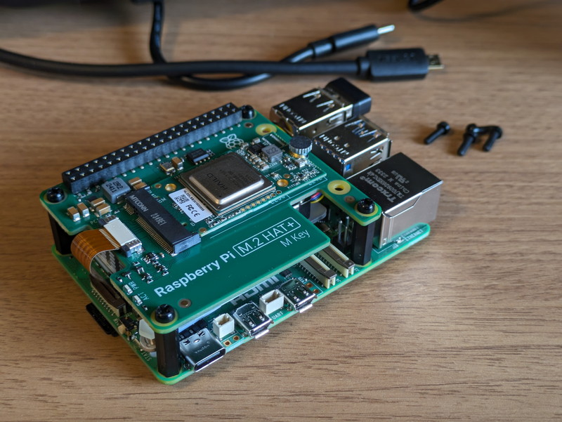
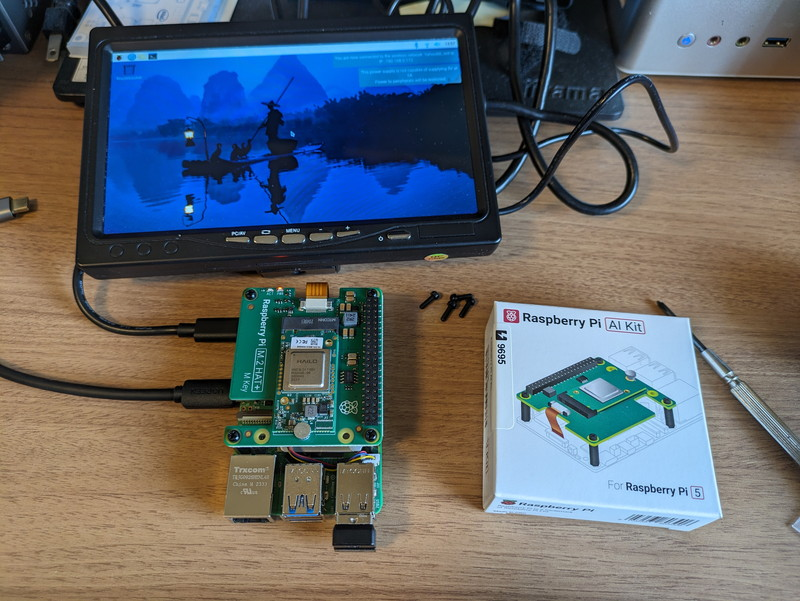
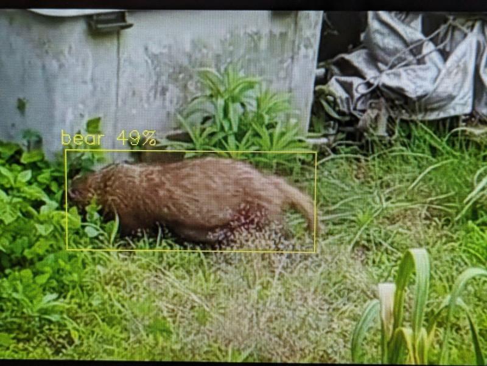

[Raspberry Pi AI Kit](https://www.switch-science.com/products/9695)が発売になったので早速試してみました。このAI KitはRaspberry Pi 5で使用するための Hailo AI アクセラレーション モジュールとRaspberry Pi M.2 HAT+ が一緒になったものです。

Hailo-8L チップは13TOPSの性能を持っているそうで、高速な推論エンジンとして画像認識などのアプリケーションで性能を発揮してくれそうです。

## Raspberry Pi AI Kitが到着

到着したAIキットです。コンパクトな箱にまとまっています。裏面には始め方のURLや機能などが書かれています。

箱の中身ですが、Raspberry Pi M.2 HAT+にHailo AI アクセラレーション モジュールとRaspberry Pi 5に接続するためのフラットケーブルが取り付け済みです。あとはGPIOポートに接続するためのヘッダピンとネジとスペーサーが一式含まれています。

Raspberry Pi AI Kitのドキュメントは以下にありますので、これに従って作業を進めてみます。

https://www.raspberrypi.com/documentation/accessories/ai-kit.html

## OSとファームウェアのアップグレード

まずはドキュメントにしたがってOSとファームウェアを最新のものにアップグレードします。いつものようにHDMIモニタ、無線USBキーボード、無線USBマウスを取り付けてコマンドを入力していきます。

これは特に問題なく実行できました。

## Raspberry Pi 5にAI Kitを取り付ける

ウェブにあるドキュメントに詳しく説明がありますので、Raspberry Pi本体への取り付けはすぐ終わると思いますが、フラットケーブルの接続はケーブルやコネクタを傷めないように十分注意してください。

Raspberry Pi 5 にAI Kitの取り付けが完了しました。

短いネジが８本、長いネジが４本付属していましたが、私は短いネジ８本を使って基板を固定しました。この状態で電源を投入して起動まで確認できました。

## サンプルプログラムを動かしてみる

公式ドキュメントに載っているサンプルプログラムでは公式のRaspberry Pi カメラ (例: カメラモジュール 3 または高品質カメラ)が必要と記載されていて、専用カメラモジュールを使うようになっていました。私もRaspberry Pi カメラは持っているのですが、見つからなかったので他に動作確認をする方法はないか探してみたところ、以下のページがありました。

https://github.com/hailo-ai/hailo-rpi5-examples

こちらの[Hailo RPi5 Basic Pipelines](https://github.com/hailo-ai/hailo-rpi5-examples/blob/main/doc/basic-pipelines.md#hailo-rpi5-basic-pipelines)で試してみることにします。リポジトリにはpythonのプログラムと確認用のビデオファイルも含まれていますので、素材を準備しなくても画像認識を試すことができます。ちなみにサンプルのビデオファイルは風景的に日本のような気がします。

また、オプションを指定することでUSBカメラを接続した画像認識処理も行えました。私の場合はRealSenseカメラを使い、机の上のオブジェクトをリアルタイムで認識することができました。

ビデオファイルも入力できるので、先日実家に帰ったときに見かけたアナグマのビデオを入力して画像認識を行ったところ、Bear 49%と表示されました。:-)

## まとめ

これまでGPUを搭載したPCでないと難しかったリアルタイム画像処理がRaspberry Pi 5でできるようになったのは素晴らしいと思います。今回の実験ではRaspberry Pi 5に[秋月電子の3.8A USB-C ACアダプタ](https://akizukidenshi.com/catalog/g/g114935/)を使用しましたので、5Aの電源でなくても動かすことができています。ロボットへの搭載にも応用できそうです。
