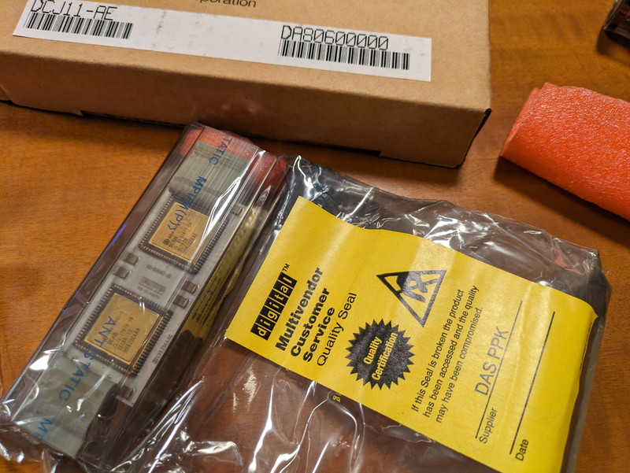
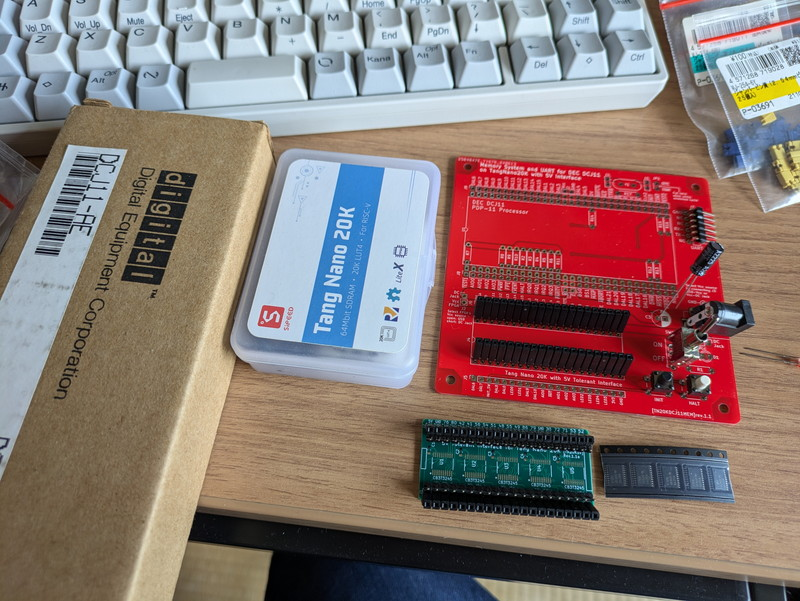
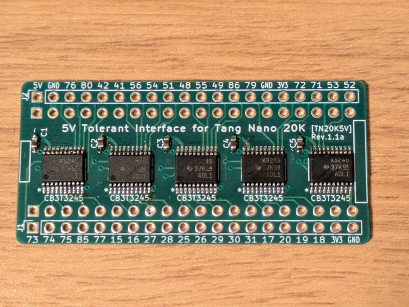
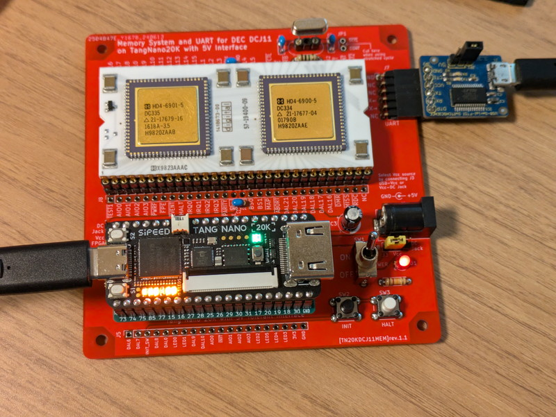

## DCJ11 CPUとの出会い

Xで[DEC DCJ11 CPU](https://en.wikipedia.org/wiki/DEC_J-11)がeBayで購入できるらしいとのポストがありました。私もこのポストを見るまでは知らなかったCPUなのですが、その特徴的な外観と、[PDP-11](https://ja.wikipedia.org/wiki/PDP-11)の命令セットが動作するということで興味を持ちました。

やや高価ですので、購入は躊躇しましたが、今買わないと買えなくなるかもということもあり思い切って購入しました。

DCJ11 CPUの仕様はウェブ検索すると様々な情報がありますが、DCJ11 Microprocessor User's Guideは必読です。

https://archive.org/details/dcj11-microprocessor-users-guide-dec-1983-10-ek-dcj-11-ug-pre-preliminary

また、すでにDCJ11 CPUを動かしているかたもいました。こちらの情報も参考になります。

http://madrona.ca/e/pdp11hack/index.html

## DCJ11 CPUの入手

eBayでオーダーしたあと、さほど時間はかからずにDCJ11 CPUが到着しました。

梱包パッケージはDCJ11用のようですが、静電防止袋は開封されており、肝心のCPUは足が微妙に曲がっていたのですが、動作すれば問題ないので、入手できることがありがたいです。

このCPUは内部にODTというメモリを読み書きしたり、プログラムを実行させたりすることができるツールがあるそうです。以前取り組んだ[MC68EZ328 CPU](https://kanpapa.com/tag/mc68ez328)でも同様な機能があり、やはり実際に動かしてみたいところです。

## TangNanoDCJ11MEMの公開

TwitterではDCJ11が届いたという書き込みが多数届いてはいますが、実際に動作させたというポストは見当たりません。[PDP-11/HACK](http://madrona.ca/e/pdp11hack/index.html)の記事を参考にハードウェアを製作しようとしていたところでXに強力なポストがありました。

https://twitter.com/uCOM80/status/1783372645683310957

Ryo Mukaiさんが開発を行っている[TangNanoDCJ11MEM](https://github.com/ryomuk/TangNanoDCJ11MEM)は、[TangNano 20K](https://wiki.sipeed.com/hardware/en/tang/tang-nano-20k/nano-20k.html)というFPGA開発ツールにDCJ11 CPUのメモリやシリアルコンソールの機能をもたせるという試みです。順調に開発が進んでいるようなので見守っていたところに、[TangNanoDCJ11MEM専用プリント基板](https://store.shopping.yahoo.co.jp/orangepicoshop/pico-a-088.html)がオレンジピコショップさんから発売になりました。すぐ購入しようとしたのですが、あっという間に売り切れてしまい、2回めの発売で購入することができました。

https://store.shopping.yahoo.co.jp/orangepicoshop/pico-a-088.html

到着したTangNanoDCJ11MEMの基板と製作に必要なパーツです。

実装に必要となる[tangnano-5V(20K版)専用プリント基板](https://store.shopping.yahoo.co.jp/orangepicoshop/pico-a-077.html)と[レベル変換用のIC(SN74CB3T3245PWR)](https://store.shopping.yahoo.co.jp/orangepicoshop/pico-i-186.html)もオレンジピコショップさんで同時に購入しました。Tang Nano 20KはAliexpressで購入しました。残りのパーツは手持ちのものや秋月電子さんでの購入です。

## TangNanoDCJ11MEMの製作

パーツ数は多くないので製作自体は短時間でできました。GitHubにも製作上の注意事項が書かれていますので良く読むことをお勧めします。

https://github.com/ryomuk/TangNanoDCJ11MEM

まずTangNano 20Kを5Vの回路に接続できるようにレベル変換を行ってくれるTangNano-5Vの半田付けを行いました、TSSOPのハンダ付けも何とかうまくできました。

DCJ11を取り付ける部分の丸ピンICソケットの位置決めは以下のように固定して進めました。

XTALは交換できるようにしておくのが良いとのことでしたので、丸ピンICソケットを3ピンだけ切り離し真ん中のピンを抜いてXTALソケットとしました。

DCJ11 CPUとTangNano 20Kの実装前の基板です。

注意すべき点として、**DCJ11 CPUのピンは非常に曲がりやすい**です。私もCPU取り付け時にいくつかピンを曲げてしまい慎重にピンを修正して丸ピンICソケットに差すことができました。開発者もCPUのピンを保護するために丸ピンICソケットを2重にしている理由が良くわかりました。

(2024/07/17追記）10ピン程度にした丸ピンICソケットをCPUのピンに取り付けていった上で、基板上の丸ピンICソケットに取り付けると良いとの情報をHanya Zouさんから頂きました。参考にしてください。

https://twitter.com/hanyazou/status/1813038940359991676

完成したTangNanoDCJ11MEM基板です。DCJ11 CPUの迫力に圧倒されます。

ハードウェアはこれで完成ですが、開発環境の整備とTangNano20Kへの書き込みなどを行っていきます。（[bare metal編に続く](https://kanpapa.com/2024/07/tangnanodcj11mem-pdp-11-cpu-2-bare-metal.html)）
