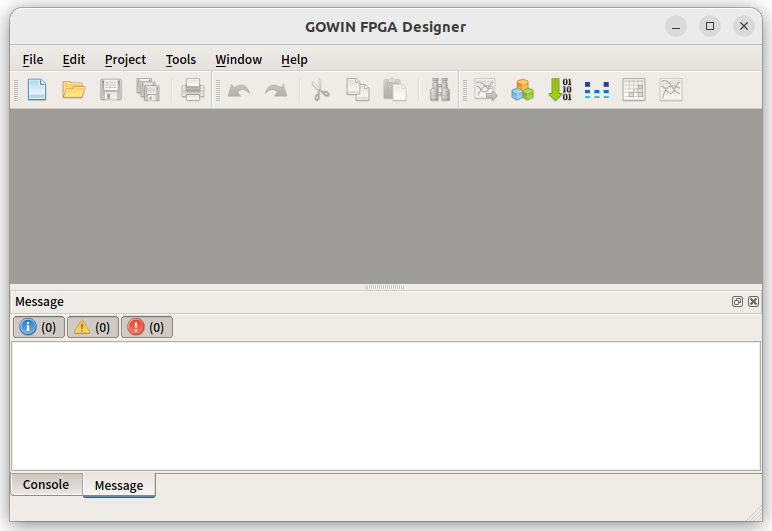
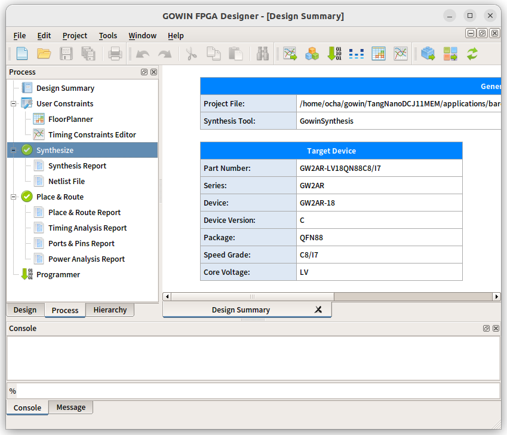
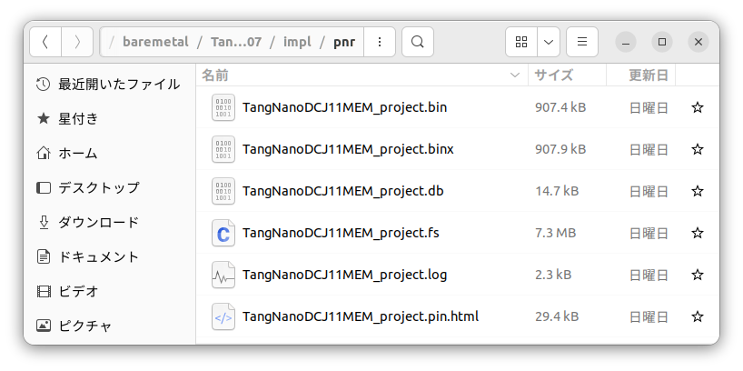
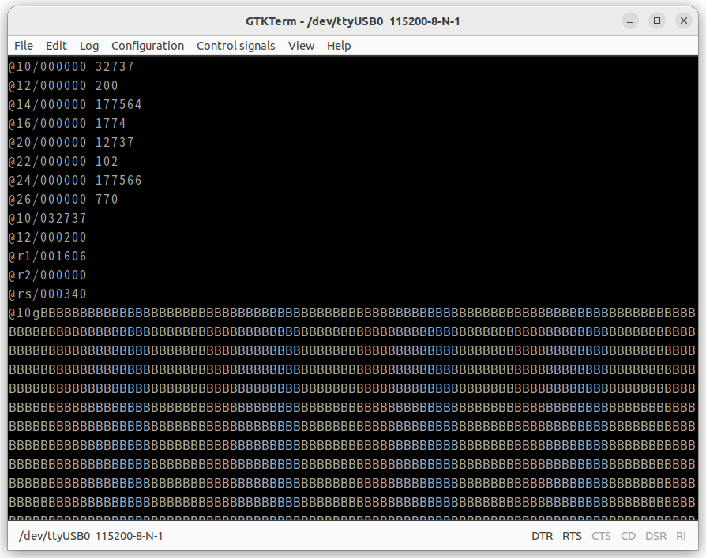

## bare metalとは

[前回製作したTangNanoDCJ11MEM](https://kanpapa.com/2024/07/pdp-11-dcj11-cpu-1.html)でプログラムを動かしてみます。CPUやメモリ、周辺機器を直接制御するbaremetal環境を使います。GitHubのリポジトリでは applications/baremetal/ になります。TangNano 20KのHDLがシンプルな構造なので、これをベースとして機能拡張が行えます。

## TangNano 20Kの開発環境

今回使用するFPGAボードTangNano 20Kの開発に必要なソフトウェアをインストールします。 [TangNano 20Kのメーカーサイト](https://wiki.sipeed.com/hardware/en/tang/tang-nano-20k/nano-20k.html)に詳細な説明が掲載されていますが、私の場合はUbuntu 22.04 LTSがインストールされているPCを使用しましたが、もちろんWindowsでもインストール可能です。

### GOWIN IDEのセットアップ

[Install IDE](https://wiki.sipeed.com/hardware/en/tang/Tang-Nano-Doc/install-the-ide.html)のページには、GOWIN EDAをサポートページからダウンロードしてインストールする手順が掲載されています。

https://wiki.sipeed.com/hardware/en/tang/tang-nano-20k/nano-20k.html

ダウンロードページにアクセスするためにはアカウントを登録する必要があります。私の場合はアカウント登録後にLinux OS用のGowin\_V1.9.9.03\_Education\_linux.tar.gzをダウンロードしてホームディレクトリに展開しました。なお、Education版はライセンスの申請は不要で、非営利および非商用目的でのみ使用できます。

Linux OSの場合は展開したフォルダのIDE/bin/gw\_ideを実行することで、GOWIN IDEが起動します。



GOWIN IDEの詳細な使用方法は省略しますが、TangNanoDCJ11MEMのソースをビルドしてTangNano20Kに書き込むためのビットストリームを作りたい場合は、FileメニューからOpenを選択して、GitHubからcloneしたapplication/baremetal/TangNanoDCJ11MEM\_project.20240707のディレクトリにあるGOWINプロジェクトファイル TangNanoDCJ11MEM.project.gprj を指定してOpenします。


その後、左側のProcessタブを選び、Synthesizeを右クリックしてRerunし、さらにPlace&Routeを右クリックしてRerunを行うだけです。



ビットストリームはapplications/baremetal/pnr/TangNanoDCJ11MEM\_project.fsに生成されます。ファイルサイズが大きいのですぐわかると思います。



なお、Githubのリポジトリにはビルド済のビットストリームも登録されていますので、ソースを変更しないのであれば後述するOpenFPGALoaderでビルド済のビットストリームをTangNano 20Kに書き込むだけで完了です。

Gowin IDEにも書き込みツールが提供されているのですが、どうも私のLinux環境では正常に動作しないので、実績のあるOpenFPGALoaderを使用しています。

### OpenFPGALoaderのセットアップ

OpenFPGALoaderを使用する場合はビルドする必要がありますが、以下の手順に従って簡単にビルドができます。

https://trabucayre.github.io/openFPGALoader/guide/install.html

Ubuntuの場合、インストール手順は以下の通りです。

```
git clone https://github.com/trabucayre/openFPGALoader
cd openFPGALoader
mkdir build
cd build
cmake ..
cmake --build .
sudo make install
```

正常にインストールされると /usr/local/bin/openFPGALoader および /usr/local/share/openFPGALoader/ に必要なファイル群が置かれます。

### TangNano 20Kへの書き込み

ここではGitHubからCloneしたリポジトリに登録されているbaremetalのビットストリームをtangnano20Kにそのまま書き込んでみます。手順は以下のようになります。

```
git clone https://github.com/ryomuk/TangNanoDCJ11MEM.git
cd TangNanoDCJ11MEM/applications/baremetal/TangNanoDCJ11MEM_project.20240707/impl/pnr
openFPGALoader -b tangnano20k -f TangNanoDCJ11MEM_project.fs
```

書き込みを行う前にTangNano20KとPCをUSBケーブルで接続しておきます。

実際に書き込みを行った例です。


## bare metalでの動作確認

TangNano 20Kにbaremetalのビットストリームを書き込んだら、TangNanoDCJ11MEM基板のシリアル端子にUSBシリアル変換ボードを接続し、ターミナルソフトで115200bpsに設定したあとにINITスイッチを押すと以下のようなasciiartの描画が行われるはずです。


すべて表示されると停止しますが、これはプログラム内で無限ループを行って停止しているためです。

もう一度INITスイッチを押すと、再びasciiartの描画が始まります。HALTスイッチを押すと＠が表示されて停止します。これはDCJ11 CPUに内蔵されているODT (Octal Debugging Technique)の入力待ちプロンプトです。

## PDP-11のクロス開発環境

baremetalで動作するアプリケーションをCやアセンブラで書くためにはクロスコンパイル環境が必要です。先ほどのasciiartのプログラムはCで書かれており、ソースコードはapplications/baremetal/samples/asciiart/にあります。このソースをコンパイルするためのクロスコンパイル環境の設定方法とコンパイル方法はGitHubリポジトリのPDP-11用プログラム開発環境で触れられています。

https://github.com/ryomuk/TangNanoDCJ11MEM/tree/main/applications/baremetal

ここではすでにクロスコンパイル環境が設定されている状態で、実際にasciiartのソースプログラムをコンパイルして組み込み用のrom.asciiart.vを作成するところまでを示します。


このrom.asciiart.vは、applications/baremetal/TangNanoDCJ11MEM\_project.20240707/src にコピーして、rom.vにリネームします。rom.vはtop.vのソースでincludeされ、ビットストリームに組み込まれます。

なお、コンパイル時にbin2loadが無いというエラーになった場合は以下のリポジトリのソースをbuildして/usr/local/binに置いてください。

https://github.com/jguillaumes/retroutils

## ODTの動作確認

基板のHALTスイッチを押すとODTが起動します。ODTの簡単な使い方をまとめました。

| **機能** | **操作方法** |
| --- | --- |
| メモリの操作 | メモリアドレスを8進数で入力してスラッシュを入力すると、直後にメモリの内容が表示されます。   そのメモリの内容を書き換えたい場合は、上書きする内容を８進数で入力してEnterを押します。   特にメモリの内容を書き換えない場合はそのままEnterキーを押します。 |
| プログラムの実行 | プログラムを実行したい場合は実行開始アドレスを８進数で入力してgと入力します。   gを押したタイミングでプログラムが実行されます。 |
| レジスタの操作 | r1, r2などと入力してスラッシュを入力すると直後にレジスタの値が表示されます。   レジスタの内容を書き換えたい場合はメモリと同様の操作になります。 |

[PDP-11/HACKのサイト](http://madrona.ca/e/pdp11hack/index.html)に掲載されているPDP-11 Test #2をODTで実行した操作例を示します。

```
@10/000000 32737       <--- 10番地の内容は000000。内容を32737に上書き
@12/000000 200         <--- 12番地の内容は000000。内容を200に上書き
@14/000000 177564　　　<--- 以下同上
@16/000000 1774
@20/000000 12737
@22/000000 102
@24/000000 177566
@26/000000 770
@10/32737 　　　 　     <--- 10番地の内容を確認。32737が正しく書き込まれている
@12/200　　　　　　　　 <--- 12番地の内容を確認。200が正しく書き込まれている       
@r1/001606              <--- レジスタr1の内容を確認
@r2/000000              <--- レジスタr2の内容を確認
@rs/000340              <--- ステータスレジスタの内容を確認
@10g　　　　　　　　　　<--- 10番地から実行
```

実際に実行すると以下のようになります。Bが連続して表示されますのでHALTスイッチで中断します。



このようにODTでは基本的な操作は行えますが、入力が大変です。さらに８進数というのが曲者でなかなか慣れませんが、後述するPDP11GUIで操作がかなり楽になります。

## PDP11GUIでの活用

ODTでの命令コードの入力や確認はすごく手間がかかります。何か良いツールが無いかと探したところ[PDP11GUI](https://www.retrocmp.com/tools/pdp11gui)というWindowsで動作するツールを見つけました。

PDP11GUIではPDP-11とのシリアル接続をサポートしていますので、シリアルポートにTangNanoDCJ11MEMを接続することでGUIでの操作が可能です。

PDP11GUIではレジスタの表示やメモリ操作、メモリダンプ、MACRO11アセンブラ、逆アセンブラなど他にも強力なツールが揃っています。これを使うことでbaremetal環境で効率良く開発作業ができそうです。


## まとめ

DCJ11 CPUを使用したTangNanoDCJ11MEMのbaremetalでの開発環境を立ち上げることができました。PDP-11の資産は膨大にありますので、それらをこのTangNanoDCJ11MEMで動作させることができると思われます。

Ryo Mukaiさんの[TangNanoDCJ11MEMのリポジトリ](https://github.com/ryomuk/TangNanoDCJ11MEM)では、紙テープで提供されていたBASICインタプリタをSDカードから読み込んで動作させたり、unix-v1が動作するようにSDカードでディスクI/Oをサポートしたりなど様々なチャレンジが継続しています。

TangNanoDCJ11MEMはまだ開発途中のものですので、これらが完全に動作するにはもう少し時間がかかるかもしれませんが今後も楽しめそうです。Ryo Mukaiさんありがとうございました。
