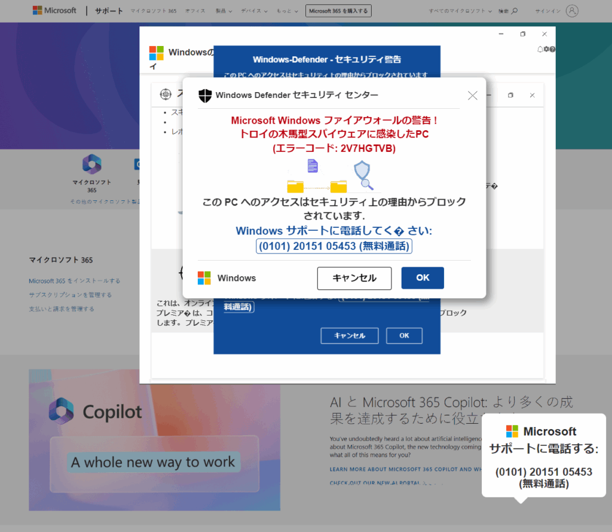

ここであげるような怪しい広告はクリックしないことを推奨します。私は毎回破棄できるテスト用の環境で確認しています。

## Facebook ブラウザ版の広告枠が汚染されている？

FacebookをPCで見るときはブラウザで利用しているのですが、こんな広告が右上の広告枠に表示されるのを見かけました。

パッと見、fb.messeger（わざとスペルを間違えているかも？）と書かれていることもあり、Facebookメッセンジャーの着信数を示しているように見えますが、どうみても広告枠です。

試しにその広告をクリックしてみたところ、いきなりGoogle Safe Browsingで警告画面が表示されました。

それ以上は深追いしませんでしたが、悪質サイトに誘導するフィッシング広告ではないかと思います。GSBで警告画面になるので実害は少ないかもしれませんが、Facebookで広告審査が回っているのか心配になってしまいました。

## サポート詐欺サイトに遷移するパターンも

もう一つ別のパターンも見かけました。こちらはonline.messengerと書かれています。

こちらの広告をクリックするとGoogle Safe browsingで警告は出ませんでしたが、よくあるサポート詐欺の画面に遷移しました。

やはり、Facebookで広告審査が回っているのか心配になってしまいました。他の大手サイトでもこのようなことがあり得ますので十分な注意が必要です。
