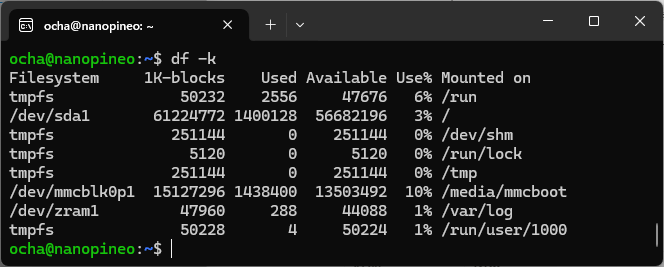

自宅サーバとして稼働している[NanoPi NEO](https://www.armbian.com/nanopi-neo/)ですが、これまで[Armbian Buster(Debian 10.8)をインストール](https://kanpapa.com/2021/02/nanopi-neo-buster-setup.html)して使用していましたが、すでにEOLとなっているので最新版の[Armbian](https://www.armbian.com/)を再インストールすることにしました。

## Armbian Communityをインストールする

現在の最新版を確認したところ、[NanoPi NEO](https://www.armbian.com/nanopi-neo/)はArmbianの正式サポートからは外れてしまいましたが、Armbian Communityであれば引き続き使えるとのことなので、Armbian Linux v6.6 Build Date: Sep 26, 2024のイメージファイルをダウンロードし、[balenaEtcher](https://etcher.balena.io/)でmicroSDカードに書き込みました。このmicroSDカードをNano Pi NEOにをセットして電源を投入すればArmbian Communityが起動します。


## SSDにファイルシステムを変更する

microSDカードにファイルシステムを置くとスピードや耐久性が心配です。このため前回と同様にarmbian-installスクリプトでファイルシステムをSSDに変更しましたが、ここでトラブル発生です。変更後にrebootしても起動しません。しかたなくシリアルコンソールを接続して起動の様子を確認したところ、やはり途中で止まっていました。

```
U-Boot SPL 2024.01-armbian-2024.01-S866c-Pb2fe-H0429-V6b5d-Bda0a-R448a (Sep 24 2024 - 02:33:41 +0000)
DRAM: 512 MiB
Trying to boot from MMC1
ns16550_serial serial@1c28000: pinctrl_select_state_full: uclass_get_device_by_phandle_id: err=-19

U-Boot 2024.01-armbian-2024.01-S866c-Pb2fe-H0429-V6b5d-Bda0a-R448a (Sep 24 2024 - 02:33:41 +0000) Allwinner Technology

CPU:   Allwinner H3 (SUN8I 1680)
Model: FriendlyARM NanoPi NEO
DRAM:  512 MiB
Core:  66 devices, 18 uclasses, devicetree: separate
WDT:   Not starting watchdog@1c20ca0
MMC:   mmc@1c0f000: 0, mmc@1c11000: 1
Loading Environment from FAT... Unable to use mmc 0:1...
In:    serial,usbkbd
Out:   serial
Err:   serial
Net:   eth0: ethernet@1c30000
starting USB...
Bus usb@1c1a000: sun4i_usb_phy phy@1c19400: External vbus detected, not enabling our own vbus
  :
  :
Starting kernel ...

Loading, please wait...
Starting systemd-udevd version 255.4-1ubuntu8.4
Begin: Loading essential drivers ... done.
Begin: Running /scripts/init-premount ... done.
Begin: Mounting root file system ... Begin: Running /scripts/local-top ... done.
Begin: Running /scripts/local-premount ... Scanning for Btrfs filesystems
done.
Begin: Waiting for root file system ... Begin: Running /scripts/local-block ... done.
done.
Gave up waiting for root file system device.  Common problems:
 - Boot args (cat /proc/cmdline)
   - Check rootdelay= (did the system wait long enough?)
 - Missing modules (cat /proc/modules; ls /dev)
ALERT!  UUID=22930c6c-ef7e-4858-a444-35c016756bb6 does not exist.  Dropping to a shell!

BusyBox v1.36.1 (Ubuntu 1:1.36.1-6ubuntu3.1) built-in shell (ash)
Enter 'help' for a list of built-in commands.

(initramfs)
```

ファイルシステムをSSDに変更する前に、apt updateとapt upgradeを行ったのちにarmbian-installスクリプトを実行し、rebootしたところ正常に起動することができました。イメージファイルは最新の状態ではないため、作業前に更新しておくべきでした。

再起動後にマウント状況を確認したところ、ルートファイルシステムがSSDにマウントされていることが確認できました。



## Mackerelでサーバ監視

前回同様に[Raspberry Pi を Mackerel で監視する](https://qiita.com/ww24/items/5409aefd87f14beff504)の記事に従って[Mackerel](https://mackerel.io/)の監視エージェントをインストールすることでサーバ監視が再開されました。


## これまでの歴史を振り返る

このNanoPi NEOですが、mackerelに変更履歴を残しています。

- 2018/09/09 armbian でSSD化して投入
- 2021/02/23 Armbian Buster で再構築。
    - Armbian 22.11.1 Buster with Linux 5.15.80-sunxi
- 2024/09/28 Armbian Community 24.11 で再構築
    - Linux nanopineo 6.6.44-current-sunxi

2018年9月から連続稼働していることがわかります。どこまで使えるか試していきたいと思います。
