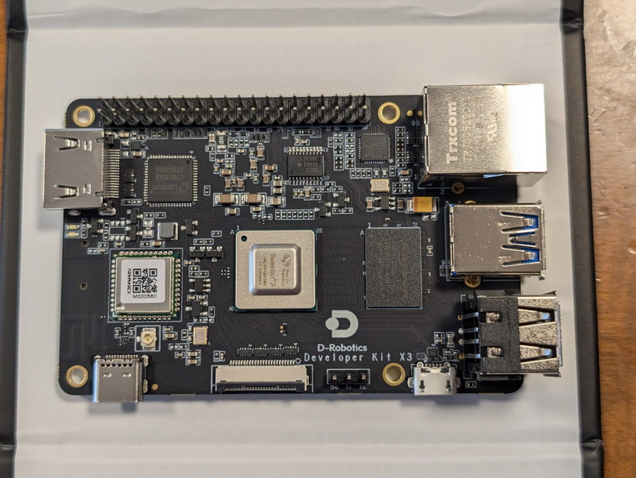
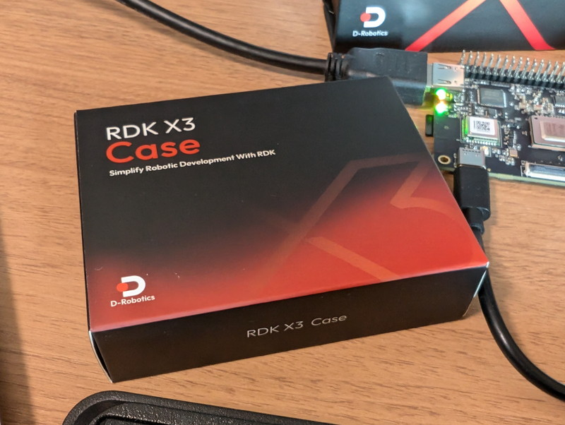
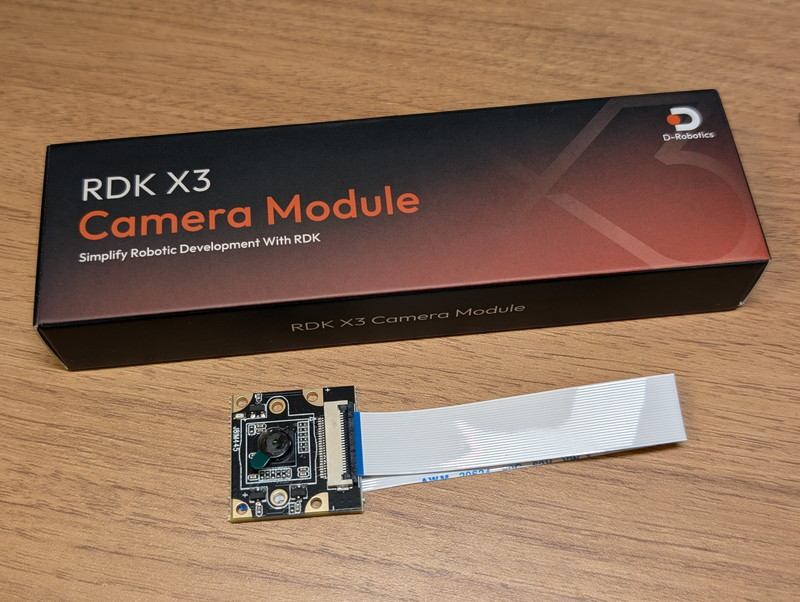
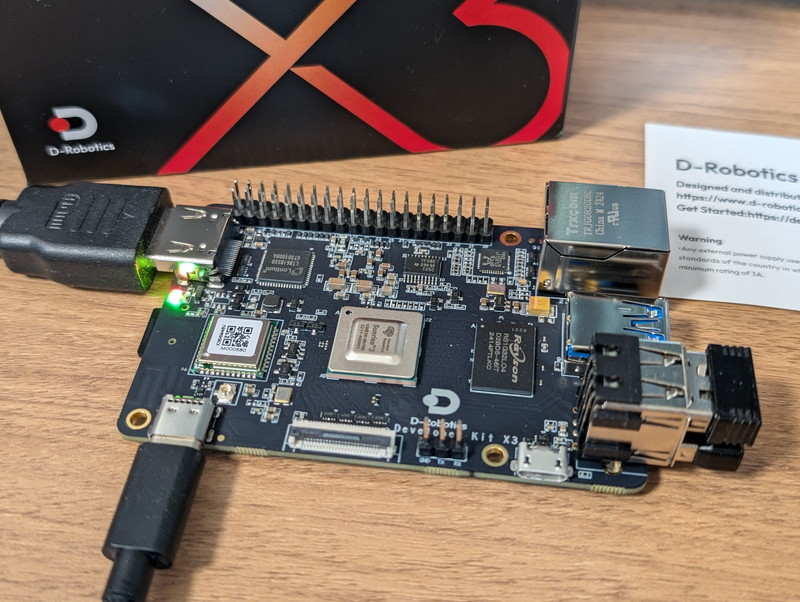
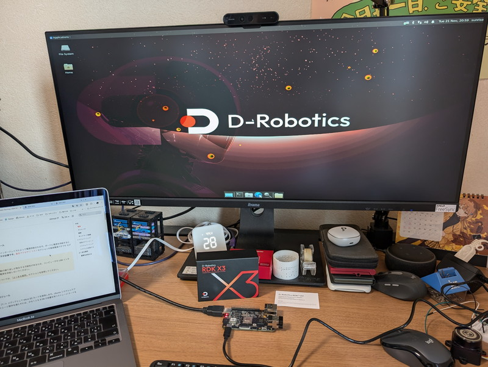
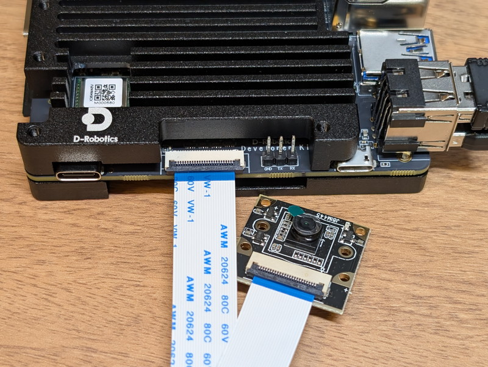
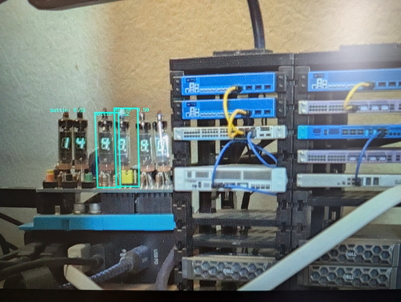

[Maker Faire Tokyo 2024](https://makezine.jp/event/mft2024/)のスイッチサイエンスさんのブースで[D-Robotics社のRDK X3](https://www.switch-science.com/blogs/magazine/d-robotics-rdk-x3)というマイコンボードが先行販売されていました。Raspberry Piぐらいのサイズですが、画像認識のデモが行われていて複数のオブジェクトが高速に認識できているように見えました。これはAIロボットに使えるかもと思わず買ってしまったので、第一印象をまとめてみました。

## RDK X3ボードの概要

展示ブースでぜひこのURLを見てほしいと何度も紹介されたので、まずは公式サイトを覗いてみます。

https://developer.d-robotics.cc/rdkx3

公式サイトにも書かれているように、5 TOPSの性能を持っているというのが売りのようで、画像認識のデモはこの性能が発揮されて高速に表示できたのでしょう。

ちなみにRaspberry Pi 5 AI Kitは最大13 TOPSとのことですが、Raspberry Pi 5とのセットだと倍以上の価格になってしまいます。また電源についても5V 5A推奨のRaspberry Pi 5に比べて、RDK X3は5V 3Aですので省電力化も期待できます。

## RDK X3の外観

今回購入したRDK X3 (4GB RAM)です。箱がカッコ良くて厚みがあってしっかりした作りです。

CPU側から見たところです。HDMIは標準コネクタで、USB-Cは電源用です。カメラコネクタの横の3ピンはデバック用のUARTです。

裏面はmicroSDカードスロットがあります。技適マークも表示があり日本国内の利用も問題ありません。細かいですが、40Pの拡張コネクタの部分に信号名が書かれているのは親切ですね。

いずれ必要と思われるケースとカメラモジュールも同時に買ってしまいました。これらはあとで取り付けることにします。

## RDK X3を動かしてみる

公式サイトのQuick Startに従ってセットアップを進めます。

https://d-robotics.github.io/rdk\_doc/en/Quick\_start

まずはイメージファイルをmicroSDカードに書き込みます。私の場合は3.0.0/release/ubuntu-preinstalled-desktop-arm64.img.xzをダウンロードして、balenaEtcherでmicroSDカードに書き込みました。デスクトップ環境が起動するはずなので、HDMIディスプレイと、USB無線キーボード、USB無線マウスを接続し、電源は秋月電子の[スイッチングACアダプター(USB ACアダプター) Type-Cオス 5.1V3.8A](https://akizukidenshi.com/catalog/g/g114935/)を使用しました。

しばらくするとディスプレイにデスクトップが表示されました。

Quick Startに従ってWiFiを接続し、他のPCからsshができるところまで確認しました。OSはubuntu 22.04.4 LTSでした。

## ケースとカメラの取り付け

とりあえず動作に問題はなさそうなので一度shutdownをして専用ケースを取り付けます。専用ケースはロゴもプリントされ、しっかりした作りに見えます。

ケースを取り付けた状態でも各ポートへのアクセスは良さそうです。

カメラモジュールも取り付けます。ケースに干渉せず取り付けやすい位置にコネクタがあり助かります。

ボードに実装されているLEDが隠れないかなと思ったのですが、特に問題ありませんでした。

## デモプログラムでの画像認識

Basic Applicationで紹介されている画像認識アプリケーションを試してみます。今回はMIPIカメラモジュールを使いましたがUSBカメラでも使えます。

https://developer.d-robotics.cc/rdk\_doc/en/Basic\_Application/Image/mipi\_camera

まずは実行に必要となるカメラモジュールが正常に接続できているかを確認しました。I2Cアドレス0x10として無事カメラモジュールが認識されています。

サンプルプログラムを実行したところ、机の上のVFD時計がbottleとして認識されました。他にも部屋の中のものが認識されているのですが、ここに写真を載せるのは恥ずかしいのでこの画像だけとします。Maker Faire Tokyoの会場で見たとおりのスピードが出ていると思いました。

## まとめ

RDK X3のセットアップを行い、サンプルプログラムで画像認識が動作することを確認しました。他にもサンプルプログラムがあるので試してみますが、購入した目的はロボット制御ですので、D-Robotics社がRDK用に開発した[TogetheROS.Bot](https://developer.d-robotics.cc/rdk_doc/en/Robot_development/tros)（略称はtros.b）でのアプリケーションの動作を中心に試してみようと思います。ROS2 Foxy/Humbleと完全互換とのことなので、これまでのROS2の資産を生かしつつRDK X3が得意とする物体検出、画像分類、音声処理といった機能をフル活用できるのではと期待しています。

追記）この後に[D-Robotics RDK X3 でルンバを制御](https://kanpapa.com/2024/09/rdk-x3-roomba-controlled-ros2.html)してみました。
