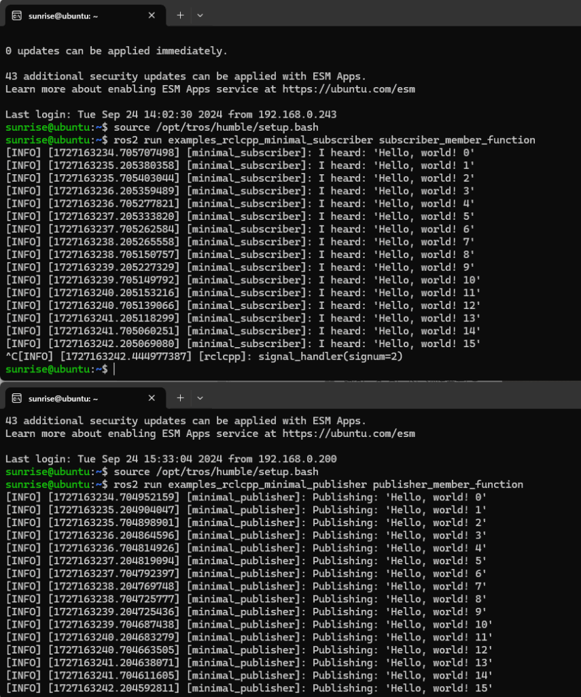
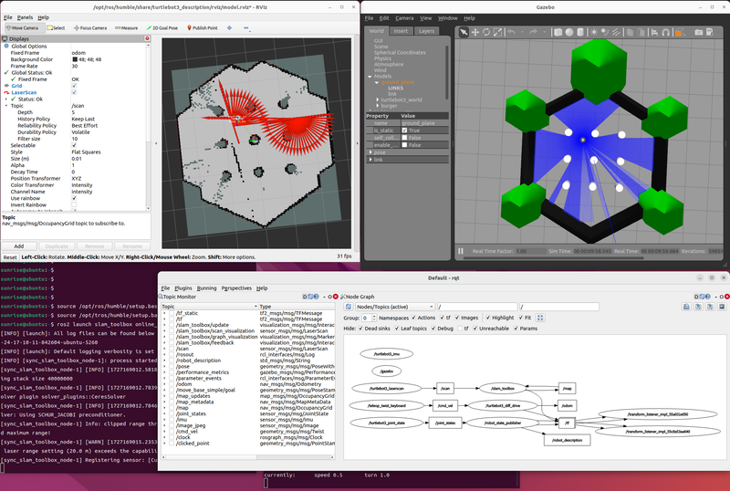
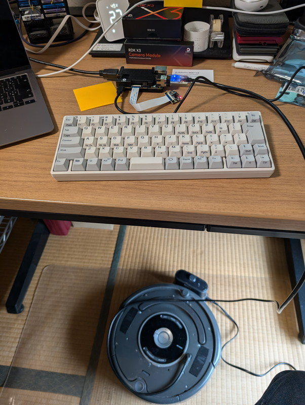
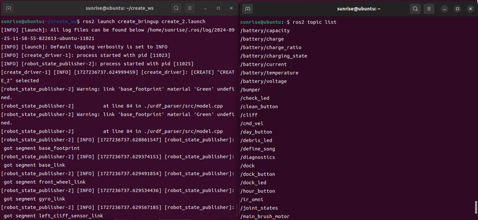
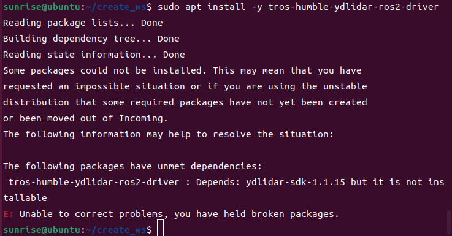
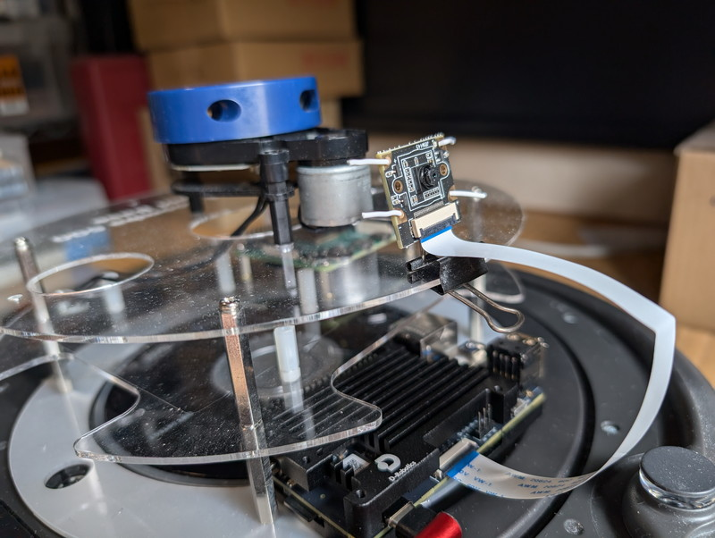
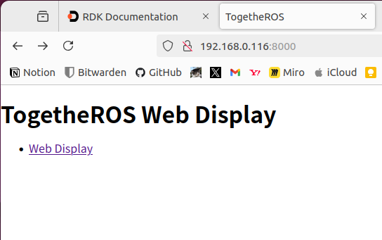

前回の記事では[D-Robotics RDK X3マイコンボードの概要](https://kanpapa.com/2024/09/rdk-x3-4g-board1.html)をまとめましたが、今回は実際にロボットアプリケーションを動かしてみます。

D-Robotics RDK X3の公式ドキュメントにはロボットアプリケーション開発について説明しているページがあります。

https://d-robotics.github.io/rdk\_doc/en/Robot\_development

ここで説明されているのはD-Robotics社がRDK用に開発した[TogetheROS.Bot](https://developer.d-robotics.cc/rdk_doc/en/Robot_development/tros)（略称はtros.b）とそのサンプルアプリケーションです。これまでのROS2の資産を生かしつつRDK X3が得意とする物体検出、画像分類、音声処理などが最適化された状態でアプリケーションから利用できる仕組みのようです。ROS2 Foxy/Humbleと完全互換とのことなので実際にサンプルアプリケーションを動かして使い勝手を確認してみます。

## tros.bパッケージのインストール

まずはtros.bパッケージをインストールします。OSがUbuntu 22.04ですので、ROS2 humbleの環境とします。

```
sudo apt update
sudo apt install tros-humble
sudo apt update
sudo apt upgrade
```

これで最新版のtros.bがインストールされます。

## Hello worldを動かす

引き続きドキュメントに従って必要なパッケージをインストールします。ros2 humbleのサンプルプログラムであるpublisherとsubscriberで通信テストを行うようです。

```
sudo apt update
sudo apt install ros-humble-examples-rclcpp-minimal-publisher ros-humble-examples-rclcpp-minimal-subscriber
```

ターミナルを2画面開いてコマンドを実行します。このプログラムはROS2のチュートリアルで試したことがあります。実際の動作画面です。



問題なくトピックの送受信ができていることがわかります。

ここで注意すべき点は source /opt/**tros**/humble/setup.bash としている点です。通常のROS2 humbleの場合は source /opt/**ros**/humble/setup.bash ですので、tros.bの環境でROS2のpublisherとsubscriberを動かしていることになります。

## RDK X3でSLAMを動かしてみる

サンプルアプリケーションにSLAMがありましたので試してみました。

https://d-robotics.github.io/rdk\_doc/en/Robot\_development/apps/slam

PCではGazeboによるロボットシミュレータとRviz2による可視化を行い、RDK X3でslam toolboxを動かす構成です。手順通りで問題なく動かすことができました。手順も source /opt/**tros**/humble/setup.bash とtros.bの環境にすることを除いて、ROS2 humbleで実行するときと同じコマンドラインです。

実行結果です。RDK X3でのSLAMでmapが生成できました。



## RDK X3でルンバを動かしてみる

ROS2 humbleと高い互換性がありそうなので、RDK X3にルンバ実機を接続してみることにしました。



ROS2 humbleでのルンバ実機の動かしかたは以下のGitHubにまとめていますので、これを参考にして環境設定を行います。

https://github.com/kanpapa/RoombaControlls/tree/humble-devel/ROS2

tros.bを使用するように source /opt/**tros**/humble/setup.bash と指定したこと以外は手順通りに進めることができました。実際にルンバのROS2ドライバをRDK X3で動作させた画面です。



実際にRDK X3で制御されているルンバの動画です。コマンドで連続してcmd\_velを送って動かしています。

https://www.youtube.com/watch?v=Ei\_oN0CyfvM

これに加えて、SLAMやNav2を行うときにはYDLIDAR X2を使用するので、[NodeHub](https://developer.d-robotics.cc/nodehub)で紹介されていた[YDLIDAR用のドライバパッケージ](https://developer.d-robotics.cc/nodehubdetail/167289845913411078)をインストールしたのですが、ydlidar-sdk-1.1.15パッケージが見つからずエラーとなってしまいました。



このため、今回はGitHubの手順書に記載しているYDLIDAR公式のドライバをtros.bの環境でビルドしました。試しにSLAMを少しだけ実行してみましたが問題なさそうです。


## 人についていくルンバをつくる

カメラモジュールを使ったアプリケーションが無いかと探したところ、Robot Follows the Human Bodyというアプリケーションがありました。

https://d-robotics.github.io/rdk\_doc/en/Robot\_development/apps/car\_tracking

サンプルアプリケーションはGazeboを使ったシミュレーションとなっていましたが、Gazeboの代わりにルンバ実機を使ってみることにしました。

少し工夫が必要だったのはルンバへのカメラモジュールの取り付けです。ルンバにLiDARを搭載するためのフレームをダブルクリップで挟んで取り付け台をつくりカメラを針金で固定しました。これで撮影角度も自在に変えることができます。



手順としてはGazeboを動かさずに、代わりにルンバのROS2ドライバを動かして、body\_trackingをlaunchするだけです。サンプルプログラムの変更は一切ありません。

ターミナルを2つ開いてRDK X3にログインし以下のように入力しました。

```
source /opt/tros/humble/setup.bash
ros2 launch create_bringup create_2.launch
```

```
source /opt/tros/humble/setup.bash
cp -r /opt/tros/${TROS_DISTRO}/lib/mono2d_body_detection/config/ .
export CAM_TYPE=mipi
ros2 launch body_tracking body_tracking_without_gesture.launch.py
```

カメラモジュールでどのように物体が認識されているかは、RDK X3の8000ポートにブラウザでアクセスすることでリアルタイム表示されます。ロボット開発者が必要とする機能が実装されていて好印象です。



実際にルンバを動作させながらスマートフォンで表示した画面です。人間のパーツが認識されています。この位置情報を使ってついてくる動きを制御します。


動作中の動画です。面白いくらいに人についていくことがわかります。反応も良いですね。

https://youtu.be/kpddnwHPiwY

参考までにrqtgraphです。頭にhobotやhbとあるところがtros.bの機能を使っているようです。


## まとめ

RDK X3が得意とするロボットアプリケーションを試してみました。D-Robotics社独自のtros.bはROS2と互換がありルンバのROS2ドライバやYDLIDARのドライバも通常のROS2 humbleのビルド手順で期待した動作をしてくれました。サンプルアプリケーションをそのまま使い、画像認識によるロボット制御も実行でき、スムーズな動きを見せてくれました。

まだ試していないロボットアプリケーションが残っていますが、これらのサンプルアプリケーションはロボットシミュレータのGazeboで動くようになっているので、Gazeboをルンバ実機に置き換えるだけでいろいろ試せるのがうれしいです。引き続きGazeboとルンバ実機で試してみます。

追記）この後に[D-Robotics RDK X3 でルンバを音声制御](https://kanpapa.com/2024/10/rdk-x3-roomba-voice-controlled-ros2.html)してみました。
