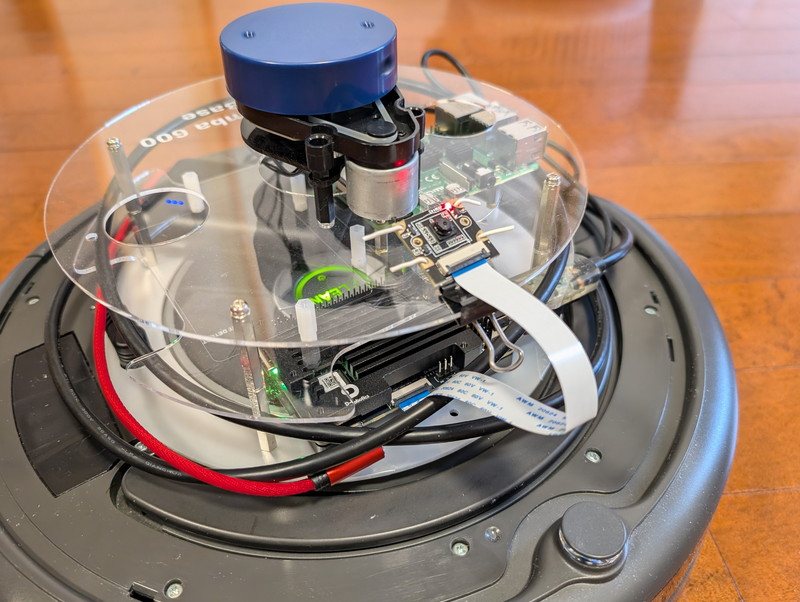
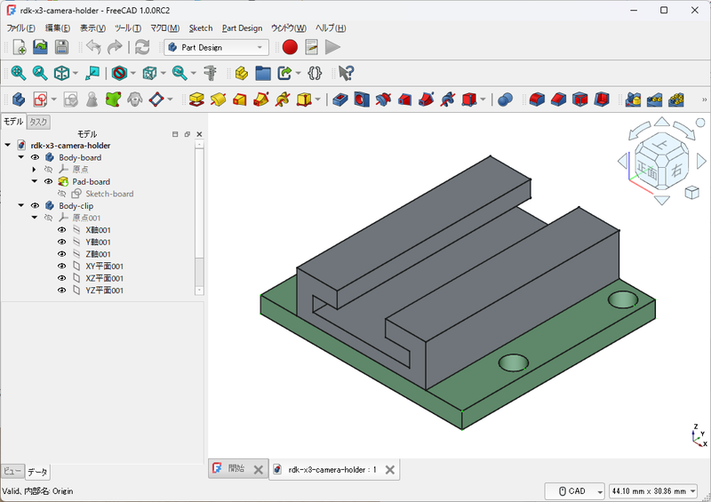
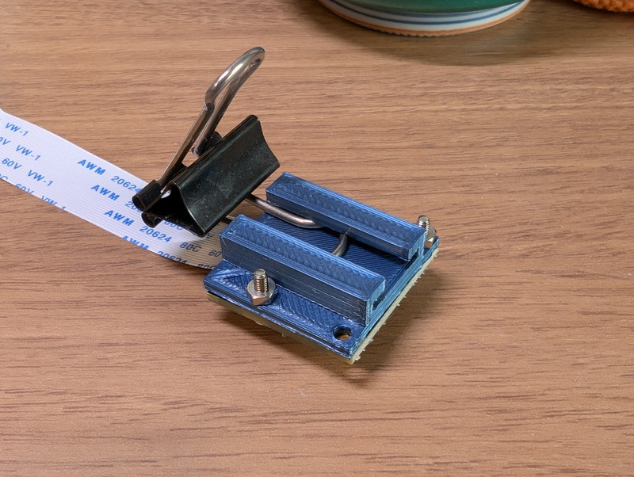

[RDK X3をルンバに搭載](https://kanpapa.com/2024/09/rdk-x3-roomba-controlled-ros2.html)したときに、暫定的な取り付け方法としてダブルクリップにカメラモジュールを針金で取り付けていました。

実はこれは結構便利なのではないかと思い、3Dプリンタでダブルクリップで固定できるカメラホルダーを作ってみました。

## 3Dプリンタでカメラホルダーを作る

まずは頭に浮かんだイメージを[FreeCAD](https://www.freecad.org/)で3Dデータにしました。[RDK X3カメラモジュール](http://ssci.to/9838)の寸法図はスイッチサイエンスさんのサイトにあったものを参考にしました。ダブルクリップの寸法はノギスで測定し、何度か3Dプリンタで出力してダブルクリップに固定できるように調整しました。

3Dプリンタで出力したホルダーです。まだサポートがついたままですが、これを綺麗に切り離しました。

## カメラホルダーへの取り付け

カメラモジュールを2mmのネジで固定し、ダブルクリップを取り付け部に差し込み固定します。

ダブルクリップだけでも簡易的な固定台にはなりますが、少し触ると倒れます。ダブルクリップの針金は動きますので角度の調整はしやすいです。

何かをクリップに挟んで固定すると安定します。この状態で画像認識などの実験を行っています。

## FreeCADで作成したデータ

FreeCADで作成したCADデータはGitHubにあげておきました。私の3Dプリンタで出力したときにちょうど良いように調整していますので、細かい寸法は3Dプリンタで出力しながら調整いただくのが良いです。

https://github.com/kanpapa/rdk-x3

## まとめ

簡易的な固定方法にはなりますが、3Dプリンタが手元にあるとこのようなツールが簡単に作れるので便利です。今回はRDK X3 カメラモジュールに対応していますが、Raspberry Pi カメラもほぼ同じサイズなので使えるかもしれません。
