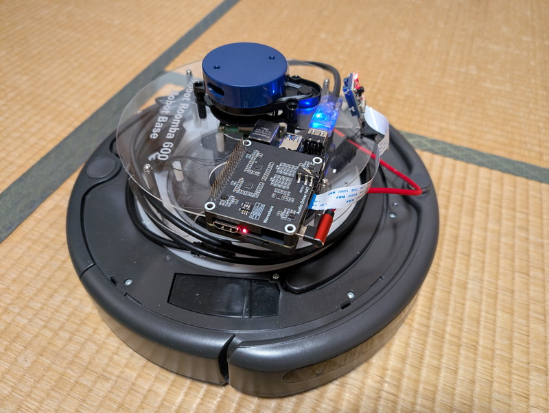

D-Robotics RDK X3のRoboticsサンプルプログラムには音声でロボットを制御するものがあります。これを試してみました。

## 音声入出力モジュールを選ぶ

RDK X3のドキュメントによるとRDK X3でサポートしている音声入出力モジュールは以下の２つがあります。いずれもWaveshare社製です。

- [Audio Driver HAT REV2](https://www.waveshare.com/wiki/Audio_Driver_HAT)
- [WM8960 Audio HAT](https://www.waveshare.com/wiki/WM8960_Audio_HAT)

WM8960 Audio HATはRaspberry Pi用に設計された汎用的なもので2チャンネルマイクが搭載されています。Audio Driver HAT REV2はRDK用に設計されていて４チャンネルマイクがあり、音声が360度のどの方向から聞こえてくるかがわかるようです。今回は高機能なAudio Driver HAT REV2をオーダーしてみました。

製品の詳細やRDK X3でのセットアップ情報は以下のドキュメントページにまとまっています。（ブラウザの翻訳機能で日本語にして読んでいます）

https://d-robotics.github.io/rdk\_doc/en/Basic\_Application/audio/audio\_board\_x3\_md

## Audio Driver HATを接続する

到着したAudio Driver HAT REV2.1です。輸送中にピンが少し曲がってしまったようですが、このくらいであれば修正できます。


RDK X3のケースの上にぴったりと取り付けることができました。


## 音声認識でロボットシミュレータを動かす

まずはドキュメントのサンプルプログラムに従ってGazeboシミュレーターを音声で制御してみます。

https://d-robotics.github.io/rdk\_doc/en/Robot\_development/apps/car\_audio\_control

このサンプルプログラムでは中国語しか対応していないようなので、Google翻訳の音声出力を使用して動作確認を行いました。中国語の音声の命令通りに左右に動くことがわかります。

https://youtu.be/D0ODMQSckUs

英語での認識はできないのかなと、キーワードリストに英語を入れてみました。

```
[hobot_audio-1] hrsc sdk wakeup word is:
[hobot_audio-1] {
[hobot_audio-1]     "cmd_word": [
[hobot_audio-1]         "地平线你好",
[hobot_audio-1]         "向前走",
[hobot_audio-1]         "向后退",
[hobot_audio-1]         "向左转",
[hobot_audio-1]         "向右转",
[hobot_audio-1]         "停止运动",
[hobot_audio-1] 	"你好",     ←試しに追加
[hobot_audio-1] 	"再见",     ←試しに追加
[hobot_audio-1] 	"wifi",     ←試しに追加
[hobot_audio-1] 	"internet"  ←試しに追加
[hobot_audio-1]     ]
[hobot_audio-1] }
```

英語は残念ながらoov(Out of Vocabulary)となってしまいました。

```
[hobot_audio-1] [WARN] [1728804510.117729212] [hobot_audio]: start to capture audio
[hobot_audio-1] I20241013 15:28:30.573455  7022 context_graph.cc:95] Num of contexts: 10
[hobot_audio-1] W20241013 15:28:30.573650  7022 context_graph.cc:37] INTERNET is oov.
[hobot_audio-1] W20241013 15:28:30.573678  7022 context_graph.cc:104] Ignore unknown unit found during compilation.
[hobot_audio-1] W20241013 15:28:30.573697  7022 context_graph.cc:37] WIFI is oov.
[hobot_audio-1] W20241013 15:28:30.573710  7022 context_graph.cc:104] Ignore unknown unit found during compilation.
```

試しに追加した中国語の「再见」や「你好」は認識していました。

```
[hobot_audio-1] recv hrsc sdk command data: 再见
[hobot_audio-1] [WARN] [1728804552.679160353] [hobot_audio]: recv cmd word:再见
[hobot_audio-1] recv hrsc sdk doa data: 340
[hobot_audio-1] recv hrsc sdk command data: 你好
[hobot_audio-1] [WARN] [1728804571.841200623] [hobot_audio]: recv cmd word:你好
[hobot_audio-1] recv hrsc sdk doa data: 335
```

中国語以外での音声認識は学習モデルを入れ替える必要がありそうです。

## ルンバを音声認識で制御してみる

Gazeboシミュレーターが動作したのであれば、ルンバも制御できるはずです。Audio Driver HATを搭載したRDK X3をルンバに接続して試してみました。



RDK X3にsshでリモートログインしてターミナルを２つ開き、以下のコマンドを入力しました。

ターミナルを2つ開いてRDK X3にログインし以下のように入力しました。

```
source /opt/tros/humble/setup.bash
ros2 launch create_bringup create_2.launch
```

```
source /opt/tros/humble/setup.bash
ros2 launch audio_control audio_control.launch.py
```

実際にRDK X3とAudio Driver HATとルンバだけで動作している様子です。操作のための中国語音声はPCのブラウザでGoogle翻訳をつかって出力しています。

https://youtu.be/MwVNIX19Ya4

RDK X3のログは以下のように出力されていました。なお、doa dataの数字は音声が聞こえる方向を示しています。

```
[hobot_audio-1] [WARN] [1729236247.826063427] [hobot_audio]: recv cmd word:向左转
[hobot_audio-1] recv hrsc sdk doa data: 280
[hobot_audio-1] recv hrsc sdk command data: 向右转
[hobot_audio-1] [WARN] [1729236250.801982982] [hobot_audio]: recv cmd word:向右转
[hobot_audio-1] recv hrsc sdk doa data: 0
[hobot_audio-1] recv hrsc sdk command data: 向右转
[hobot_audio-1] [WARN] [1729236253.697065394] [hobot_audio]: recv cmd word:向右转
[hobot_audio-1] recv hrsc sdk doa data: 355
[hobot_audio-1] recv hrsc sdk command data: 向右转
[hobot_audio-1] [WARN] [1729236257.913281499] [hobot_audio]: recv cmd word:向右转
[hobot_audio-1] recv hrsc sdk doa data: 280
[hobot_audio-1] recv hrsc sdk command data: 向前走
[hobot_audio-1] [WARN] [1729236261.495394311] [hobot_audio]: recv cmd word:向前走
[hobot_audio-1] recv hrsc sdk doa data: 355
[hobot_audio-1] recv hrsc sdk command data: 向前走
[hobot_audio-1] [WARN] [1729236264.403530427] [hobot_audio]: recv cmd word:向前走
[hobot_audio-1] recv hrsc sdk doa data: 355
[hobot_audio-1] recv hrsc sdk command data: 向前走
```

ルンバ本体と音声を出しているPCとの距離は少し離れているのですが、このように十分認識してくれるようです。

## まとめ

中国語での音声認識によるルンバ実機の制御ができました。中国語以外にも対応したいので学習モデルを入れ替えてみたいところです。ログメッセージなどから[WENETのHorizon BPU runtime](https://github.com/wenet-e2e/wenet/tree/main/runtime)を使用しているようなので、こちらを調査している最中ですが、なかなか手ごわそうなので、できればメーカーから英語版の音声制御のデモアプリケーションも提供いただけるとありがたいです。
