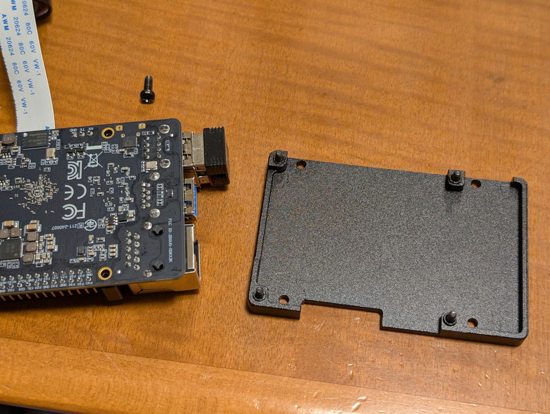
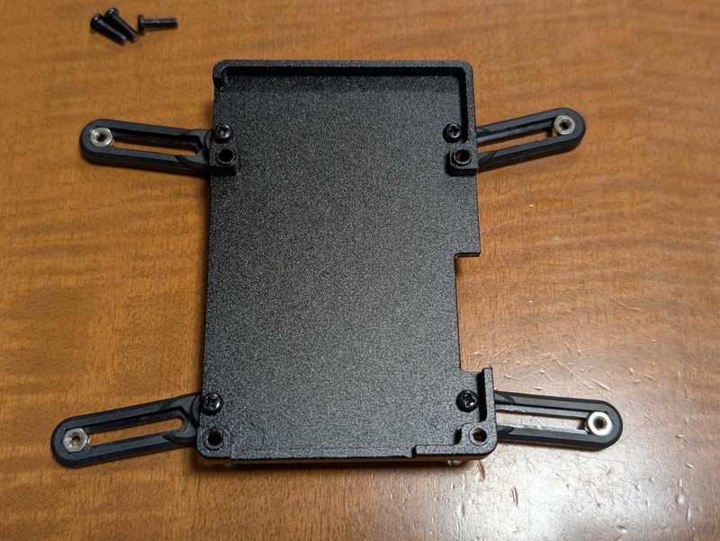
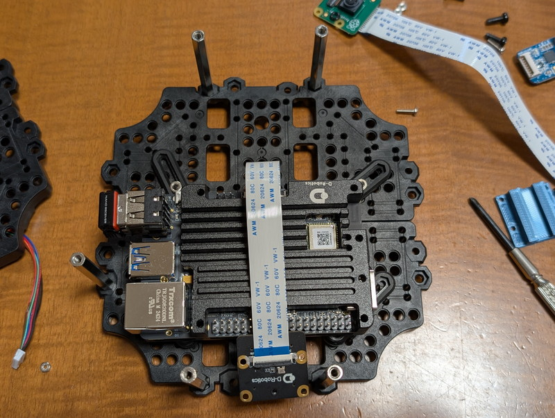
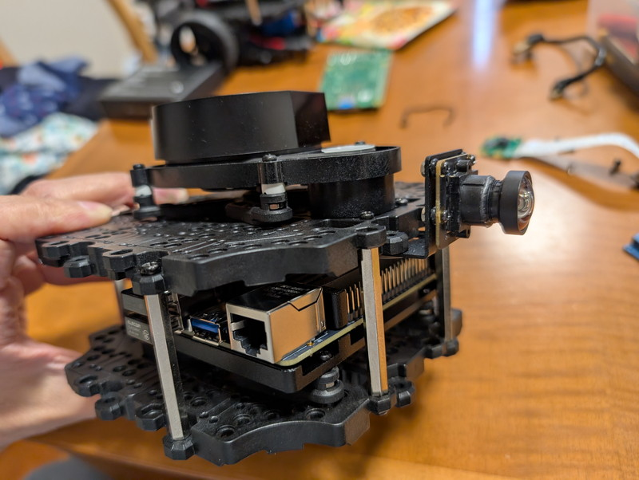
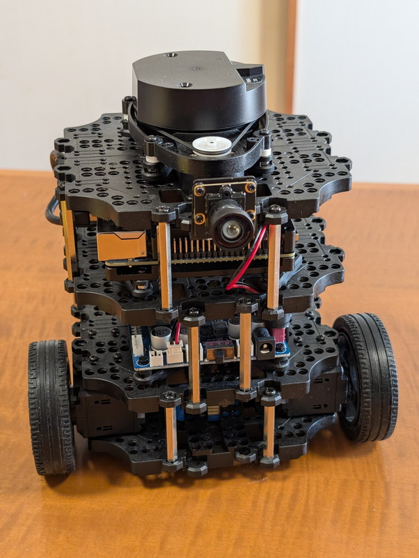

[D-Robotics RDK X3](https://developer.d-robotics.cc/rdkx3)を使っていろいろ試してみますが、机の上で走行できるコンパクトなロボット環境があると良いなということで、[TurtleBot3](https://www.turtlebot.com/turtlebot3/)にRDK X3を搭載してみました。TurtleBot3は標準ではRaspberry Pi 3または4を使用しているので、これをRDK X3に置き換えることで5 TOPSの性能にアップグレードできます。

## TurtleBot3とは

TurtleBot3とは、ROSでリファレンスモデルとして公式にサポートされているRobotis社製の小型ロボットです。柔軟な拡張性があり様々な方法でカスタマイズできます。本体にはROS2が稼働するRaspberry Piマイコンボードに加え、モーターやセンサーの制御用のOpenCRマイコンボード、LiDAR、高性能サーボモーターDYNAMIXELが搭載されています。LiDARが搭載されていますので、SLAMやNavigationといった自律走行もできますし、カメラの搭載も可能です。詳細はe-manualにまとまっています。

https://emanual.robotis.com/docs/en/platform/turtlebot3/overview

## RDK X3の取り付け

RDK X3はRaspberry Piに似ているマイコンボードですので、交換は簡単かなと思っていたのですが、RDK X3は発熱も大きいため専用のケースで放熱を行っています。


標準搭載のRaspberry Piは写真のように放熱フィンを取り付けた状態で基板をネジ止めしています。


RDK X3は専用ケースに格納していますので、RDK X3の基板を直接ネジ止めすることはできません。良い取り付け方法がないかと確認してみると、ケースの底に穴が4か所開いていました。



これを利用してネジ止めができそうです。3Dプリンタで固定用の部品を製作することも考えたのですが、Raspberry Piを固定している部品がそのまま使用できそうです。


この4つの部品を取り外して、RDK X3ケースに軽くネジ止めします。きつく締めてしまうとあとで位置の調整ができないためです。



この状態で、RDK X3をケースにいれてケースを組み立てると次の写真のようになります。


これで4本の足は自由に動きますのでTurtleBot3に固定できそうです。カメラモジュールの取り付けも考えて、次の写真のようにRDK X3を仮止めしました



RDK X3カメラモジュールはRaspberry Piカメラモジュールと同じ寸法なので、こちらは問題なく取り付けができました。ケーブルの長さもぴったりでした。



RDK X3への電源供給はRaspberry Piの時と同様に40P拡張コネクタから行います。ピン配置もRaspberry Piと同じですので4番ピンをVDD +5V、6番ピンをGNDに接続しています。

これでもう一度TurtleBot3を組み立て直して、RDK X3搭載のTurtleBot3が完成しました。



このようにTurtleBot3は柔軟性があるので良いですね。取り付け位置の微調整も容易になるようにうまく設計されています。

## ソフトウェアのセットアップ

次にソフトウェアのセットアップを行なっていきます。Raspberry Pi用のセットアップ手順は公式マニュアルのQuick Start Guideにまとまっています。今回はhumbleを使います。

https://emanual.robotis.com/docs/en/platform/turtlebot3/quick-start

RDK X3のセットアップは、[3.2 SBC Setup](https://emanual.robotis.com/docs/en/platform/turtlebot3/sbc_setup/#sbc-setup)に従って作業を進めます。RDK X3ではUbuntu 22.04のイメージが配布されていますので、これをそのまま使うことで、12. Install ROS2 Humble Hawksbill までの手順はスキップできます。このため、13.Install and Build ROS Packages から作業を進めていきます。変更すべき点は[ルンバを動かしたとき](https://kanpapa.com/2024/09/rdk-x3-roomba-controlled-ros2.html)と同様に

```
source /opt/ros/humble/setup.bash
```

を

```
source /opt/tros/humble/setup.bash
```

とするだけです。他はそのまま実行すれば問題ありません。

## 動作確認

### Turtlebot3のBringup

Quick Start Guideの[3.5 Bringup](https://emanual.robotis.com/docs/en/platform/turtlebot3/bringup/#bringup)に従って作業を進め、何の問題もなくturtlebot3ドライバを起動することができました。

```
$ export TURTLEBOT3_MODEL=burger
$ ros2 launch turtlebot3_bringup robot.launch.py
```


トピックも正常に流れてます。これでRDK X3のROS humbleでTurtleBot3が動き始めました。


### キーボードでの動作確認

実際に車輪が動くかどうかをキーボード入力で確認します。Quick Start Guideの3.6 Basic Operationの[3.6.1.1 Keyboard](https://emanual.robotis.com/docs/en/platform/turtlebot3/basic_operation/#keyboard)を行います。

```
$ ros2 run turtlebot3_teleop teleop_keyboard
```

D-robotics RDK X3を載せたturtlebot3がキーボードの指示通りに問題なく動きました。

https://youtu.be/kR93CRkBfwI

## 応用例

モーター制御はKeyboardで確認できましたので、LiDARの動作とRDK X3が得意とする画像認識を確認してみます。

### SLAMで地図作成

LiDARの動作を確認するために、Quick Start Guideの[4.SLAM](https://emanual.robotis.com/docs/en/platform/turtlebot3/slam/) を実行してみました。画面写真にあるようにLiDARの点群も表示されて地図の生成ができています。


### ジェスチャーでの制御

次はRDK X3の画像認識の機能を使い、手のジェスチャーでの制御を行ってみます。RDK X3の公式ドキュメントにある[5.4.5 Gesture Control The Car](https://d-robotics.github.io/rdk_doc/en/Robot_development/apps/car_gesture_control)を実行しました。左手で撮影しながら机の上で実験しましたのでやや反応が鈍いように見えますが、RDK X3カメラと手の位置が適正であれば正しく動いてくれます。

https://youtu.be/ffh\_8o9Sb3c

## まとめ

ここまではRDK X3搭載のTurtleBot3は良好に動いているように見えます。次はバッテリーでの動作確認を行い、床面で各種ROSアプリケーションの実験をしてみます。

あとは、RDK X3のリファレンスロボットである[Originbot](http://www.originbot.org)とこのTurtleBot3を比べるとどう違うのかが少し気になります。そのうちOriginbotのレポートが出てくると思いますので楽しみです。
