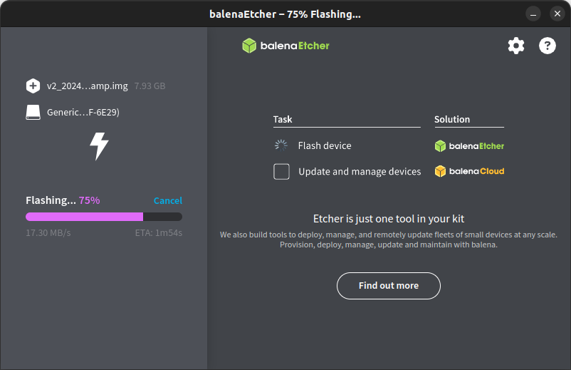
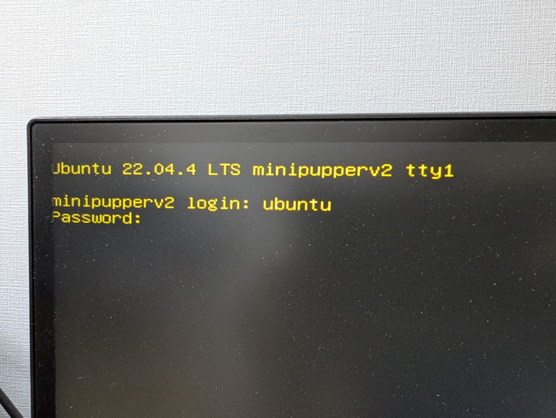
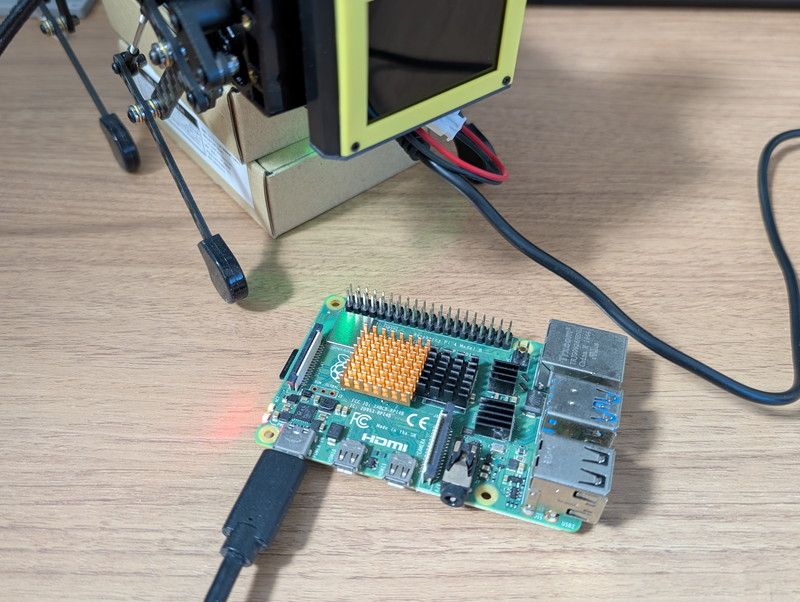

[私のMini Pupper 2](https://kanpapa.com/2025/02/mini-pupper-2-makuake.html)のROS2 Humbleは2023年11月の状態のままでしたので、現在提供されている2024-06-18版のROS2 Humbleのイメージにアップデートしてみました。

現在は日本語のマニュアルが提供されていましたので、こちらのROS2ガイドの手順に沿って進めました。なお[キャリブレーションまではすでに済んでいる状態](https://kanpapa.com/2024/02/mini-pupper-2-6-final-assembly.html)です。

https://minipupperdocs.readthedocs.io/ja/latest/guide/ROS2Guide.html

基本的にはこのガイドの通りで問題ないのですが、注意すべき点がいくつかあったのでそれも記載しておきます。

## インストール

### PCのセットアップ

Mini Pupper 2をリモート制御するためにUbuntu 22.04がインストールされているPCが必要です。「1.1 ROS2 Humbleのインストール」から「1.4 ロボットモデルのエクスポート」まではガイド通りで問題ありませんでしたので、ガイド通り操作すればPCのセットアップは完了です。

### ミニぷぱ２のセットアップ

#### イメージファイルの入手

ガイドに記載されているビルド済のMini Pupper 2用ROS2イメージをダウンロードしました。ファイル名は以下の通りです。

- 20240618\_MD-Puppy2\_ROS2Humble\_Ubuntu22.04.img.zip　(2.54GB)

次に新しいmicroSDカードを用意してこのイメージファイルをbalenaEtherで書き込みます。書き込みかたはガイドの通りです。私の場合は32GBのmicroSDカードに書き込みました。



#### Wi-Fi設定

ガイドの「2.2 Wi-Fi設定」に従って書き込んだmicroSDカードをミニぷぱ２のカードスロットに差し込みWiFi設定を行うのですが、電源を入れる前に写真のようにmicroHDMIケーブルでディスプレイに接続し、USBキーボードをUSB端子に取り付けないとミニぷぱ２にログインしての編集はできません。


この状態で電源を投入すると、Ubuntuが起動しますのでログインして、ガイドにあるように /etc/netplan/50-cloud-init.yaml にWiFiのSSIDとキーフレーズを設定します。



編集後に以下のコマンドを入力すると記載がありますが、私はsudo apt updateとsudo apt upgradeはここでは行いませんでした。

```
sudo netplan apply
sudo apt update
sudo apt upgrade
reboot
```

microSDカードに書き込んだイメージファイルは少し前のものですので、このままアップデートを実行してしまうと、初回のためアップデートが長時間になるためです。バッテリーで動かした場合、万が一途中でバッテリー切れとなるとファイルシステムが損傷してやり直しとなる可能性があります。

そのため、ここではWiFi接続を行う以下のコマンドだけを実行しました。

```
sudo netplan apply
reboot
```

この状態でミニぷぱ２が再起動し、Wi-Fiに接続できIPアドレスが取得できたら、写真のようにIPアドレスが表示されます。


アップデートはどこかで実施する必要がありますが、私の場合は安全のためにUSB電源に接続されたRaspberry Pi 4で行うことにしました。これで電源の心配もなくゆっくりアップデートできます。



ミニぷぱ２にログインして、シャットダウンし、microSDカードを取り外し、別のRaspberry Pi 4にセットして起動、ログインしたあとに以下のコマンドを実行しました。

```
sudo apt update
sudo apt upgrade
```


アップデートが終わったら再びRaspberry Pi 4をシャットダウンして、microSDカードをミニぷぱ２にセットします。

#### ロボットモデルの設定

ここはガイドの「2.3 ロボットモデルの設定」の通りに進めれば問題ありません。

### ミニぷぱ２とPCの接続

ここもガイドの「3. ミニぷぱとPCの接続」の通りに進めれば問題ありません。

## クイックスタート

私はジョイスティックをもっていないのでキーボードから操作を行うことにしました。そのため、「2. 起動」から進めました。

### 起動

最初にPCからミニぷぱ２にsshでログインして、mini\_pupper\_bringupを起動します。

```
ubuntu:~$ ssh ubuntu@192.168.0.113
ubuntu@192.168.0.113's password: 
Last login: Tue Feb  4 04:24:04 2025 from 192.168.0.126
ubuntu@minipupperv2:~$ . ~/ros2_ws/install/setup.bash
ubuntu@minipupperv2:~$ ros2 launch mini_pupper_bringup bringup.launch.py
```

リモート制御用のPCでトピック一覧とサービス一覧を確認します。ガイドと同じ表示ができれば正常です。

```
ubuntu:~$ ros2 topic list 
/base_to_footprint_pose
/body_pose
/cmd_vel
/diagnostics
/foot
/foot_contacts
/imu/data
/joint_group_effort_controller/joint_trajectory
/joint_states
/odom
/odom/local
/odom/raw
/parameter_events
/robot_description
/rosout
/scan
/set_pose
/tf
/tf_static
ubuntu:~$ ros2 service list
/LD06/describe_parameters
/LD06/get_parameter_types
/LD06/get_parameters
/LD06/list_parameters
/LD06/set_parameters
/LD06/set_parameters_atomically
/base_to_footprint_ekf/describe_parameters
/base_to_footprint_ekf/get_parameter_types
/base_to_footprint_ekf/get_parameters
/base_to_footprint_ekf/list_parameters
/base_to_footprint_ekf/set_parameters
/base_to_footprint_ekf/set_parameters_atomically
/enable
/footprint_to_odom_ekf/describe_parameters
/footprint_to_odom_ekf/get_parameter_types
/footprint_to_odom_ekf/get_parameters
/footprint_to_odom_ekf/list_parameters
/footprint_to_odom_ekf/set_parameters
/footprint_to_odom_ekf/set_parameters_atomically
/imu_interface/describe_parameters
/imu_interface/get_parameter_types
/imu_interface/get_parameters
/imu_interface/list_parameters
/imu_interface/set_parameters
/imu_interface/set_parameters_atomically
/quadruped_controller_node/describe_parameters
/quadruped_controller_node/get_parameter_types
/quadruped_controller_node/get_parameters
/quadruped_controller_node/list_parameters
/quadruped_controller_node/set_parameters
/quadruped_controller_node/set_parameters_atomically
/robot_state_publisher/describe_parameters
/robot_state_publisher/get_parameter_types
/robot_state_publisher/get_parameters
/robot_state_publisher/list_parameters
/robot_state_publisher/set_parameters
/robot_state_publisher/set_parameters_atomically
/servo_interface/describe_parameters
/servo_interface/get_parameter_types
/servo_interface/get_parameters
/servo_interface/list_parameters
/servo_interface/set_parameters
/servo_interface/set_parameters_atomically
/set_pose
/state_estimation_node/describe_parameters
/state_estimation_node/get_parameter_types
/state_estimation_node/get_parameters
/state_estimation_node/list_parameters
/state_estimation_node/set_parameters
/state_estimation_node/set_parameters_atomically
/toggle
ubuntu:~$
```

### 遠隔操作

リモート制御用のPCで以下のコマンドを入力します。

```
ubuntu:~$ . ~/ros2_ws/install/setup.bash
ubuntu:~$ ros2 run teleop_twist_keyboard teleop_twist_keyboard

This node takes keypresses from the keyboard and publishes them
as Twist/TwistStamped messages. It works best with a US keyboard layout.
---------------------------
Moving around:
   u    i    o
   j    k    l
   m    ,    .

For Holonomic mode (strafing), hold down the shift key:
---------------------------
   U    I    O
   J    K    L
   M    <    >

t : up (+z)
b : down (-z)

anything else : stop

q/z : increase/decrease max speeds by 10%
w/x : increase/decrease only linear speed by 10%
e/c : increase/decrease only angular speed by 10%

CTRL-C to quit

currently:	speed 0.5	turn 1.0 
```

この状態で、「i」「j」「l」「,」「k」のキーを押すことで上下左右・停止ができます。

https://youtu.be/sM9j-B0Yu0U

動画のようにキーボード操作で思うようにミニぷぱ２が動けばROS2のセットアップは完了です。

## まとめ

これでミニぷぱ2がROS2によって制御できるようになりました。ROS2は様々な便利な機能がありますので、引き続きSLAM、ナビゲーションを試してみます。
