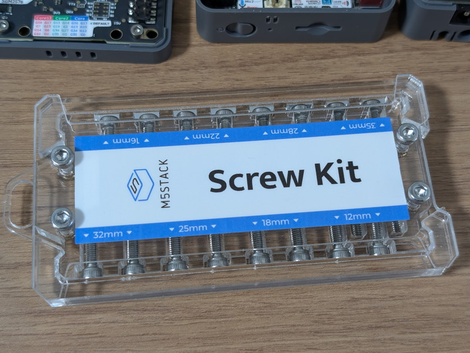
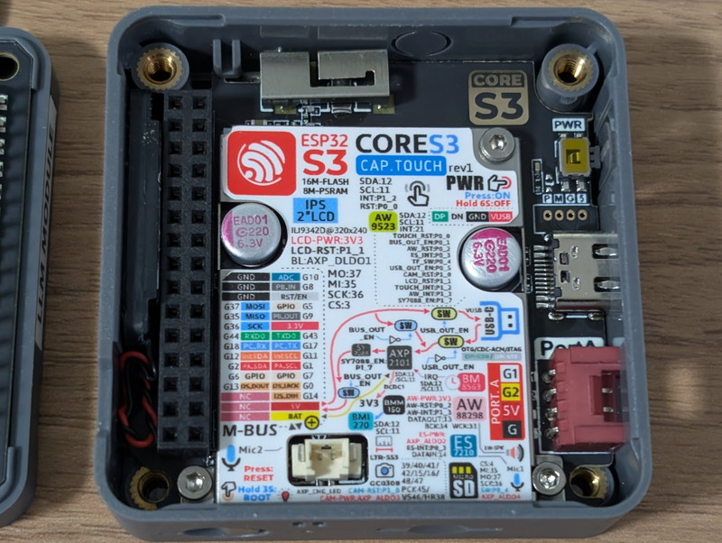
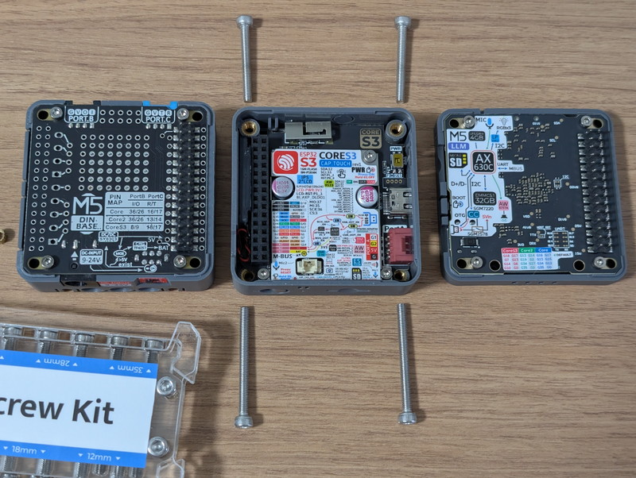
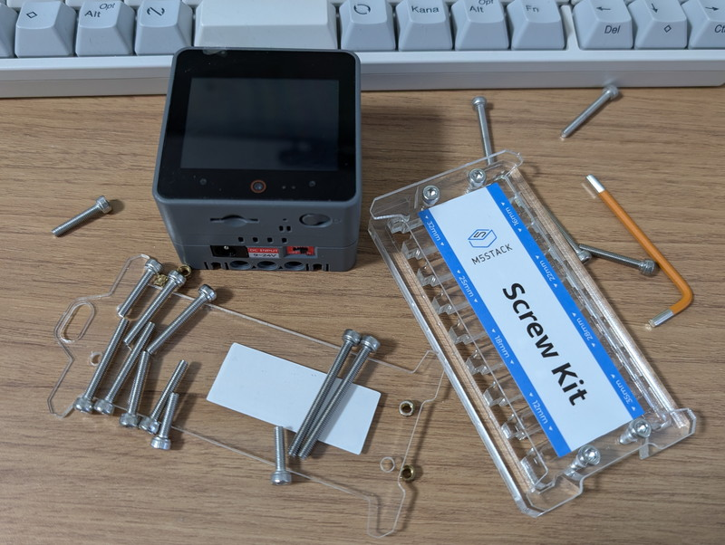

M5CoreS3にLLMモジュールを取り付けるためにはM5CoreS3とDIN BASEを固定しているネジを外す必要があります。LLMモジュールを追加するとネジの長さが当然足りなくなり固定できません。特にネジで固定しなくても問題はないのですが、少し浮いてしまうのが気になるのと、何かのはずみで外れないか心配なので別途購入した[Screw Kit](https://docs.m5stack.com/ja/accessory/screw)のネジで固定してみました。

## M5Stackのネジの入手

M5Stackを固定するためのネジは[Screw Kit](https://docs.m5stack.com/ja/accessory/screw)として販売されています。

別にこのネジを使わなくても通常のM3ネジでも良いのですが、カッコいいのと様々な長さが揃っているので今後も組み合わせて使うだろうとこれを使いました。

## ネジの長さをどう決めるか

LLMモジュールを追加したときのネジの長さはどう決めればいいのかなと、ChatGPTに聞いてみたところ、最初に付属していたネジのサイズを基準とし、追加モジュールの厚み分だけ長いネジを使えば良いとのこと。確かにそうですね。

M5CoreS3はDIN BASEとセットになっていて、これを固定しているネジは25mm 2本と20mm 2本です。なぜ長さが違うのかはM5CoreS3の上側2つのネジ穴と下側2つのネジ穴の位置が異なるためです。写真をみると下側のネジ穴が奥にあるのがわかりますが、このため下側のネジが長くなります。

## LLMモジュールの厚さからネジの長さを求める

今回取り付けたLLMモジュールの厚みをノギスで計測したところ6.7mmでした。

このため必要なネジの長さは以下のようになります。

- 25mm（元のネジ） + 6.7mm（LLMの厚み） = 31.7mm
- 20mm（元のネジ） + 6.7mm（LLMの厚み） = 26.7mm

Screw Kitで一番長さが近いネジとしてまずは32mmと25mmで試してみました。上側が短いネジ25mmで下側が長いネジ32mmです。

実際に試したところ、長いネジ32mmはちょうど良いのですが、短いネジ25mmは空回りしてしまいました。このため28mmにしたところ固定することができました。

## 結果

M5CoreS3 + DIN BASEにLLMモジュールを取り付けるときのネジの長さは

- 32mm × 2本
- 28mm × 2本

でした。

無事M5CoreS3とLLMモジュールがネジでしっかりと固定できました。他のモジュールでも考え方は同じですので、参考にしてください。
