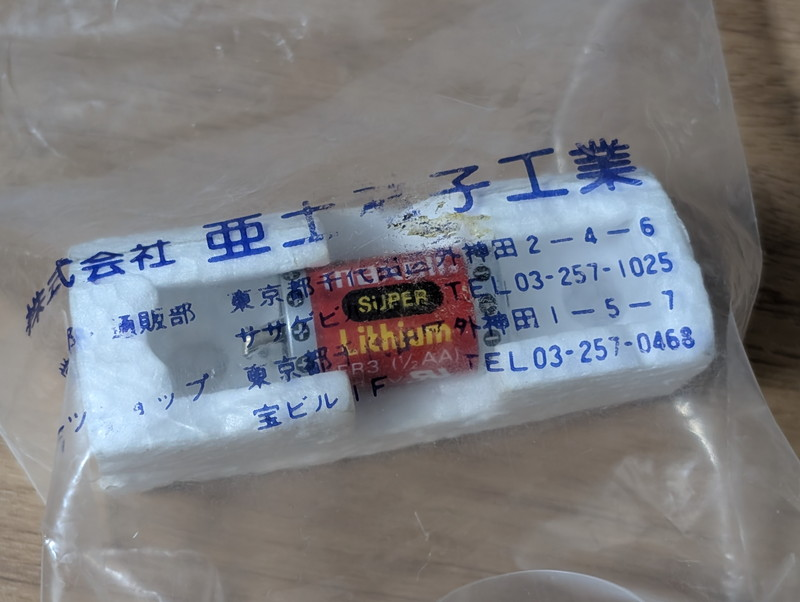
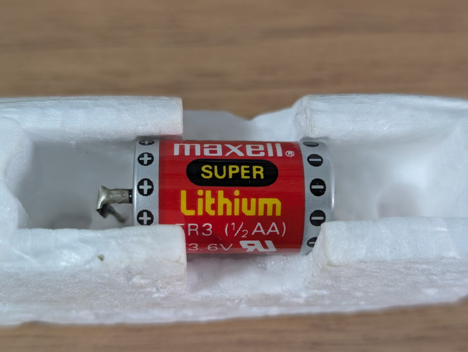
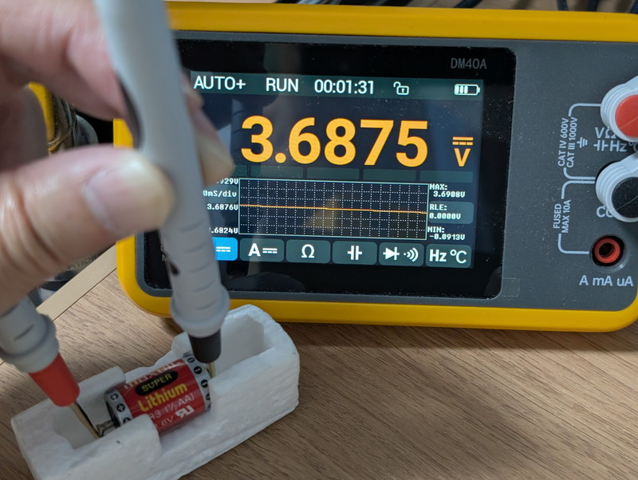
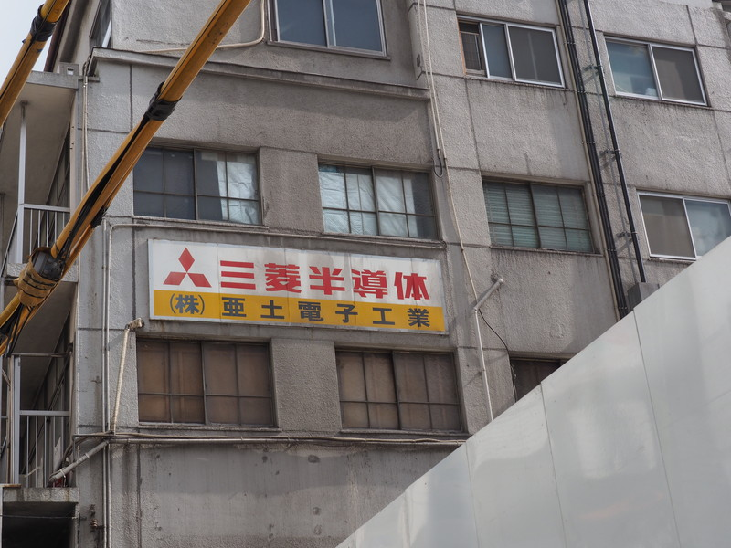

SUPER AKI-80の基板にはBTというパターンがあります。どうやらこれはメモリのバックアップ用電池を取り付けるためのようです。薄っすらとここに合うバッテリーを持っていたような記憶があります。

## 亜土電子工業で購入したリチウムバッテリー

パーツ箱をひっくり返して探してみたところリチウムバッテリーが見つかりました。しかも亜土電子工業の袋に入っています。たぶん1980年代に秋葉原にあったADOパーツショップで購入したものをそのまま保管していたのでしょう。

袋から取り出してみました。これは一度も使用したことはないと思います。

古いものなので流石にもう電圧が降下しているだろうとDMMで計測したところ、なんと定格の3.6Vを維持していました。

未使用品ですが、ある程度劣化していると思っていたので驚きました。

## 実は39年前のものだった

梱包材からバッテリーを取り出してよく見ると年月が86-03と記載されていました。

1986年3月が製造年月なのか最大使用期限なのかはわかりませんが、39年前のものであることは間違いありません。

SUPER AKI-80に取り付けるのはもう少し先にすることにします。

## おまけ

おまけで外神田1丁目エリアの大規模再開発で出現した亜土電子工業の看板の写真を載せておきます。ADOパーツショップはこの宝ビルの1階でしたね。

