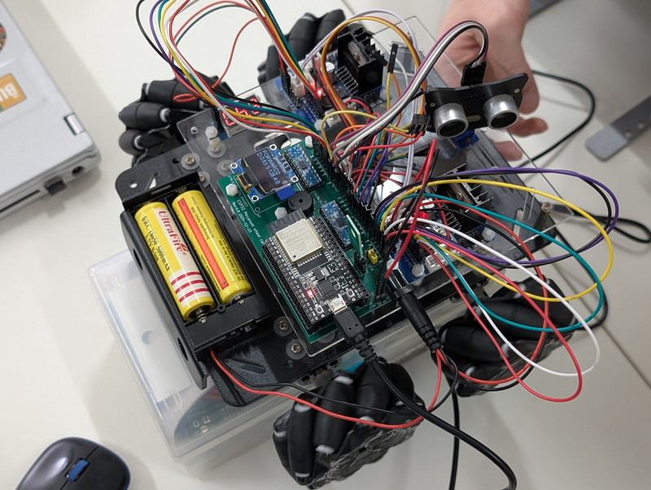
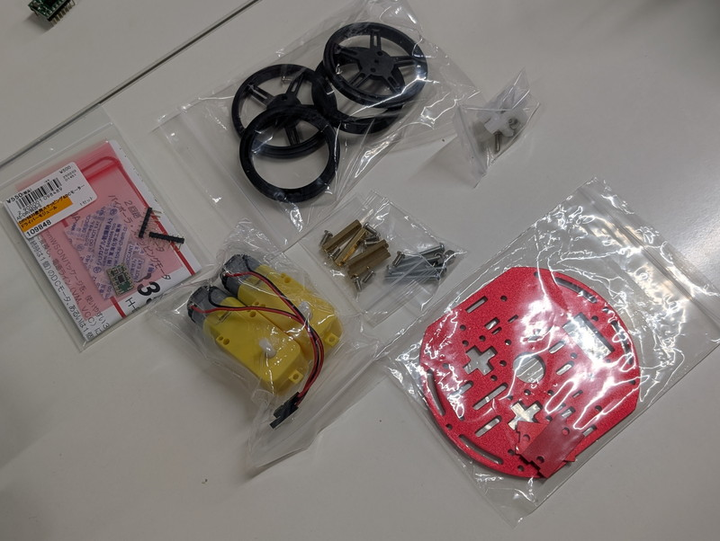

[おおたfab](https://ot-fb.com/event)さんでは電子工作初心者勉強会を定期的に開催しています。

これまでは[Arduino MEGAで制御していたメカナムホイールをESP32 DevkitCに置き換えて動かす実験](https://kanpapa.com/2023/12/otafab-esp32-mecanum1.html)をしていました。一通り動くようになったので、今後は別のテーマに取り組んでいくことになりました。

## まずはアイデア出しから

まずは勉強会の参加者でディスカッションから始めました。あがった意見としては、

- やはり動くものが良い→ESP32でモーターを動かす
- 参加者全員が試せるようにしたい→手軽に用意できる材料で
- 目的を決めたい→ゴールを明確にしてそれに取り組みたい
- ネットワークを使うか？
- 画像系を使う。カメラをつけてみる
- ２台でついていく
- 物体を追いかける→もし、画像認識を行うときはRaspberry Piへのアップグレードも必要かも。

いろいろなアイデアがありましたが、まずは「手軽に試せて動くもの」ということで、メカナムホイールよりは小回りが利く小さい車を動かして、それをベースに機能を追加していくことになりました。

## ベースとなる筐体を探す

これまでの製作のベースとなったメカナムホイールはおおたfabさんで以前購入したキットを使わせてもらっていました。



写真のようにややサイズが大きいため、今よりもう少し小型で手軽に扱えるものをウェブサイトで探したところ、秋月電子さんで販売している[2WD Mini Smart Robot Mobile Platform Kit for education](https://akizukidenshi.com/catalog/g/g113651/)をベースにしてみようということになりました。

https://akizukidenshi.com/catalog/g/g113651

このキットは簡単なフレームとギヤ付きDCモーターと車輪がセットになったものです。販売ページではArduinoを使用した例も示されています。コンパクトで価格も安いので1人1台も実現できそうです。

まずはこの2WD Mini Smart Robot Mobile Platformを入手して実際に組み立てることで、ゴールイメージを考えていくことになりました。ESP32でモーターを動かすのであればこれまでのメカナムホイールの回路やスケッチを応用できそうです。

## 主要パーツの仕様確認

まずはモーターの仕様を確認します。2WD Mini Smart Robot Mobile Platform Kit for educationの仕様は以下の通りです。

- 種別：ロボット・ラジコンカー
- 電源電圧min.：3V
- 電源電圧max.：6V
- 長辺：100mm
- 短辺：80mm
- 高さ：27mm

モーターの電源は単3電池が2本～4本ぐらいと想定すれば良さそうです。モーターをマイコンに直接接続することはできませんので、このモーター電圧を制御できるモータードライバが必要となります。マイコンはESP32 DevkitCを使用する予定ですので、モータードライバの制御電圧は3.3Vとなります。

今回使用する[DRV8835使用ステッピング&DCモータードライバーモジュール](https://akizukidenshi.com/catalog/g/g109848/)の仕様は以下の通りです。

- ドライバー回路数：2
- モーター電源電圧min.：0V
- モーター電源電圧max.：11V
- モーター出力電流max.：1.5A
- ロジック電源電圧min.：2V
- ロジック電源電圧max.：7V

モーター２個を制御でき、モーター電源電圧の6Vは範囲内、モータ電流は1.5Aですがさすがに今回の小型モータではそこまでの電流は流れないでしょう。ロジック電源電圧も3.3Vで問題なく使用できることを確認しました。

## ミニカーの詳細設計

集めたパーツをどのようにミニカーの形にしていくか、詳細を検討しました。

### マイコン系

Arduino UnoとモータドライバAE-DRV8835-Sを使用した例をベースにしてマイコンをESP32 DevKitCに置き換えてみることにします。

- Arduinoでの製作例　[https://akizukidenshi.com/goodsaffix/ft-dc-002\_appendix.pdf](https://akizukidenshi.com/goodsaffix/ft-dc-002_appendix.pdf)

### センサー・表示系

筐体が小さいので大きなセンサーの取り付けは難しそうです。まずは目となる超音波センサーと情報を表示するためのOLEDを接続することにしました。ESP32の3.3V系で接続できるものを選定します。

- [超音波距離センサー HC-SR04](https://akizukidenshi.com/catalog/g/g111009/)　
- [0.96インチ 128×64ドット有機ELディスプレイ(OLED) 白色](https://akizukidenshi.com/catalog/g/g112031/)

### 電源系

モーター電源とマイコン電源は念のため別系統にします。これはモーターの始動時に大きな電流が流れ電圧が変動することがあるためです。初心者向けの勉強会ですので安定して確実に動くことを第一にします。

- モーター電源：３Ｖ～６Ｖのバッテリー
    - メカナムホイールで使用していたリチウムイオン電池 18650 3.7V 1本
    - もしくは単３乾電池２本または４本
- マイコン電源：USBバッテリーでESP32 DevkitCにUSBコネクタから供給
    - 小型モバイルバッテリー
    - もしくは単３乾電池２本でUSBに給電できる電池ケース

### フレームまわり

2WD Mini Smart Robot Mobile Platform Kit for educationには2枚のプレートがはいっています。ここにバッテリー、センサー、マイコンボードを取り付けなければなりません。2段では足りないかもしれないので拡張プレートを用意することにしました。

- 拡張プレート：プレートを採寸して作成したCADデータでアクリル板をレーザーカッターで加工して拡張プレートを作成。適当な穴を使ってスペーサー＋ネジで固定して3段重ねにする。
- ESP32の電源としてモバイルバッテリー 5Vを3段重ねの中段にとりつける。
- ESP32を搭載したブレッドボードを拡張プレートに両面テープで固定する
- 超音波センサーはアクリル板もしくは3Dプリンタで造形したパーツで固定する。

フレームの実装イメージ案は以下のようになります。

```
　 　ESP32 + 超音波センサー------------------------------　←拡張プレート（アクリル板）　　　　USBバッテリー==============================　←Kitに含まれる金属板　モーター + モーターバッテリー==============================　←Kitに含まれる金属板　 　　　　　車輪
```

## 到着したパーツ

到着した[2WD Mini Smart Robot Mobile Platform Kit for education](https://akizukidenshi.com/catalog/g/g113651/)です。[DRV8835使用ステッピング&DCモータードライバーモジュール](https://akizukidenshi.com/catalog/g/g109848/)も一緒に購入しました。



超音波センサーやOLED、電池ボックスなどは手持ちのものを使用します。

## 次回は組み立て

次回はこれらのパーツを使って[ESP32ミニカーを組み立てていきます](https://kanpapa.com/2025/05/otafab-esp32-minicar2.html)。
