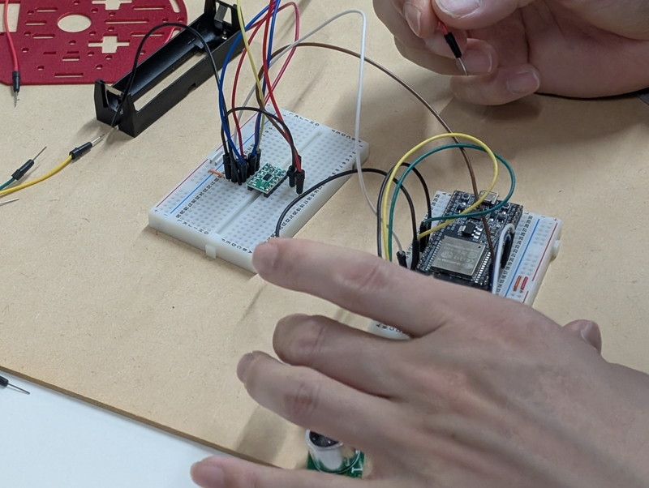

[おおたfab](https://ot-fb.com/event)さんでは電子工作初心者勉強会を定期的に開催しています。

前回は[ESP32ミニカーの仕様決めと材料集めを行いました](https://kanpapa.com/2025/05/otafab-esp32-minicar1.html)。今回はプロトタイプを組み立ててみます。

## モータードライバのハンダ付け

今回はブレッドボードで配線します。そのため[DRV8835使用ステッピング&DCモータードライバーモジュール](https://akizukidenshi.com/catalog/g/g109848/)に付属のピンヘッダをハンダ付けする必要があります。

ブレッドボードにピンヘッダを取り付けて、モータードライバ基板を載せます。


この状態で手早くハンダ付けします。


この作業は参加者の皆さんに体験してもらい無事ピンヘッダのハンダ付けが終わりました。


これでモータードライバがブレッドボードで使えるようになりました。

## 回路図を作る

配線の前に回路図を作りました。ペイントで適当な図を張り付けて線を引いたという暫定版です。


実体配線図に近いものになったので、これを見ながら配線してみます。

## 仮配線をしてみる

暫定版の配線図をみながらブレッドボードを使って配線していきます。



ひとまず仮配線が終わった状態です。


モーターはまだフレームに取り付けずに単体のままで動かします。回転がわかるように車輪だけ先に付けました。

## プログラムをESP32に書き込む

マイコンの開発環境である[Arduino IDE](https://www.arduino.cc/en/software/)を使用して、ESP32にモーターを制御するプログラムを書き込みます。秋月電子のArduinoのサンプルプログラムを参考にして今回のESP32 DevKitCを使用した回路に合わせて書き直しました。まだ超音波センサーやOLEDは使っていません。

スケッチは以下のようになりました。単純にGPIOの番号を今回の回路に合わせただけです。構造もシンプルなのでわかりやすいです。

```
//-----------------------------------------------------
// esp32_mouse1.ino
// 
// for ESP32 DevKitC
//
// 2025/04/13
//-----------------------------------------------------
/*
DRV      ESP32
---------------
AIN1 --- IO19
AIN2 --- IO18

BIN1 --- IO17
BIN2 --- IO16
*/

/*
int LP = 3; //LEFT PLUS
int LM = 9; //LEFT MINUS
int RP = 10; //RIGHT MINUS
int RM = 11; //RIGHT PLUS
*/

int LP = 19; // AIN1   LEFT PLUS
int LM = 18; // AIN2   LEFT MINUS
int RP = 17; // BIN1   RIGHT MINUS
int RM = 16; // BIN2   RIGHT PLUS

void setup()
{
  analogWrite(LP,0);
  analogWrite(LM,0);
  analogWrite(RP,0);
  analogWrite(RM,0);
}

void loop() //RUN ZIGZAG
{
  TTL();
  delay(500);
  TTR();
  delay(500);
}

void TTL(void) // trun to left
{
  analogWrite(LP,250);
  analogWrite(RP,100);
}

void TTR(void) // trun to right
{
  analogWrite(LP,100);
  analogWrite(RP,250);
}
```

## 組み立て前の動作確認

ESP32の電源はPCに接続したUSBケーブルから供給することにします。モーターの電池は外した状態で、先ほど作成したプログラムを書き込みました。書き込み完了後にモーターの電池を接続したところ２つのモーターが動き出しました。

https://youtu.be/wwWIWfvw5C4

プログラムの通りに動いていることが確認できます。

## フレームへの取り付け

実際に車として走るように各パーツをフレームに取り付けてみました。


ESP32 DevKitCとモータードライバとOLEDが載ったブレッドボードが本体からはみ出してしまいます。ここは何とかブレッドボード1枚に収まるように再検討が必要です。ESP32の電源はPCから供給していますが、この状態で車輪を動かすことはできました。

## ブレッドボードを1枚にするには

ブレッドボード１枚に載せることができないかと考えたところ、ESP32 DevKitCを使わずに最近の小さいESP32開発ボードを使ってみてはというアイデアがでました。具体的にはSeeed StudioのXIAOシリーズです。

https://akizukidenshi.com/catalog/g/g129481

手持ちのXIAO ESP32-C6とOLEDをブレッドボードに載せて動かしてみましたが、ブレッドボードの右側のエリアは十分余裕があります。


このようなESP32-C3やC6を使用した小型の開発ボードを使用することでブレッドボードは１枚に収まりそうです。

## 次回

次回は今回使用している[ESP32 DevKitCをXIAO ESP32-C6に置き換えて再設計する](https://kanpapa.com/2025/06/otafab-esp32-minicar3.html)ことにします。これまでESP32 DevKitC開発ボードは安価で機能も豊富で手に入りやすいという理由で使用していましたが、それよりも価格も安くサイズや性能などのメリットがある新しいESP32に乗り換える時期のようです。
