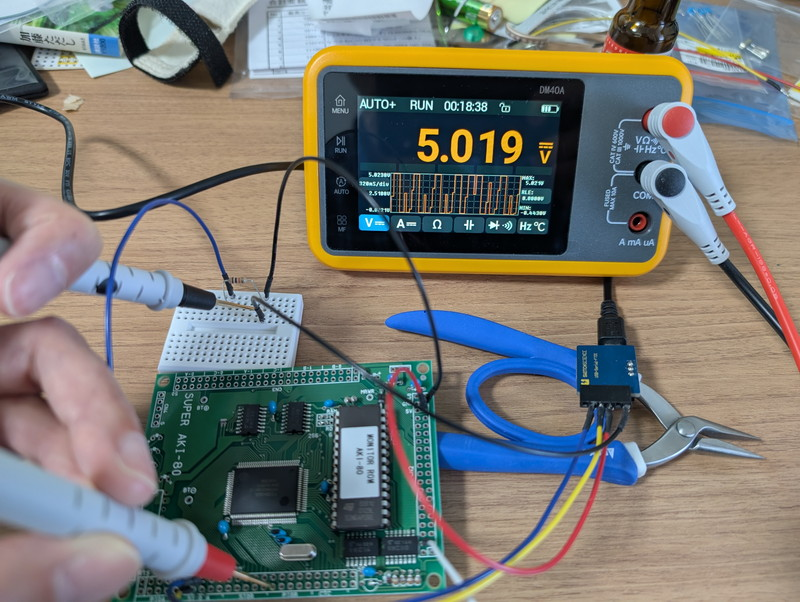
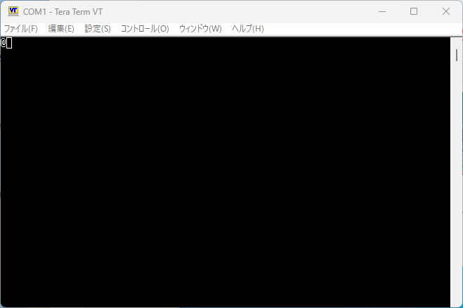
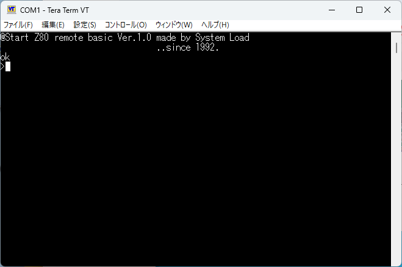
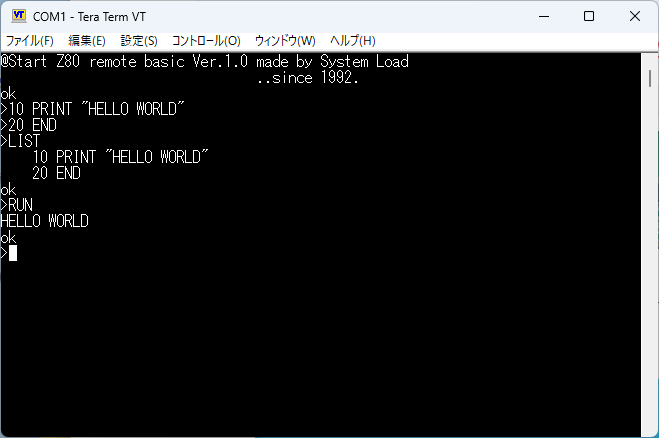
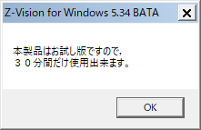
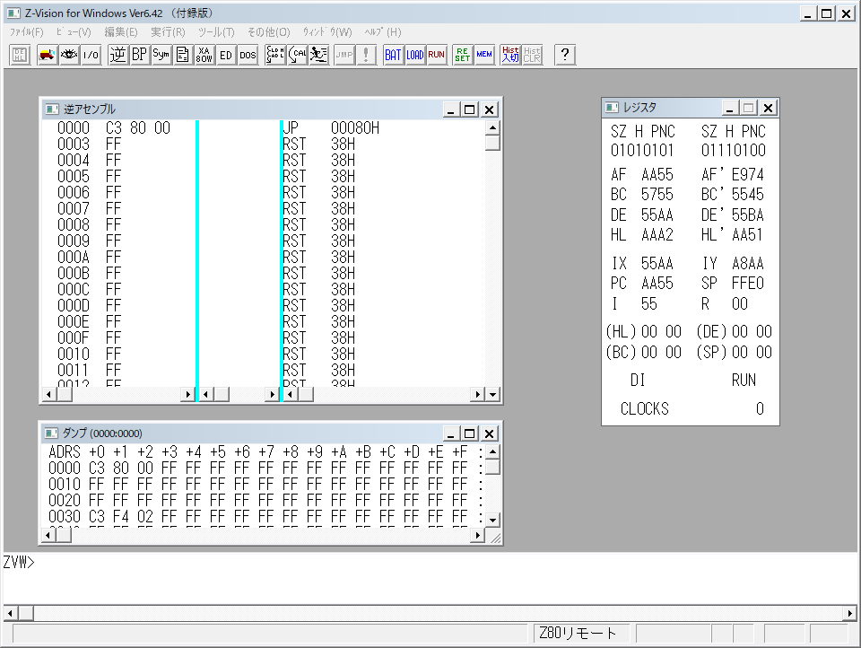
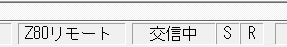

秋月電子のSuper AKI-80が在庫処分ということで安価で販売されています。私も[Super AKI-80は持っている](https://kanpapa.com/2014/01/super-aki80-led-blink.html)のですが、なぜか２枚買ってしまいました。

[電脳伝説さんが早速BASICを動かしている](https://vintagechips.wordpress.com/2025/04/24/saki80basic/)のを見て、そういえば[AKI-80モニターROM＆Cコンパイラセット](https://akizukidenshi.com/catalog/g/g101578/)も買っていたなと思いだし、今回はこのAKI-80モニターROMを使ってみることにしました。

## AKI-80モニターROMとは

[AKI-80モニターROM](https://akizukidenshi.com/catalog/g/g117738/)は27256のROMで、AKI-80のチェック機能プログラムとモニター機能プログラムが入っています。まだ秋月電子で販売されているので入手は可能です。なおモニターはこのROM単体で動作するのではなくシステムロード社のZ-Visionリモートデバッカにシリアル接続して使用するようです。ただし、システムロード社はすでに廃業されているようでZ-Vision関連の情報はあまり見当たらないようでしたが、後述のように使えることがわかりました。

## チェック機能を動かしてみる

Super AKI-80にモニターROMを取り付けて、CN1 #10を10KΩでGNDに接続することで、チェック機能が動作し、1-A, 1-B, 1-C, 0-A, 0-B, 0-Cポートが1秒間隔で1,0を繰り返します。LEDを接続すればLチカになるのでしょうが、今回はDMMで1,0を確認しました。



DMMに信号が表示されていますが、1,0を繰り返していることがわかります。これで動作チェックは完了です。

## モニター機能を動かしてみる

電脳伝説さんの接続方法の通りにUSBシリアルに9600bpsで接続し、電源投入直後にRESET信号を与えると"@"が表示されました。



この状態でEnterキーを押すと次のような画面表示になりました。



BASICインタプリタが起動しているようです。試しにプログラムを入力してみました。



BASIC言語として認識し動作はするようです。ただし、詳しい言語仕様はわかりません。こちらは別途調べてみたいと思います。

一度電源を切り、再度"@"が表示されている状態でEnter以外の文字を入力すると次の画面になりました。


この”RS”が表示された状態でZ-Visionリモートデバッカに接続すれば良いようです。

## Z-Visionリモートデバッカの入手

問題はZ-Visionリモートデバッカの入手です。いろいろ調べたところ講談社BLUE BACKSの「[動かしながら理解するCPUの仕組み](https://www.kodansha.co.jp/book/products/0000194626)」という書籍に付録CD-ROMとして添付されていることがわかりました。

早速フリマで探して購入することができました。


付属のCD-ROMからインストーラーを起動するとC:\\ZVW6にZ-Visionリモートデバッカがインストールされます。ZVW6.EXEがZ-Visionリモートデバッカです。


【追記:2025/5/4】VectorにZ-Vision Windows V5.30 BATAが登録されていました。本記事の手順で使用できますが、試用版のため30分間しか使えないようです。お試しには良いかもしれません。  
[Z-Vision Windowsの詳細情報 : Vector ソフトを探す！](https://www.vector.co.jp/soft/win95/prog/se057095.html)




## Z-Visionリモートデバッカの起動方法

現在の開発環境はWindows11です。そのままZ-Visionリモートデバッカを起動しても「このアプリはお使いのＰＣでは実行できません」と表示され動作しません。


Z-Visionリモートデバッカは16bitアプリケーションのようでプロパティにある互換モードを使っても動作しませんでした。そこで16bitアプリケーションを64bit環境で動かせるotvdmというツールを使いました。（今回はotvdm-v0.9.0で確認しました）

https://github.com/otya128/winevdm/releases

otvdmの使いかたはREADME.txtに書いてありますが、基本的にはダウンロードしたZIPファイルを解凍し、Z-Visionの実行ファイル「ZVW6.EXE」を「otvdmw.exe」にドラッグアンドドロップすることで、Z-Visionリモートデバッカを起動することができます。

## Z-VisionリモートデバッカとAKI-80を接続する

今回使用するZ-Vision付録版はシミュレーション用としてビルドされているようで、そのままではリモートデバッカとしては使用できません。ZVW6.EXEの実行ファイルと同じフォルダにある「ZVW6.INI」の以下の部分を書き換えます。

```
[DebuggerMode]MODE=シミュレート
```

（変更後）

```
[DebuggerMode]
MODE=リモート
```

ZVW6.INIファイルを修正したあとは、読み取り専用にしてください。ZVW6.EXEを起動するたびに「シミュレート」に書き換えているようでそれを防ぐためです。

この状態で、Z-Visionを起動すると、COMポートの設定画面になるので、USBシリアルが接続されているCOMポートを設定してください。なお、COM1～COM10までしか指定できないので、必要に応じてUSBシリアルのCOMポートがこの範囲になるようにデバイスマネージャーからUSBシリアルポートのプロパティで設定してください。


最初にSuper AKI-80にシリアルターミナルを接続し、@RS の状態にしておいてシリアルターミナルを終了し、Z-Visionリモートデバッカを上記の方法で起動するとデバッカとリモート接続されます。



正常に接続できていればZ-Visionウィンドウの最下段に「Z-80リモート」と表示されます。



これでSuper AKI-80のメモリダンプや書き換え、逆アセンブル、実行などの機能をZ-Visionリモートデバッカから行うことができます。

## まとめ

これでSuper AKI-80のリモートデバック環境がWindowsのGUI環境で使えるようになりました。次は開発環境の整備です。AKI-80モニターROMに付属のCコンパイラも使ったことがないので環境を作ってみたいと思います。

## 謝辞

本記事の執筆にあたっては以下のサイトの情報を参考にさせていただきました。

https://vintagechips.wordpress.com/2025/04/24/saki80basic

https://ameblo.jp/kissam59/theme-10109422387.html

https://bbm7b5.hateblo.jp/entry/2022/09/13/182858
