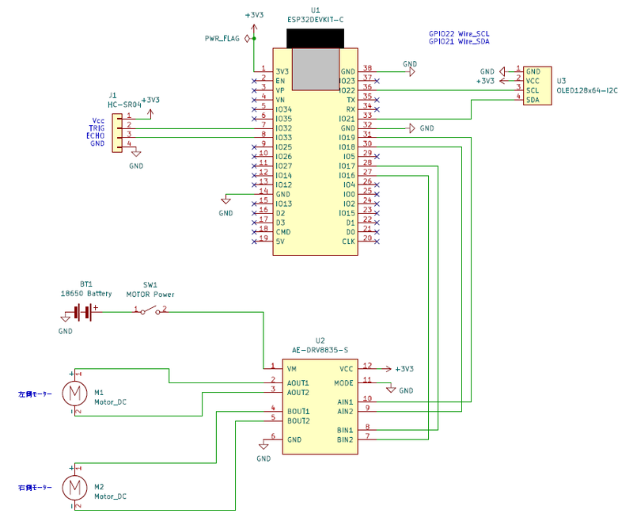
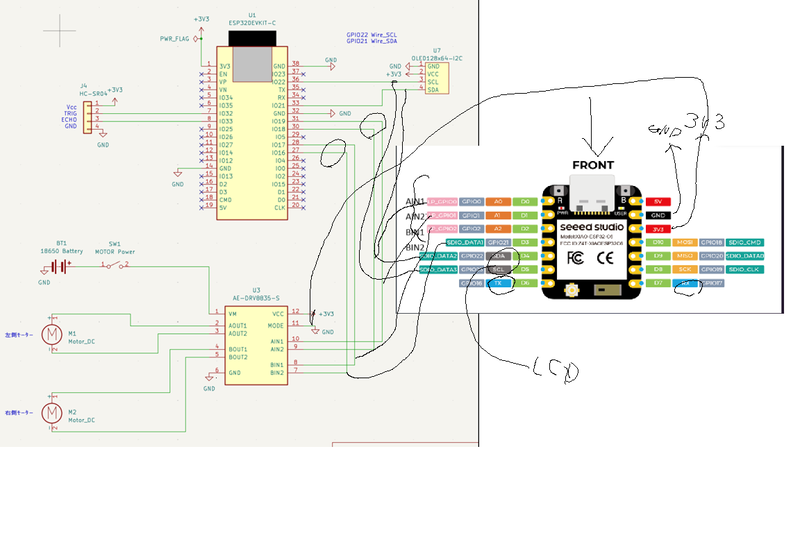
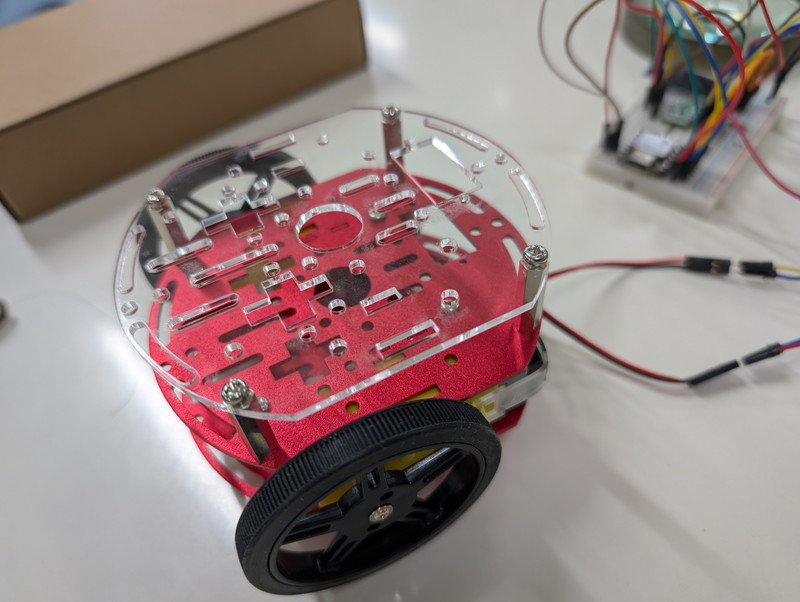

[おおたfab](https://ot-fb.com/event)さんでは電子工作初心者勉強会を定期的に開催しています。

前回は[ESP32ミニカーのプロトタイプの組み立てを行いました](https://kanpapa.com/2025/05/otafab-esp32-minicar2.html)。実装してみると車体をコンパクトにした影響でパーツを取り付けられる面積が小さいという課題がでてきました。ESP32マイコンによるモーター制御回路をブレッドボード１枚に収めるためにESP32マイコンの変更を行います。

## 回路図を清書する

前回は勉強会中に即席で作成した実体配線図を使用して製作を行いました。この回路図をきちんと清書しておきます。回路図エディタとしてKiCadを使用しました。完成した回路図は以下になります。



このようにESP32 DevKitCを使用していますが空きピンが多い状態です。前回のアイデアで出てきた[Seeed Studio XIAO ESP32-C6](https://akizukidenshi.com/catalog/g/g129481/)に置き換えることは問題なさそうです。

## XIAO ESP32-C6版の回路図を作成

ESP32 DevKitCをXIAO ESP32-C6に置き換えた回路図を作成しました。この図も勉強会中に即席で切り貼りして線を引いただけです。ややわかりにくいですが、XIAOのピンは足りそうです。



モータードライバとの接続を表にまとめると以下のようになります。

| XIAO ESP32C6 | モータードライバ |
| --- | --- |
| GPIO0 | AIN1 |
| GPIO1 | AIN2 |
| GPIO2 | BIN1 |
| GPIO21 | BIN2 |

OLEDはI2C接続になりますのでXIAOのSDA/SCLのピンに接続しました。まだ超音波センサーは接続していませんが、残りのGPIOピンに接続することになります。

## マイコンをXIAO ESP32-C6に交換する

ブレッドボードに取り付けているESP32 DevKitCをXIAO ESP32-C6に置き換えます。ここではモータードライバを取り付けているブレッドボードにXIAO ESP32-C6を取り付けて、ESP32 DevKitCと接続していた配線を付け替えることにしました。


これまで使っていたESP32 DevKitCは切り離されて、1枚のブレッドボードにXIAO ESP32-C6、モータードライバ、OLEDを載せることができました。

## XIAO ESP32-C6用にプログラムを修正する

マイコンの変更に伴い、GPIO番号がかわります。変更したスケッチは以下のようになりました。

```
//-----------------------------------------------------
// esp32_mouse2.ino
// 
// for XIAO ESP32C6
//
// 2025/05/25
//-----------------------------------------------------
/* ESP32-devkitc
DRV       ESP32
---------------
AIN1 --- IO19
AIN2 --- IO18

BIN1 --- IO17
BIN2 --- IO16
*/

/* Arduino Uno
int LP = 3; //LEFT PLUS
int LM = 9; //LEFT MINUS
int RP = 10; //RIGHT MINUS
int RM = 11; //RIGHT PLUS
*/

/* XIAO ESP32C6
DRV       ESP32
---------------
AIN1 --- GPIO0
AIN2 --- GPIO1
BIN1 --- GPIO2
BIN2 --- GPIO21
*/

int LP = 0; // AIN1   LEFT PLUS
int LM = 1; // AIN2   LEFT MINUS
int RP = 2; // BIN1   RIGHT MINUS
int RM = 21; // BIN2   RIGHT PLUS

void setup()
{
  analogWrite(LP,0);
  analogWrite(LM,0);
  analogWrite(RP,0);
  analogWrite(RM,0);
}

void loop() //RUN ZIGZAG
{
  TTL();
  delay(500);
  TTR();
  delay(500);
}

void TTL(void) // trun to left
{
  analogWrite(LP,250);
  analogWrite(RP,100);
}

void TTR(void) // trun to right
{
  analogWrite(LP,100);
  analogWrite(RP,250);
}
```

修正したプログラムをXIAO ESP32-C6に書き込んで、前回のようにモーターを動かすことができました。

## 拡張プレートをとりつける

ミニカーとしてブレッドボードやバッテリーを実装するために、別途アクリル板で拡張プレートを製作しました。これは[おおたfabさんのレーザーカッター](https://ot-fb.com/fablab)で製作したものです。早速スペーサーで取り付けます。



なかなか良い感じではないでしょうか。この拡張プレートの上に先ほど製作したブレッドボードを１枚両面テープで固定することを考えています。

マイコン用のバッテリーは2段目に取り付ける予定です。単3×2本の乾電池式USBモバイルバッテリーが収まりそうです。


だんだんミニカーの形が見えてきました。

## 次回

今回製作したミニカーのフレームとブレッドボードを組み合わせてマイコン制御で動く車にします。合わせてOLEDの動作確認、超音波センサーの動作確認を行ったのちに自律走行するミニカーとしてのプログラムを作成していく予定です。
