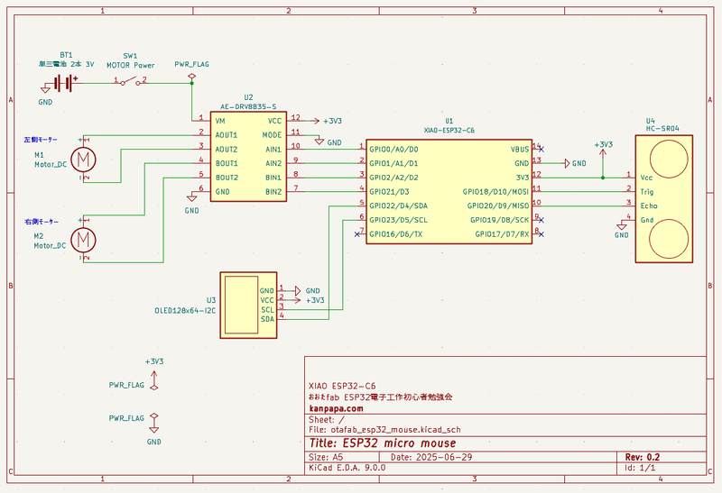
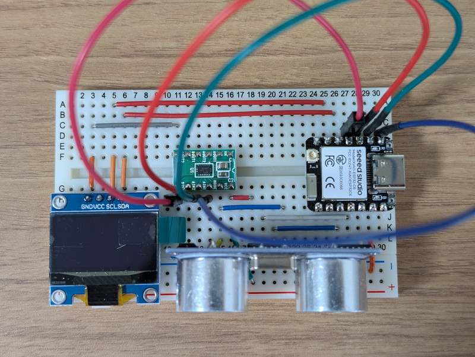
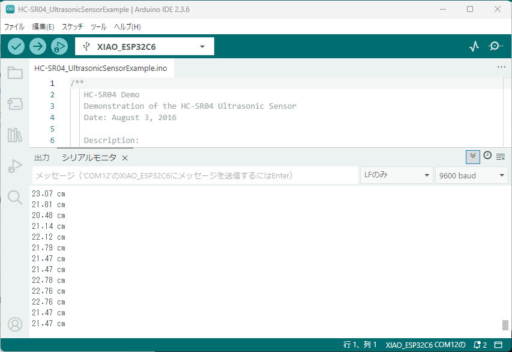

[おおたfab](https://ot-fb.com/event)さんでは電子工作初心者勉強会を定期的に開催しています。

前回は[ESP32ミニカーのマイコンをXIAO ESP32C6に変更してモーターを動かしました](https://kanpapa.com/2025/06/otafab-esp32-minicar3.html)。今回はミニカーに情報を表示するためのOLEDと障害物との距離を測る超音波センサーを実装してみます。

## ミニカーの回路図を清書する

前回までの回路図を清書しておきます。マイコンが変更になったのでシンプルな回路図になりました。



この回路図では今回接続するOLEDと超音波センサーを含めています。OLEDは「Organic Light Emitting Diode」の略称で有機ELディスプレイです。液晶とは異なり自ら発光するのでバックライトが不要できれいな表示ができます。XIAO ESP32C6ではI2Cデバイスを接続できるピンが決まっています。このためI2CデバイスであるOLEDはGPIO22(SDA)とGPIO23(SCL)に接続します。超音波センサーは空いているGPIO18(TRIG)とGPIO20(ECHO)に接続しました。

## ミニカーにOLEDと超音波センサーを実装する

ミニカーのブレッドボードにはすでにOLEDを実装していますが、これに超音波センサーも接続する必要があります。今回は超音波センサーをそのままブレッドボードに挿すことで、回路の接続とセンサーの固定を行いました。センサーの位置で問題がでてきた場合はその時に再検討することにします。



これで回路図に従った実装ができました。

## ESP32でOLEDに文字を表示する

OLEDに文字を表示するにはすでに提供されているライブラリを使うと簡単です。様々なライブラリが提供されていますが、ここではAdafruit ssd1306を使用することにします。

Arduino IDEのライブラリマネージャーでssd1306を検索するといくつか表示されますが、この中でAdafruit ssd1306を選択してインストールします。


スケッチ例にssd1306を使用したデモプログラムが用意されていますので、ファイルのスケッチ例からssd1306\_128x64\_i2cを選択します。今回は秋月電子さんの[OLED 128x64](https://akizukidenshi.com/catalog/g/g112031/)を使用しましたが、I2Cアドレスが0x3cでしたので35行目だけを修正しました。

修正前

```
#define SCREEN_ADDRESS 0x3D ///< See datasheet for Address; 0x3D for 128x64, 0x3C for 128x32
```

修正後

```
#define SCREEN_ADDRESS 0x3C ///< See datasheet for Address; 0x3D for 128x64, 0x3C for 128x32
```

修正したスケッチをコンパイルしてXIAO ESP32C6に書き込むと、さまざまな表示がOLEDに現れます。かなり高機能のライブラリのようなので今後も活用できそうです。


## ESP32で超音波センサーの値を読み取る

超音波センサーは秋月電子で販売している[超音波距離センサー HC-SR04](https://akizukidenshi.com/catalog/g/g111009/)を使用しました。これを選択した理由は電源電圧が3.3vに対応しているからです。HC-SR04のプログラムはSparkfunのサンプルコードを参照しました。

https://github.com/sparkfun/HC-SR04\_UltrasonicSensor

先ほどの回路図のようにTRIGをGPIO18に、ECHOをGPIO20に接続していますので、サンプルコードのGPIO番号を以下のように修正しました。

修正前

```
// Pins
const int TRIG_PIN = 7;
const int ECHO_PIN = 8;
```

修正後

```
// Pins
const int TRIG_PIN = 18;
const int ECHO_PIN = 20;
```

このスケッチをXIAO ESP32C6に書き込むと、シリアルモニタに距離が表示されました。



これで超音波センサーで距離が計測できることが確認できました。

## ミニカーのプログラムでOLEDに距離を表示する

前回までに作成したミニカーのプログラムにこれまでのOLEDや超音波センサーのデモプログラムを取り込んでみました。超音波センサーの距離を測る部分は関数にしています。テスト目的ですので、ミニカーのプログラムのloop関数内で距離をOLEDに表示するように組み込みました。

ソースコードはこちら（esp32\_mouse2-dest.ino）

```
//-----------------------------------------------------
// esp32_mouse2-dest.ino
// 
// for XIAO ESP32C6
//
// 2025/06/29
//-----------------------------------------------------
#include <SPI.h>
#include <Wire.h>
#include <Adafruit_GFX.h>
#include <Adafruit_SSD1306.h>

#define SCREEN_WIDTH 128 // OLED display width, in pixels
#define SCREEN_HEIGHT 64 // OLED display height, in pixels

// Declaration for an SSD1306 display connected to I2C (SDA, SCL pins)
// The pins for I2C are defined by the Wire-library. 
#define OLED_RESET     -1 // Reset pin # (or -1 if sharing Arduino reset pin)
#define SCREEN_ADDRESS 0x3C ///< See datasheet for Address; 0x3D for 128x64, 0x3C for 128x32
Adafruit_SSD1306 display(SCREEN_WIDTH, SCREEN_HEIGHT, &Wire, OLED_RESET);

const int TRIG_PIN = 18;
const int ECHO_PIN = 20;

// Anything over 400 cm (23200 us pulse) is "out of range"
const unsigned int MAX_DIST = 23200;

/* XIAO ESP32C6
DRV       ESP32
---------------
AIN1 --- GPIO0
AIN2 --- GPIO1
BIN1 --- GPIO2
BIN2 --- GPIO21
*/

const int LP = 0; // AIN1   LEFT PLUS
const int LM = 1; // AIN2   LEFT MINUS
const int RP = 2; // BIN1   RIGHT MINUS
const int RM = 21; // BIN2   RIGHT PLUS

void setup()
{
  Serial.begin(9600);

  // The Trigger pin will tell the sensor to range find
  pinMode(TRIG_PIN, OUTPUT);
  digitalWrite(TRIG_PIN, LOW);

  //Set Echo pin as input to measure the duration of 
  //pulses coming back from the distance sensor
  pinMode(ECHO_PIN, INPUT);

  // SSD1306_SWITCHCAPVCC = generate display voltage from 3.3V internally
  if(!display.begin(SSD1306_SWITCHCAPVCC, SCREEN_ADDRESS)) {
    Serial.println(F("SSD1306 allocation failed"));
    for(;;); // Don't proceed, loop forever
  }

  // Show initial display buffer contents on the screen --
  // the library initializes this with an Adafruit splash screen.
  display.display();
  delay(2000); // Pause for 2 seconds

  // Clear the buffer
  display.clearDisplay();
  display.setTextSize(3);             // Normal 1:1 pixel scale
  display.setTextColor(SSD1306_WHITE);        // Draw white text
  display.setCursor(0,0);             // Start at top-left corner
  display.println(F("Hello, world!"));
  display.display();
  delay(2000);

  analogWrite(LP,0);
  analogWrite(LM,0);
  analogWrite(RP,0);
  analogWrite(RM,0);
}

void loop() //RUN ZIGZAG
{
  TTL();
  delay(500);
  TTR();
  delay(500);
  
  display.clearDisplay();
  display.setCursor(0,0);             // Start at top-left corner
  display.println(dest());
  display.display();
}

void TTL(void) // trun to left
{
  analogWrite(LP,250);
  analogWrite(RP,100);
}

void TTR(void) // trun to right
{
  analogWrite(LP,100);
  analogWrite(RP,250);
}

float dest() {

  unsigned long t1;
  unsigned long t2;
  unsigned long pulse_width;
  float cm;
  float inches;

  // Hold the trigger pin high for at least 10 us
  digitalWrite(TRIG_PIN, HIGH);
  delayMicroseconds(10);
  digitalWrite(TRIG_PIN, LOW);

  // Wait for pulse on echo pin
  while ( digitalRead(ECHO_PIN) == 0 );

  // Measure how long the echo pin was held high (pulse width)
  // Note: the micros() counter will overflow after ~70 min
  t1 = micros();
  while ( digitalRead(ECHO_PIN) == 1);
  t2 = micros();
  pulse_width = t2 - t1;

  // Calculate distance in centimeters and inches. The constants
  // are found in the datasheet, and calculated from the assumed speed
  //of sound in air at sea level (~340 m/s).
  cm = pulse_width / 58.0;
  //inches = pulse_width / 148.0;

  // Print out results
  if ( pulse_width > MAX_DIST ) {
    Serial.println("Out of range");
  } else {
    Serial.print(cm);
    Serial.println(" cm");
    //Serial.print(inches);
    //Serial.println(" in");
  }

  return(cm);
}
```

モーターを動かしながら距離を表示することができていますが、このプログラムでは１秒間隔で距離を測って表示することしかできないので実用的ではありません。もう少し工夫をする必要があります。


テスト走行の動画です。走りながらも距離を表示していました。

https://youtu.be/goSN\_Ni4D7U

## 次回

次回は距離センサーの値をリアルタイムで液晶ディスプレイに表示し、その距離から障害物を避ける走り方を考えてみます。


