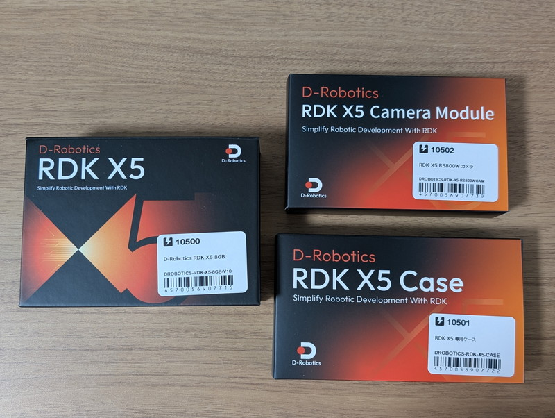
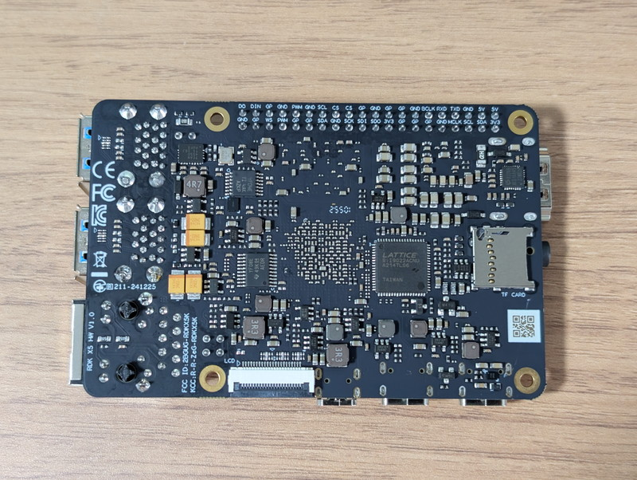
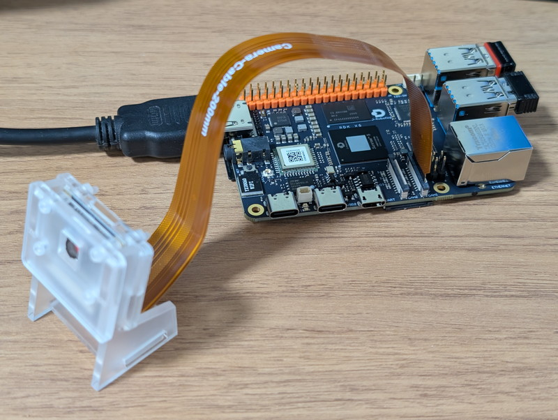
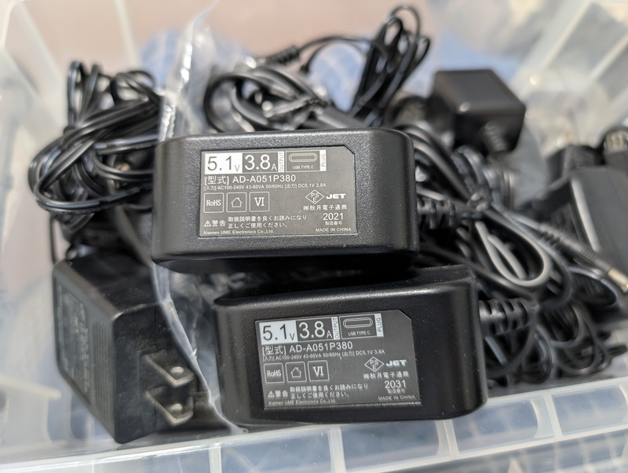

スイッチサイエンスさんのサイトを何気なく見ていたところ、[RDK X5](https://www.switch-science.com/products/10500)と[OriginBot Pro JP](https://www.switch-science.com/products/10505)が発売開始になったことを知りました。以前、Maker Faireで見かけた[D-Robotics社のRDK X3というマイコンボードを衝動買い](https://kanpapa.com/2024/09/rdk-x3-4g-board1.html)してしまったので、今回のRDK X5も結局オーダーしてしまいました。

RDK X3では最初からROS2の環境や5TOPSの性能を持つBPU(Brain Processing Unit)を生かしたデモプログラムが整備されていて、ルンバやTurtlebot3といった既存のロボットですぐ実験することができて衝撃を受けました。今回のRDK X5ではどのように変わっているのかを試してみます。

## RDK X5ボードの概要

RDK X3については[別記事](https://kanpapa.com/2024/09/rdk-x3-4g-board1.html)を参照いただくとして、RDK X3との違いをまとめてみます。

- CPUやBPUはRDK X3にくらべて2倍の性能

- USB 3.0コネクタが４つになった

- MIPIカメラコネクタが2つに増えた

- オーディオ入出力の機能が追加された

- 2.4 GHz / 5 GHz Wi-Fi 6（IEEE 802.11ax）に対応

このように細かいところも機能アップしていることがわかります。

今回購入したRDK X5はメモリが8GBで、さらにCPUやBPUの処理性能はRDK X3にくらべて2倍になっているのでデスクトップ環境でも快適に動作すると思われましたが実際その通りでした。

RDK X3に比べて価格は少し上がっていますが、Raspberry Pi 5 8GB＋AI Kitの機能を持つと考えると低価格ではと思われます。RDK X5の詳細は公式サイトを見ていただくことをお勧めします。

https://developer.d-robotics.cc/en/rdkx5

## RDK X5ボードの外観

スイッチサイエンスさんに注文して翌日にはRDK X5が到着しました。購入したものはRDK X5本体、ケース、カメラの３点セットです。RDK X3と同様にかっこいい箱に入っています。



RDK X5本体です。




ケースにはカメラを取り付けるためのパーツが含まれていました。


カメラにもカメラホルダーのパーツが付属していました。


カメラホルダーのように必要となるものが最初から含まれているのは好感が持てます。

## RDK X5を動かしてみる

電源を入れる前にMIPIカメラを接続しました。デモプログラムでもカメラを応用するものが多いためです。なお、MIPIカメラでなくてもUSBカメラも使えます。



RDK X5の公式サイトにセットアップの方法は書かれていますので、それに従って進めれば問題ありません。公式サイトは英語版と中国語版がありますが、英語版は若干内容が古いところがあり、そのままでは動作しないところがあるので、中国語版をブラウザの翻訳機能で日本語にして参照することをお勧めします。

https://d-robotics.github.io/rdk\_doc/Quick\_start/hardware\_introduction/rdk\_x5

今回もRDK X3の時と同様に秋月電子の[スイッチングACアダプター(USB ACアダプター) Type-Cオス 5.1V3.8A](https://akizukidenshi.com/catalog/g/g114935/)を使用します。



RDK X5のスペック上は5V5Aということにはなっているのですが、搭載したいロボットの電源容量は3～4Aなので、このような電源でも問題なく動作するのかを確認したかったためです。同時に発売となった[OriginBot Pro JP](https://www.switch-science.com/products/10505)の仕様では5V3Aのモバイルバッテリーを使用している点も参考にしています。

デスクトップ版のOSイメージをmicroSDに書き込んで起動してみましたが、RDK X3と比べて明らかに高速で快適です。rebootしたときの時間も速く、もう再起動したのかと思うほどです。またRDK X5版ではデスクトップに公式サイトへのリンクが置いてありました。ブラウザでマニュアルを見ながら操作しても十分快適ですよという自信の表れかもしれません。


## デモプログラムでの画像認識

RDK X3の時と同様にカメラ画像からリアルタイムで物体を検出するプログラムを試してみました。

https://d-robotics.github.io/rdk\_doc/Basic\_Application/Image/mipi\_camera

RDK X3の時は画像にBoxが表示されていたのですが、今回のデモプログラムではBoxの表示がありませんでした。


しかし、ターミナルには認識されているオブジェクトが次々と表示されているので正常に動作していると思われます。

公式ドキュメントの動作画面の例ではBoxが表示されていますがRDK X3の例のようなので、RDK X5の例や違いなども公式ドキュメントに含めていただけると良いのですが。

## OriginBot Pro JPの実装例

ここでOriginBot Pro JPにおけるRDK X5の実装例を確認してみます。

https://www.switch-science.com/products/10505

OriginBot Pro JPはRDK X5を搭載しているにも関わらずモバイルバッテリーで動作しています。この例からロボットに搭載した場合の電源容量はとりあえず3Aを確保すればよさそうです。

またCPUの発熱も気になるのですが、写真や動画をみるかぎり、CPUにヒートシンクは取り付けていないようにみえます。私がRDK X3を使ったときは発熱を気にして[専用ケースを取り付けたまま状態でTurtlebot3に実装していた](https://kanpapa.com/2024/11/rdk-x3-turtlebot3.html)のですが、ケースが無くても良いのであれば実装が楽です。

まずはバッテリーでの動作確認としてAnker PowerCare 10000モバイルバッテリー(5V2.4A)を接続してRDK X5を動かしてみましたが、特に問題なく動作するようです。


モバイルバッテリーでの動作やCPUの発熱を確認しながらお手軽なルンバの制御を行ってみます。

## RDK X5でルンバを動かしてみる

以前に行ったRDK X3でルンバを制御した手順に従ってRDK X5でルンバを動作させてみます。

https://kanpapa.com/2024/09/rdk-x3-roomba-controlled-ros2.html

まずは、Raspberry Pi 4をルンバに搭載するためのベースにRDK X5を取り付けました。


RDK X5のねじ穴はRaspberry Pi 4と全く同じでそのまま取り付けができますので、Raspberry Piの周辺機器を活用しやすい構造になっています。

このベースをルンバに実装した状態です。ルンバとはシリアルUSBケーブルで接続しています。


ROS2ベースのデモアプリケーションであるRobot Follows the Human Bodyを動かしてみました。

https://d-robotics.github.io/rdk\_doc/Robot\_development/apps/car\_tracking

実験部屋が狭いので追いかけてくる動作まではできませんでしたが、カメラで捉えた人の方向にルンバが向いてくることがわかります。もう少しルンバから離れることができれば追いかけてくることは確認できています。

https://youtu.be/svVNqC0i8mU

他にもロボットアプリケーションの例として手のジェスチャーでの制御も問題なく動作しました。

https://d-robotics.github.io/rdk\_doc/Robot\_development/apps/car\_gesture\_control

気になるCPUの温度ですが、これらの画像認識系のアプリケーションを動かしていた時は以下のような状態でした。指ではCPUを触れない状態なので何かで冷却するのが良いかもしれません。

```
sunrise@ubuntu:~$ sudo hrut_somstatus
====================
temperature-->
        DDR      : 80.2 (C)
        BPU      : 78.6 (C)
        CPU      : 79.7 (C)
```

## まとめ

今回はRDK X5をRDK X3と比較しながら使用してみました。RDK X3に比べて高速化されておりモバイルバッテリーでも動作することがわかりました。

また、公式サイトではAI機能を活用したデモプログラムが増えていて、顔認識を行うスマートボックスやASR（Automatic Speech Recognition, 自動音声認識）とVLM(Vision-Language Model, 視覚言語モデル)/LLM(Large Language Model, 大規模言語モデル) とTTS（Text-to-Speech, 音声合成）を組み合わせてカメラに写っているものを認識して説明してくれるビジュアルボイスボックスなどRDK X5専用のアプリケーションもありますので、引き続きこれらのデモプログラムを試してみます。
