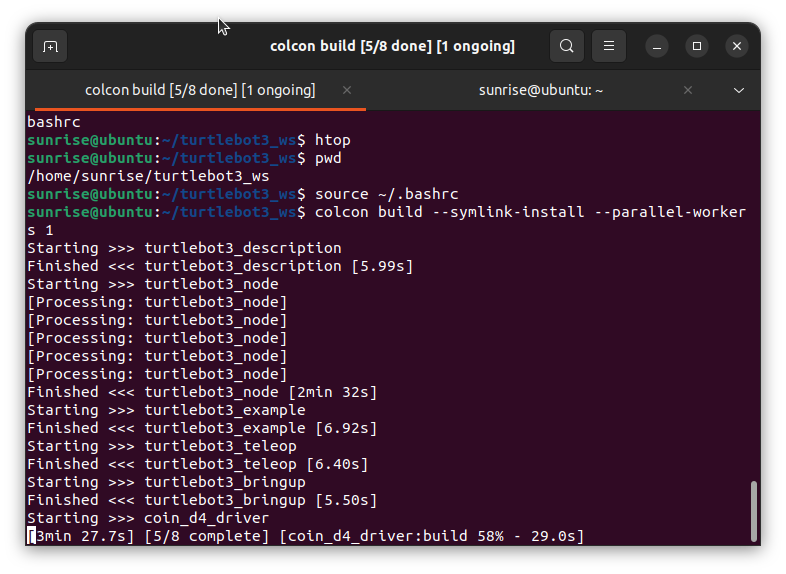
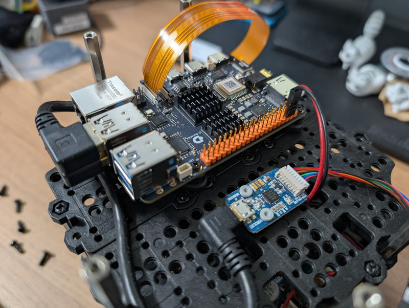
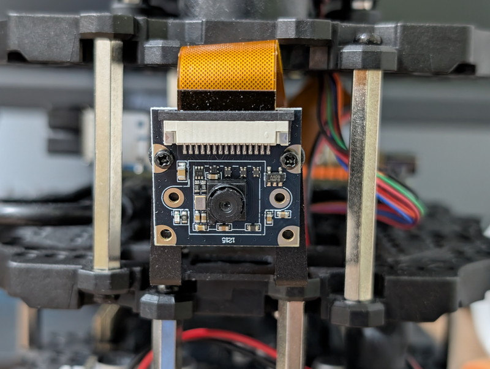
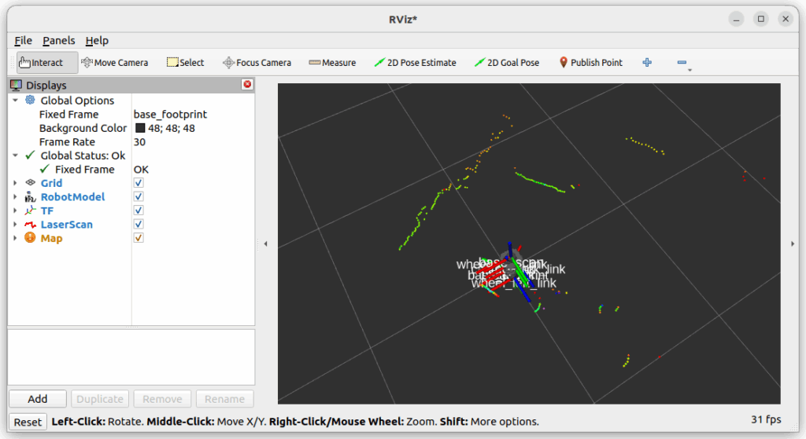
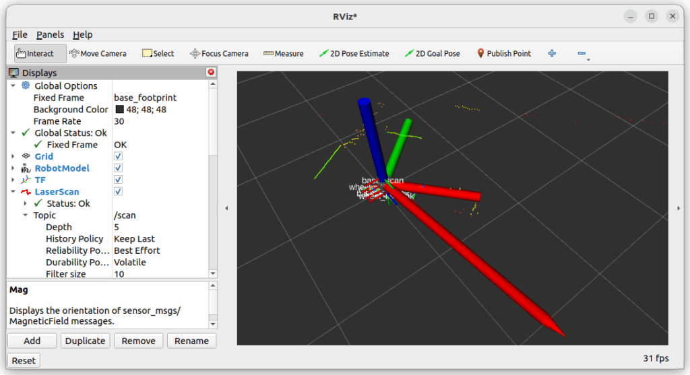

[D-Robotics RDK X5](https://www.switch-science.com/products/10500)を[TurtleBot3](https://emanual.robotis.com/docs/en/platform/turtlebot3/overview/)に載せてみました。以前に[RDK X3をTurtleBot3に載せた](https://kanpapa.com/2024/11/rdk-x3-turtlebot3.html)ことはありますので基本的にはその手順で問題ないのですが、RDK X5での違いや気づいたところを中心にまとめました。

## ソフトウェアのセットアップ

TurtleBot3にRDK X5を取り付ける前にRDK X5のソフトウェアをセットアップしました。今回は以下のイメージファイルをダウンロードし、32GBのmicroSDカードに書き込みました。

/downloads/os\_images/rdk\_x5/rdk\_os\_3.2.3-2025-7-9/rdk-x5-ubuntu22-preinstalled-desktop-3.2.3-arm64.img.xz

RDK X5が起動するまでの手順は以下のページを参照してください。

https://d-robotics.github.io/rdk\_doc/Quick\_start/install\_os/rdk\_x5

次にTurtleBot3用のソフトウェアをセットアップしていきます。これはTurtleBot3 公式マニュアルのQuick Start Guideにまとまっています。ROS2 humbleを使います。

https://emanual.robotis.com/docs/en/platform/turtlebot3/sbc\_setup/#install-packages-on-raspberry-pi

RDK X5のセットアップは、[3.2 SBC Setup](https://emanual.robotis.com/docs/en/platform/turtlebot3/sbc_setup/#sbc-setup)に従って作業を進めます。RDK X5ではUbuntu 22.04のイメージが配布されていますので、3.2.5 Install packages on Raspberry PI の 1. Install ROS2 Humble Hawksbill までの手順はスキップできます。このため、2. Install and Build ROS Packages から作業を進めていきます。変更すべき点は[ルンバを動かしたとき](https://kanpapa.com/2024/09/rdk-x3-roomba-controlled-ros2.html)と同様にrosをtrosにします。

```
source /opt/tros/humble/setup.bash
```

他はそのまま実行すればturtlebot3用パッケージのビルドが始まります。



無事ビルドが完了しました。


## RDK X5の取り付け

標準で実装されているRaspberry Pi 4を外して、RDK X5を取り付けます。ねじ穴の位置は同じですのでそのまま交換できます。RDK X3のときは放熱を考えて、専用ケースを取り付けた状態で固定しましたが、今回は[Raspberry Pi 4B用 ヒートシンク](https://akizukidenshi.com/catalog/g/g116098/)を取り付けることで発熱は問題なさそうということが分かっているので、専用ケースは使わずに実装しました。


RDK X5の電源供給ですが、TurtleBot3にはモータードライバが実装されているマイコン基板 OpenCRボード があり、そこからRaspberry Pi 4の拡張コネクタを介して電源を供給しています。RDK X5もRaspberry Pi 4と同様の拡張コネクタがありますので同様に接続できます。



次にRDK X5のカメラモジュールをRaspberry Piカメラ用のフレーム [Pi-Camera Frame Set](https://e-shop.robotis.co.jp/product.php?id=281)に取り付けようとしたところ、ねじ穴が一致しません。



図面を確認したところ、穴の位置が1mm違います。左の図面はRDK X5専用カメラモジュールで右側はRaspberry Piカメラモジュールです。横方向の穴の間の寸法は両方とも21.0mmですが、縦方向の穴の間の寸法はRDK X5は13.5mm、Raspberry Pi Cameraは12.5mmで1mmの差があります。このため取り付け穴が合いませんでした。


RDK X3のカメラモジュールはそのまま取り付けできたのですが、今回はやむなく上側のネジだけで固定しました。あまり良い取り付け方法ではないので、後ほど3Dプリンタで専用ホルダーを作ってみようと思います。

カメラモジュール以外は特に問題なくRDK X5の取り付けが完了しました。


## TurtleBot3を起動する

TurtleBot3を動かす手順はTurtleBot3の公式マニュアルにある 3.5 bringupに従います。

https://emanual.robotis.com/docs/en/platform/turtlebot3/bringup

リモートPCからRDK X5にログインして起動します。

```
ocha@ocha-ubuntu:~$ ssh sunrise@192.168.0.105
sunrise@192.168.0.105's password: 
  :
Last login: Tue Jul 22 15:15:52 2025 from 192.168.0.158
sunrise@ubuntu:~$ export TURTLEBOT3_MODEL=burger
sunrise@ubuntu:~$ ros2 launch turtlebot3_bringup robot.launch.py
[INFO] [launch]: All log files can be found below /home/sunrise/.ros/log/2025-07-29-10-39-07-040159-ubuntu-4665
[INFO] [launch]: Default logging verbosity is set to INFO
urdf_file_name : turtlebot3_burger.urdf
[INFO] [robot_state_publisher-1]: process started with pid [4675]
[INFO] [hlds_laser_publisher-2]: process started with pid [4677]
[INFO] [turtlebot3_ros-3]: process started with pid [4679]
  :
[turtlebot3_ros-3] [INFO] [1753753153.557328075] [turtlebot3_node]: Succeeded to create sound server
[turtlebot3_ros-3] [INFO] [1753753153.559945149] [turtlebot3_node]: Run!
[turtlebot3_ros-3] [INFO] [1753753153.601400618] [diff_drive_controller]: Init Odometry
[turtlebot3_ros-3] [INFO] [1753753153.621595334] [diff_drive_controller]: Run!
```

これでTurtleBot3が起動しました。

別のターミナルでトピックを確認します。

```
ocha@ocha-ubuntu:~$ ros2 topic list 
/battery_state
/cmd_vel
/imu
/joint_states
/magnetic_field
/odom
/parameter_events
/robot_description
/rosout
/scan
/sensor_state
/tf
/tf_static
ocha@ocha-ubuntu:~$ 
```

TurtleBot3公式マニュアルと同じtopicが表示されることが確認できます。

## teteopでの手動操作

TurtleBot3公式マニュアルの 3.6.1 Teleoperation にしたがって手動操作を行ってみます。

https://emanual.robotis.com/docs/en/platform/turtlebot3/basic\_operation/#teleoperation

turtlebot3\_teleopを起動します。

```
ocha@ocha-ubuntu:~$ export TURTLEBOT3_MODEL=${TB3_MODEL}
ocha@ocha-ubuntu:~$ ros2 run turtlebot3_teleop teleop_keyboard

Control Your TurtleBot3!
---------------------------
Moving around:
        w
   a    s    d
        x

w/x : increase/decrease linear velocity (Burger : ~ 0.22, Waffle and Waffle Pi : ~ 0.26)
a/d : increase/decrease angular velocity (Burger : ~ 2.84, Waffle and Waffle Pi : ~ 1.82)

space key, s : force stop

CTRL-C to quit

```

このように表示された状態で、キーボードのa/w/x/dを入力するとその方向に動きます。停止はsです。

https://youtu.be/8A7Pv9vOc7Y

これで車輪を動かす基本的な動作の確認はできました。

## カメラの確認

次にTurtleBot3に搭載したRDK X5カメラ IMX219カメラの確認をします。ROS2 humbleを使用している例がRDK X5ドキュメントの5.2.1 Image Captureにありますのでこれにしたがって操作します。

https://d-robotics.github.io/rdk\_doc/Robot\_development/quick\_demo/demo\_sensor#mipi%E5%9B%BE%E5%83%8F%E9%87%87%E9%9B%86

新しいターミナルでRDK X5にログインし、以下のコマンドを入力します。このmipi\_camノードはMIPIカメラのデータを/mbmem\_imgというトピックで配信するものです。

```
sunrise@ubuntu:/opt/tros/humble/lib/mipi_cam/config$ ros2 launch mipi_cam mipi_cam.launch.py
[INFO] [launch]: All log files can be found below /home/sunrise/.ros/log/2025-07-29-11-02-59-429588-ubuntu-7219
[INFO] [launch]: Default logging verbosity is set to INFO
config_file_path is  /opt/tros/humble/lib/mipi_cam/config/
Hobot shm pkg enables zero-copy with fastrtps profiles file: /opt/tros/humble/lib/hobot_shm/config/shm_fastdds.xml
  :
```

この状態でもう一つ新しいターミナルからRDK X5にログインし、以下のコマンドを入力します。hobot\_codec\_encodeノードは/mbmem\_imgトピックを/image\_jpegトピックにエンコードしてくれます。

```
sunrise@ubuntu:~$ ros2 launch hobot_codec hobot_codec_encode.launch.py
[INFO] [launch]: All log files can be found below /home/sunrise/.ros/log/2025-07-29-11-06-03-750889-ubuntu-7680
[INFO] [launch]: Default logging verbosity is set to INFO
Hobot shm pkg enables zero-copy with fastrtps profiles file: /opt/tros/humble/lib/hobot_shm/config/shm_fastdds.xml
Hobot shm pkg sets RMW_FASTRTPS_USE_QOS_FROM_XML: 1
env of RMW_FASTRTPS_USE_QOS_FROM_XML is  1 , ignore env setting
[INFO] [hobot_codec_republish-1]: process started with pid [7689]
   :
```

最後にもう一つ新しいターミナルからRDK X5にログインし、次のコマンドを入力します。このwebsocketノードは/image\_jpegを購読して、RDK X5のWebサーバで画像を表示するものです。

```
sunrise@ubuntu:~$ ros2 launch websocket websocket.launch.py websocket_image_topic:=/image_jpeg websocket_only_show_image:=true
[INFO] [launch]: All log files can be found below /home/sunrise/.ros/log/2025-07-29-11-08-41-445683-ubuntu-8031
[INFO] [launch]: Default logging verbosity is set to INFO
launch webserver
pwd_path is  /home/sunrise
webserver_path is  /opt/tros/humble/lib/websocket/webservice
launch webserver cmd is  ./sbin/nginx -p .
nginx: [alert] could not open error log file: open() "./logs/error.log" failed (13: Permission denied)
[INFO] [websocket-1]: process started with pid [8038]
[websocket-1] [WARN] [1753754922.344372428] [websocket]: 
[websocket-1] Parameter:
[websocket-1]  image_topic: /image_jpeg
      :
```

この状態でRDK X5のIPアドレスのポート8000にブラウザでアクセスすればリアルタイムで画像が表示されます。これでカメラ画像を見ながらteleopでロボットを動かすこともできます。


## LiDARの確認

TurtleBot3にはLiDARが標準で搭載されています。トピック一覧をみると/scanというトピックがありますが、これがLiDARのデータです。

rviz2で可視化することができます。以下のようにコマンドを入力します。

```
rviz2
```

Rviz2のウインドウの左下にあるAddのボタンをクリックし、LazerScanプラグインをクリックし、Topicに/scanを指定することで以下のような表示になります。LiDARで認識しているモノが点線で表示されます。これでロボットの周りにどのようなモノがあるのかを認識できます。



## IMUの確認

最後にTurtleBot3の重要なセンサーであるIMUと地磁気センサーの確認をします。これは/imuと/magnetic\_fieldの２つのトピックが配信されているのでこれをRviz2で可視化します。

Rviz2のウインドウの左下にあるAddのボタンをクリックし、Imuプラグインをクリックし、Topicに/imuを指定します。さらに、Magプラグインをクリックし、Topicに/magnetic\_fieldを指定するとロボット本体の向きと傾きと地磁気の方向が表示されます。これによりロボット自身がどのような姿勢でどちらに向いているのかを知ることができます。



実際の動きがわかるように動画も載せておきます。

https://youtu.be/mmOb8yY-\_7c

## ノードとトピックの関連図を作る

たくさんのノードやトピックがでてきたので複雑になってきました。rqt\_graphコマンドでノードとトピックの関連図ができます。

```
rqt_graph
```

楕円がノードで四角形がトピックです。


様々なノードとトピックが関連して動作していることが確認できます。

## まとめ

TurtleBot3にRDK X5を載せることで[OriginBot Pro](https://www.switch-science.com/products/10505)に近いロボットカーができました。また、TurtleBot3の公式マニュアルに載っている基本動作までは確認できました。次回はRDK X5の機能を活かしたOriginBot Proで動かしている様々なアプリケーションを試していきます。
