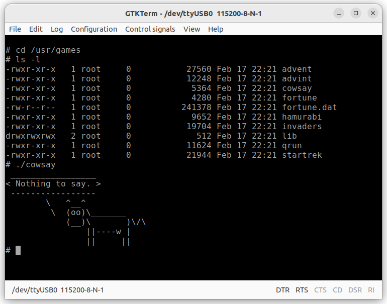

買ったまま積み基板となっていた秋月電子の[RP2040マイコンボードキット](https://akizukidenshi.com/catalog/g/g117542/)がでてきました。


とりあえずLチカぐらいはやっておこうかと手を動かし始めました。

## AE-RP2040を動かしてみよう

このAE-RP2040マイコンボードはRaspberry Pi Picoが使っているRP2040が搭載されていて、GPIOの全ピンが使えるようになっているものです。まずはヘッダピンをはんだ付けしブレッドボードで扱えるようにしました。


## 開発環境のセットアップ

AE-RP2040マイコンボードの開発環境のセットアップ方法やサンプルプログラムはRaspberry Pi Picoのドキュメントをがそのまま使えます。なお、私はUbuntu22.04 Desktopでこれらの作業を行いました。

- [Getting started with Raspberry Pi Pico](https://akizukidenshi.com/goodsaffix/getting-started-with-pico.pdf)

開発環境のインストールはスクリプトになっていますので以下のようにコマンドを実行するだけですが、スクリプトの実行時にsudoのパスワードが求められますので入力してください。

```
$ wget https://raw.githubusercontent.com/raspberrypi/pico-setup/master/pico_setup.sh
$ chmod +x pico_setup.sh
$ ./pico_setup.sh
```

ビルドに必要なコンパイラやツールがまとめてインストールされるので少し時間がかかります。セットアップが終わったらUbuntuを再起動してください。

```
$ reboot
```

ホームディレクトリの下にpicoというディレクトリができていますが、ここが開発環境になります。

## Lチカプログラムをビルドする

ホームディレクトリにできたpicoディレクトリを使ってLチカを行います。プログラムのビルド手順は以下の通りです。

```
$ cd pico/pico-examples
$ mkdir build
$ cd build
$ export PICO_SDK_PATH=../../pico-sdk
$ cmake ..
$ cd blink
$ make
$ ls -l
total 1016
drwxr-xr-x 3 ocha ocha   4096 Aug 24 14:36 CMakeFiles
-rw-r--r-- 1 ocha ocha 104621 Aug 24  2025 Makefile
-rwxr-xr-x 1 ocha ocha   6820 Aug 24 14:36 blink.bin
-rw-r--r-- 1 ocha ocha 124166 Aug 24 14:36 blink.dis
-rwxr-xr-x 1 ocha ocha 385944 Aug 24 14:36 blink.elf
-rw-r--r-- 1 ocha ocha 361092 Aug 24 14:36 blink.elf.map
-rw-r--r-- 1 ocha ocha  19255 Aug 24 14:36 blink.hex
-rw-r--r-- 1 ocha ocha  13824 Aug 24 14:36 blink.uf2
-rw-r--r-- 1 ocha ocha   1130 Aug 24  2025 cmake_install.cmake
$
```

いろいろなファイルができていますが、blink.uf2というファイルがRP2040マイコンボードに書き込むファイルです。

なお、AE-RP2040マイコンボードにはRaspberry Pi PicoのようにLEDは実装されていないので、GPIO25にLEDと抵抗を接続しました。


プログラムの書き込みはBOOTスイッチを押した状態で、RP2040マイコンボードをPCにUSB接続するとディスクドライブとして見えるので、そこにblink.uf2をドラッグ＆ドロップするだけでファームウェアが書き込まれます。簡単に書き込みが行えるので便利です。

## FUZIXを動かしてみる

Lチカができたところで他に面白いものが無いかと探してみたところ、FUZIXというUnixライクなOSを動かしている例を見つけました。

https://www.raspberrypi.com/news/how-to-get-started-with-fuzix-on-raspberry-pi-pico

この記事はRaspberry Pi Pico用ですので、新たにAE-RP2040マイコンボードを使用した回路図を作成しました。


microSDカードのブレークアウトボードは秋月電子の[マイクロSDカードスロットDIP化キット](https://akizukidenshi.com/catalog/g/g105488/)を使用しました。USBシリアル変換は秋月電子の[FT-232RQ USBシリアル変換モジュール](https://akizukidenshi.com/catalog/g/g111007/)を例にしていますが、必ずI/O電圧を3.3Vに設定して接続してください。

配線も少ないのでブレッドボードで簡単に実装できます。


先ほどのページではビルドの方法が掲載されていますが、すでにビルド済のファイルが以下のサイトに掲載されていますので今回はこちらを使いました。

https://cowlark.com/2021-02-16-fuzix-pi-pico

ここにあるRaspberry Pi Pico Fuzix binaries (fuzix.tar.xz)をダウンロードして、展開するとビルド済のカーネルとファイルシステムが入手できます。RP2040への書き込みはfuzix.uf2をドラッグ＆ドロップすれば完了です。filesystem.imgの書き込みはアーカイブに同梱されているREADME.mdに掲載されている手順で問題なくmicroSDカードに書き込めました。なお、私はUbuntu22.04でこれらの作業を行いました。

正常にFUZIXが起動するとUSBシリアルに接続したターミナルで以下のような表示になりますので、rootでログインします。


かわいいバナーにはFuzix 0.3.1とありますが、起動直後にFUZIX version 0.4pre1と表示されますのでこちらが正しいバージョンのようです。

## FUZIXを探検する

ログイン後あちこちを探検してみましたが、見た目はUnixやLinuxのような見慣れたディレクトリ構造です。/usrディレクトリを見たところ、/usr/gamesが充実していることに気が付きました。cowsayやstartrekを動かしてみましたが実際に動作しました。



/binディレクトリを探検しているとpicogpioというコマンドを見つけました。その名の通りGPIOを制御するコマンドのようです。試しにLEDが接続されているGPIO25を0にするとLEDが消灯し、1にするとLEDが点灯しました。


スクリプトなどでこのコマンドを呼び出せば簡単なGPIO制御はできそうです。

まだまだFUZIXを探検中ですので、面白いものがあれば紹介したいと思います。

## まとめ

今回はすでにビルド済みのRaspberry Pi Pico用のFUZIXを動かしてみました。まだ探検中ですので引き続きいろいろ試してみようと思いますが、今回動かしたRaspberry Pi Pico版は本家のFUZIXのリポジトリにもマージされており、開発は継続中のようです。次回は本家のFUZIXリポジトリで最新のRaspberry Pi Pico版のFUZIXをビルドしてAE-RP2040ボードで動かしてみます。
