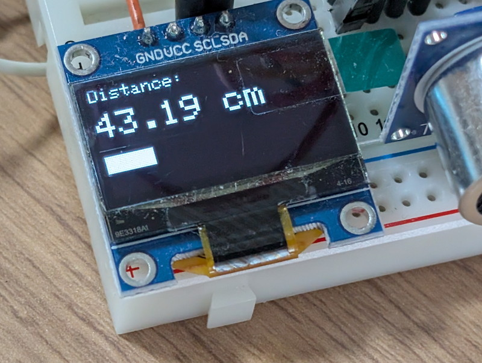
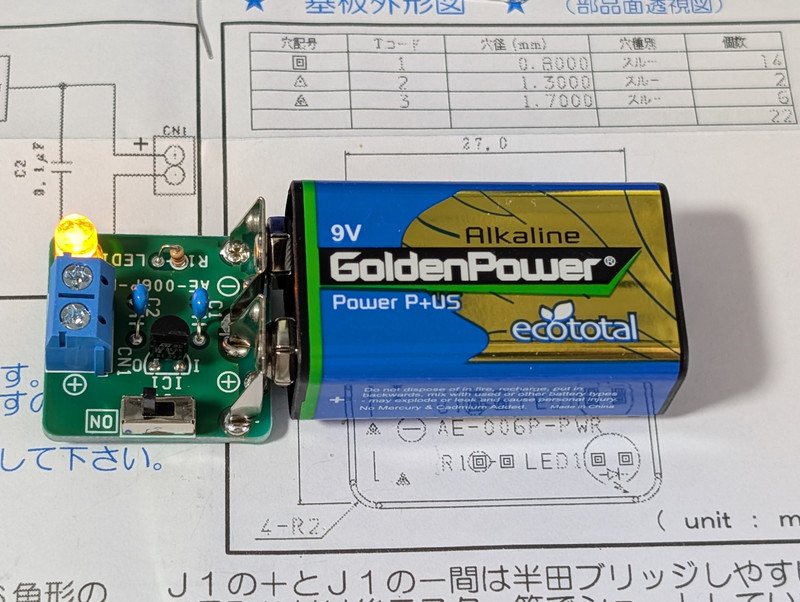
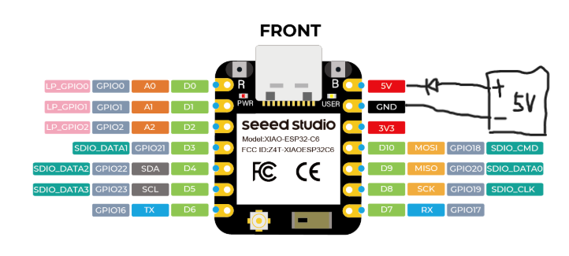
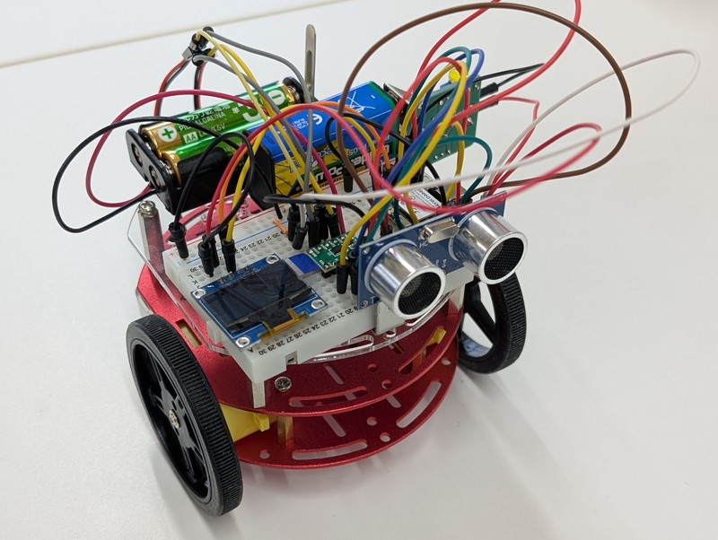

[おおたfab](https://ot-fb.com/event)さんでは電子工作初心者勉強会を定期的に開催しています。

[前回](https://kanpapa.com/2025/08/otafab-esp32-minicar5.html)はミニカーのESP32マイコンに接続した超音波センサーで障害物を検知して停止することができました。今回はミニカーとして前後左右、左右回転の動きを実装し、課題だったマイコンの電源の見直しを行います。

## ミニカーの動きを実装する

これまでミニカーの動きは左方向と右方向しかなく、それを繰り返すことでジグザク走行を行っていました。通常考えられるミニカーの動きをすべて実装しておきます。

まず考えられる動きを表にまとめました。


これに従って実装していきます。なお、参加者からOLEDで距離を棒グラフで表示したプログラムを提供いただきました。GFXのライブラリを活用しているものです。このプログラムもミニカー本体のプログラムに組み込むことで、OLEDの表示がリッチになりました。



実装したプログラムは以下のようになりました。サンプルとしてメインルーチンからそれぞれの動きを実行するようにしています。

ソースコードはこちら(esp32\_mouse2\_move\_to\_4\_direction\_and\_rolate.ino)

```
//-----------------------------------------------------
// esp32_mouse2_move_to_4_direction_and_rolate.ino
// 
// for XIAO ESP32C6
//
// 2025/09/28
//-----------------------------------------------------

#include <SPI.h>
#include <Wire.h>
#include <Adafruit_GFX.h>
#include <Adafruit_SSD1306.h>

#include <Ticker.h>
Ticker flipper;
float cm = 0;

#define SCREEN_WIDTH 128 // OLED display width, in pixels
#define SCREEN_HEIGHT 64 // OLED display height, in pixels

// Declaration for an SSD1306 display connected to I2C (SDA, SCL pins)
// The pins for I2C are defined by the Wire-library. 
// On an arduino UNO:       A4(SDA), A5(SCL)
// On an arduino MEGA 2560: 20(SDA), 21(SCL)
// On an arduino LEONARDO:   2(SDA),  3(SCL), ...
#define OLED_RESET     -1 // Reset pin # (or -1 if sharing Arduino reset pin)
#define SCREEN_ADDRESS 0x3C ///< See datasheet for Address; 0x3D for 128x64, 0x3C for 128x32 
//0x3Cに変更した
Adafruit_SSD1306 display(SCREEN_WIDTH, SCREEN_HEIGHT, &Wire, OLED_RESET);

// Pins
// const int TRIG_PIN = 7;
// const int ECHO_PIN = 8;
const int TRIG_PIN = 18;
const int ECHO_PIN = 20;

// Anything over 400 cm (23200 us pulse) is "out of range"
const unsigned int MAX_DIST = 23200;

/* XIAO ESP32C6
DRV       ESP32
---------------
AIN1 --- GPIO0
AIN2 --- GPIO1
BIN1 --- GPIO2
BIN2 --- GPIO21
*/

int LP = 0; // AIN1   LEFT PLUS
int LM = 1; // AIN2   LEFT MINUS
int RP = 2; // BIN1   RIGHT MINUS
int RM = 21; // BIN2   RIGHT PLUS

void setup()
{
  Serial.begin(9600);

  // The Trigger pin will tell the sensor to range find
  pinMode(TRIG_PIN, OUTPUT);
  digitalWrite(TRIG_PIN, LOW);

  //Set Echo pin as input to measure the duration of 
  //pulses coming back from the distance sensor
  pinMode(ECHO_PIN, INPUT);

  // SSD1306_SWITCHCAPVCC = generate display voltage from 3.3V internally
  if(!display.begin(SSD1306_SWITCHCAPVCC, SCREEN_ADDRESS)) {
    Serial.println(F("SSD1306 allocation failed"));
    for(;;); // Don't proceed, loop forever
  }

  // Show initial display buffer contents on the screen --
  // the library initializes this with an Adafruit splash screen.
  display.display();
  delay(2000); // Pause for 2 seconds

  // Clear the buffer
  display.clearDisplay();

  display.setTextSize(1);             // Normal 1:1 pixel scale
  display.setTextColor(SSD1306_WHITE);        // Draw white text
  display.setCursor(0,0);             // Start at top-left corner
  display.println(F("Hello, world!"));

  display.display();
  delay(2000); // Pause for 2 seconds
 
  analogWrite(LP,0);
  analogWrite(LM,0);
  analogWrite(RP,0);
  analogWrite(RM,0);

  // flip the pin every 0.3s
  flipper.attach(0.3, flip);
}

void loop() //RUN ZIGZAG
{
  TTL();
  delay(1000);
  TTR();
  delay(1000);
  FWD();
  delay(1000);
  BAK();
  delay(1000);
  RTL();
  delay(1000);
  RTR();
  delay(1000);
  STOP();
  delay(1000);
}

void flip() {
  cm = dest();
  // ディスプレイをクリア
  display.clearDisplay();
  
  display.setTextSize(1);
  display.setTextColor(SSD1306_WHITE);
  display.setCursor(0, 0);
  display.println("Distance:");

  // 距離の表示
  display.setTextSize(2); // 少し大きなフォント
  display.setCursor(0, 15);

  if (cm == -1.0) {
    display.println("Out of Range");
  } else {
    display.print(cm);
    display.println(" cm");
    
    // 距離に基づいて四角形（バー）を描画する例
    // 0cmから200cmまでをOLEDの幅(128ピクセル)にマッピング
    int bar_width = map(cm, 0, 200, 0, SCREEN_WIDTH);
    if (bar_width > SCREEN_WIDTH) bar_width = SCREEN_WIDTH; // 最大値を超えないように制限
    if (bar_width < 0) bar_width = 0; // 最小値を下回らないように制限

    display.fillRect(0, 40, bar_width, 10, SSD1306_WHITE); // プログレスバー
  }
  display.display();
}

void FWD(void) // forward
{
  analogWrite(LP,250);
  analogWrite(LM,0);
  analogWrite(RP,250);
  analogWrite(RM,0);
}

void BAK(void) // back
{
  analogWrite(LP,0);
  analogWrite(LM,250);
  analogWrite(RP,0);
  analogWrite(RM,250);
}

void TTL(void) // trun to left
{
  analogWrite(LP,100);
  analogWrite(LM,0);
  analogWrite(RP,250);
  analogWrite(RM,0);
}

void TTR(void) // trun to right
{
  analogWrite(LP,250);
  analogWrite(LM,0);
  analogWrite(RP,100);
  analogWrite(RM,0);
}

void RTR(void) // rotate to right
{
  analogWrite(LP,250);
  analogWrite(LM,0);
  analogWrite(RP,0);
  analogWrite(RM,250);
}

void RTL(void) // rotate to left
{
  analogWrite(LP,0);
  analogWrite(LM,250);
  analogWrite(RP,250);
  analogWrite(RM,0);
}

void STOP(void) // stop
{
  analogWrite(LP,0);
  analogWrite(LM,0);
  analogWrite(RP,0);
  analogWrite(RM,0);
}

float dest() {
  unsigned long t1;
  unsigned long t2;
  unsigned long pulse_width;
  // float cm;
  float inches;

  // Hold the trigger pin high for at least 10 us
  digitalWrite(TRIG_PIN, HIGH);
  delayMicroseconds(10);
  digitalWrite(TRIG_PIN, LOW);

  // Wait for pulse on echo pin
  while ( digitalRead(ECHO_PIN) == 0 );

  // Measure how long the echo pin was held high (pulse width)
  // Note: the micros() counter will overflow after ~70 min
  t1 = micros();
  while ( digitalRead(ECHO_PIN) == 1);
  t2 = micros();
  pulse_width = t2 - t1;

  // Calculate distance in centimeters and inches. The constants
  // are found in the datasheet, and calculated from the assumed speed
  //of sound in air at sea level (~340 m/s).
  cm = pulse_width / 58.0;
  return(cm);
}
```

## マイコン電源の見直し

これまでに実験で課題となっていたのがマイコンの電源です。単三電池２本から昇圧してUSB 5Vを出力する簡易充電器を使用してUSBコネクタから供給していましたが、実際に動かしていると電源が不安定で急にマイコンが停止し制御不能になることが見受けられました。実はXIAO ESP32にはリポバッテリーを接続することができるのですが、実験中にショートしてしまった場合は危ないので、乾電池でまとめたいところです。秋月電子のページを見ていたところ006P電池に直接取付ができる5V安定化電源キットがありました。

https://akizukidenshi.com/catalog/g/g109833

これなら取り扱いが簡単です。これをミニカーに実装することにしました。



XIAO ESP32C6に外部電源を接続する場合は5Vの端子から供給すればよいようです。ただしマニュアルには以下の記述があります。

> 5V - これはUSBポートからの5V出力です。電圧入力としても使用できますが、外部電源とこのピンの間に何らかのダイオード（ショットキー、信号、電力）を配置する必要があります。アノードをバッテリーに、カソードを5Vピンに接続してください。

逆流防止のダイオードが必要です。これは手持ちの1N4148を使いました。

https://akizukidenshi.com/catalog/g/g100941

次の図のように接続することにしました。



## 新しいマイコン電源の実装

この新しいマイコン電源をどのように実装するかを試行錯誤して最終的にはブレッドボードとモーター用バッテリーボックスの間に挟むように取り付けることにしました。この配置だと電源スイッチが少し操作しにくいのですが、電源基板が金属部分に触れてしまうことを防ぐことができます。

これでミニカーのハードウェアは完成しました。最後に両面テープでアクリル板に固定して落下しないようにしておきました。



2台で動かしてみましたが、同じプログラムなのに動きが違います。どうやらモーターの配線で極性が合っていないようです。次回見直したいと思います。

https://youtu.be/Nw9MNqU4a8M

## 次回

ハードウェアはほぼ完成したので、今後はソフトウェアでどこまで自律走行ができるかを試してみます。次回はこのミニカーが袋小路を脱出することを考えてみます。
