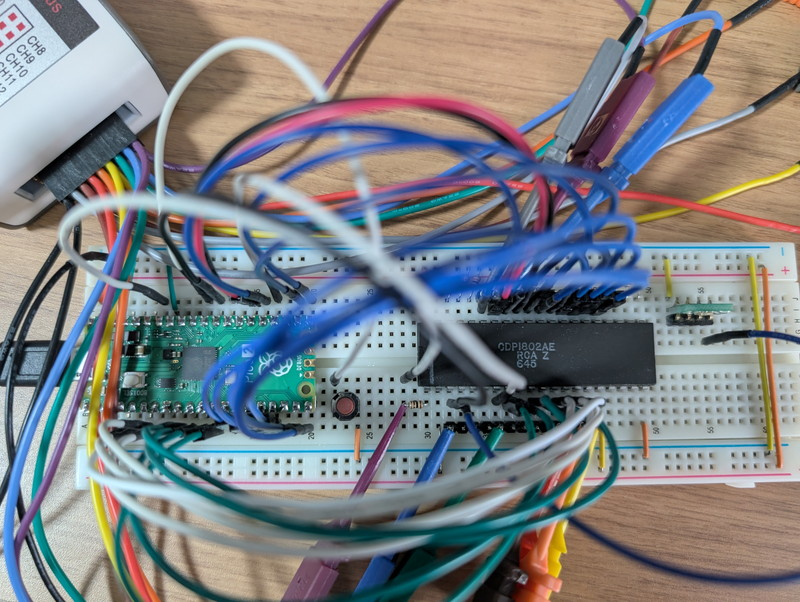
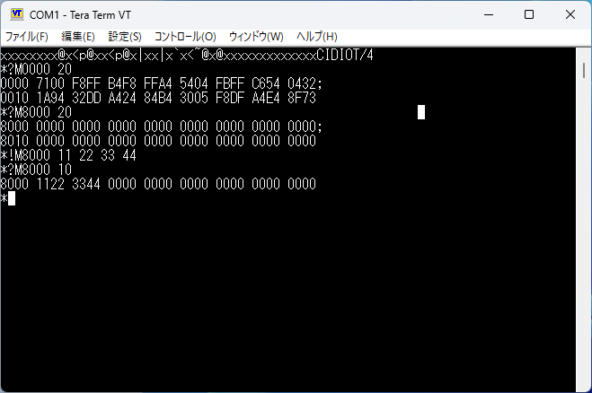

@DragonBallEZさんが開発された[Pico2ROMEmuを製作しSuper AKI-80に接続してROMエミュレーターとして使う](https://kanpapa.com/2025/10/pico2romemu-super-aki-80.html)ことができました。高速処理をどうやって行っているのだろうとソースを拝見したところ、RP2350マイコンのPIOという機能を使い、複数のステートマシンで超シンプルなプログラムを動かして、高速な処理はそれに任せているという仕組みだとわかりました。これは面白いということで頭に浮かんだのが[COSMAC CPU](https://kanpapa.github.io/cosmac-lab/about/cosmac-cpu/)に接続することです。早速ブレッドボードで実験回路を作成しました。

## Pico2ROMEmuを使うメリット

[Pico2ROMEmu](https://github.com/kyo-ta04/Pico2ROMEmuBR)は@DragonBallEZさんが開発されたもので、名前の通り[Raspberry Pi Pico2](https://www.raspberrypi.com/products/raspberry-pi-pico-2/)を使って各種マイコンボードのROMの代わりにするものです。しかし、単なるROMエミュレーターではなくマイコンを動かすための便利な機能も実装されています。

- 高速ROMのエミュレーション（ROMライターが不要）

- Pico2のUSBを使用したUSBシリアル通信機能と5V電源の供給

- マイコンに供給するCLOCKの生成

- マイコンに供給するRESET信号の生成

これまでもCPUと[PIC18F47Q43](https://akizukidenshi.com/catalog/g/g116591/)を接続し、PICに周辺デバイスの機能を持たせて動作させる[EMUシリーズ](https://vintagechips.wordpress.com/2022/03/05/emuz80_reference/)が電脳伝説さんにより開発されています。ただしPICですのでメモリ容量が少ないことや、PICに書き込むための専用プログラマやUSBシリアル変換ボードが別途必要になります。

そこでPico2を使用することでこれらの課題がなくなるのではないかと考えました。Pico2のような高速・高性能のマイコンをわざわざCOSMAC CPUの周辺デバイスとするのはナンセンスという意見もあるでしょうが、本物のCPUを手軽に動かしたいだけです。

またCOSMACの場合、アドレスバスが８本しかなく上位アドレスと下位アドレスが時分割で送られてきます。このため64KBのメモリフル実装でも、Raspberry Pi Pico2のピンにでているGPIOの数で十分対応できてしまうのです。

## Pico2とCOSMAC CPUの接続

早速Pico2ROMEmuを参考にして回路図を作成しました。データバスとアドレスバスがそれぞれ８本と制御信号が数本というシンプルな構成です。QとEF3はCOSMAC伝統のソフトウェアシリアルのTXとRXになります。これをPico2のUARTに割り当てたピンに接続しました。


これをブレッドボードに実装したものです。配線量は多いですが、Raspberry Pi Pico2とCOSMAC CPUだけのシンプルなものになります。



## ROM機能の実装

Pico2ROMEmuの主機能であるROM機能をCOSMAC用に実装します。まずは８ビットのメモリ空間（0x00～0xFF）を実装しました。CPUクロックは2MHzを供給するように変更し、PIOのプログラムはCS,OEを見ているところを、MRD(Memory Read),TPB(Timing Pulse B)を見るように変更しただけです。

```
.program oe_address_control
.wrap_target
loop1:
    wait 0 gpio 18        ; 0: MRDがLowまで待ちます
    wait 1 gpio 21        ; 1: TPBがHighになるまで待ちます
    wait 0 gpio 21        ; 2: TPBがLowになるまで待ちます
    in pins, 8            ; 3: GP10-22(MA0-MA7) 8ビットのアドレスデータを読み込み、PIO内部のISR(Input Shift Register)に格納
    push                  ; 4: ISRに格納したアドレスデータをRX FIFO（受信FIFO）にプッシュします。
    pull                  ; 5: ここでプログラムは一時停止し、TX FIFO（送信FIFO）にデータが送られてくるのを待ちます。
    mov pindirs, ~null    ; 6: メインCPUコアからデータを受け取ったので、今度はそのデータをデータバス（GP2〜GP9）に出力するため、GP2-9を出力モードに変更
    out pins, 8           ; 7: データ出力
    wait 1 gpio 18        ; 8: MRDがHighまで待ちます
    mov pindirs, null     ; 9: GP2-9を入力モードにする
.wrap
```

いつものLチカプログラムをROMデータに書き込みます。rom\_basic\_const.cを以下のように書き換えました。これが動くとQ出力のLEDが点滅を繰り返すはずです。

```
//
// COSMAC Blink program
//
//

// 0000-F8 40    START:  LDI     #$40   ; Dレジスタに$40を入れる（点滅間隔のウェイトループ値）
// 0002-B4               PHI     4      ; R4の上位バイトにDレジスタの値を代入する
// 0003-CD               LSQ            ; Qが1だったら2バイトスキップする
// 0004-7B               SEQ            ; Qを1にする
// 0005-38               SKP            ; 次の命令を無条件でスキップする
// 0006-7A               REQ            ; Qを0にする
// 0007-24       LOOP1:  DEC     4      ; R4を1減算する
// 0008-84               GLO     4      ; DレジスタにR4の下位バイトを代入する
// 0009-3A 07            BNZ     LOOP1  ; Dレジスタが0でなければLOOP1にジャンプ
// 000B-94               GHI     4      ; DレジスタにR4の上位バイトを代入する
// 000C-3A 07            BNZ     LOOP1  ; Dレジスタが0でなければLOOP1にジャンプ
// 000E-30 00            BR      START  ; 0番地から繰り返し

const unsigned char rom_basic[256] = {
  0xF8, 0x40, 0xB4, 0xCD, 0x7B, 0x38, 0x7A, 0x24, 0x84, 0x3A, 0x07, 0x94, 0x3A, 0x07, 0x30, 0x00, // 0x0000
  0xFF, 0xFF, 0xFF, 0xFF, 0xFF, 0xFF, 0xFF, 0xFF, 0xFF, 0xFF, 0xFF, 0xFF, 0xFF, 0xFF, 0xFF, 0xFF, // 0x0010
　　　　：
  0xFF, 0xFF, 0xFF, 0xFF, 0xFF, 0xFF, 0xFF, 0xFF, 0xFF, 0xFF, 0xFF, 0xFF, 0xFF, 0xFF, 0xFF, 0xFF, // 0x00F0
};
```

実行したところ問題なくLチカが動作することを確認しました。次にPIOのプログラムを書き換えてTPA（Timing Pulse A）のタイミングで上位バイトのアドレスも処理するようにして0x0100にLチカプログラムを配置して動かしてみました。

```
.program oe_address_control
.wrap_target
loop1:
    wait 1 gpio 20        ; 1: GP20(TPA)がHighになるまで待ちます
    wait 0 gpio 18        ; 2: MRDがLowまで待ちます
    in pins, 8            ; 3: GP10-22(MA0-MA7) 8ビットのアドレスデータを読み込み、PIO内部のISR(Input Shift Register)に格納
    wait 1 gpio 21        ; 4: GP21(TPB)がHighになるまで待ちます
    in pins, 8            ; 5: GP10-22(MA0-MA7) 8ビットのアドレスデータを読み込み、PIO内部のISR(Input Shift Register)に格納
    push                  ; 6: ISRに格納したアドレスデータをRX FIFO（受信FIFO）にプッシュします。
    pull                  ; 7: ここでプログラムは一時停止し、TX FIFO（送信FIFO）にデータが送られてくるのを待ちます。
    mov pindirs, ~null    ; 8: メインCPUコアからデータを受け取ったので、今度はそのデータをデータバス（GP2〜GP9）に出力するため、GP2-9を出力モードに変更する
    out pins, 8           ; 9: データ出力
    wait 1 gpio 18        ; 10: MRDがHighまで待ちます
    mov pindirs, null     ; 11: GP2-9を入力モードにする
.wrap
```

これも問題なく動作することを確認できました。


## RAM機能の実装

次はMWR（Memory Write）信号を実装してRAMエリアに書き込む動作を試してみます。とりあえず0x1000～にRAMエリアを設定しました。PIOでどのようにRAM機能を実装するかいろいろ試しましたが、最終的にはメモリアドレス取得＋メモリ読み出しのステートマシンと、メモリ書き込みのステートマシンの２つに分けて実装しました。

アドレス取得とメモリ読み出しのステートマシンはほぼROMの実装と同じですが、途中でMRDの信号をチェックしてメモリ読み出しのタイミングでなかったらそのあとのROMの処理をスキップしています。

```
; アドレス取得＆メモリ読み出しのステートマシン
.program cdp1802_get_address
.wrap_target
loop1:
    wait 1 gpio TPA_PIN        ; 1: TPAの立ち上がりを待つ
    wait 0 gpio TPA_PIN        ; 2: TPAの立ち下がりを待つ
    in pins, ADDR_BUS_WIDTH    ; 3: 上位アドレスをISRへ

    wait 1 gpio TPB_PIN        ; 4: TPBの立ち上がりを待つ
    in pins, ADDR_BUS_WIDTH    ; 5: 下位アドレスをISRへ合成し、16bitアドレスにする
    push                       ; 6: 16bitアドレスをRX FIFOにプッシュ
    pull                       ; 7: メインCPUコアからのデータをTX FIFOからOSRへ読み込む
    jmp pin loop1              ; 8: MRDがアクティブ(LOW)でなければあとはwrite_memステートマシンにまかせて最初にもどる
    mov pindirs, ~null         ; 9: MRDがアクティブなので、メインCPUコアから受け取ったデータをデータバス（GP10〜GP17）に出力するため、GP10-17を出力モードにする
    out pins, DATA_BUS_WIDTH   ; 10: OSRのデータをデータバスに出力
    wait 1 gpio MRD_PIN        ; 11: MRDが非アクティブ(HIGH)になるまで待ちます
    mov pindirs, null          ; 12: GP10-17を入力モードにする
.wrap
```

メモリ書き込みのステートマシンはMWR信号がアクティブになるのをひたすら待ち、メモリ書き込みのタイミングになったらデータバスを読み込んでPico2のCPUに渡して、その内容でRAMエリアを書き換えます。メモリアドレスは先ほどのアドレス取得のステートマシンでグローバル変数に最新のものが保持されているのでそれを使います。

```
; メモリ書き込みステートマシン
.program cdp1802_write_mem
mem_write:
    wait 0 gpio MWR_PIN         ; 1: MWRがアクティブ(LOW)になるのを待つ
    in pins, DATA_BUS_WIDTH     ; 2: データバスから8bitのデータをISRに読み込む
    wait 1 gpio MWR_PIN         ; 3: MWRが非アクティブ(HIGH)になるのを待つ
    push                        ; 4: ISRのデータをRX FIFOにプッシュ
.wrap
```

かなり甘い実装だと思いますが、COSMACはシンプルなのでこの実装で問題無く動作してくれました。動作テストは以下のようなシンプルなメモリアクセスのコードをrom\_basic\_const.cに組みこんで確認しました。

```
//
// MEMORY TEST
//
// 010E-F8 10            LDI     #$10    ; $1000 -> R1
// 0110-B1               PHI     1
// 0111-F8 00            LDI     #$00
// 0113-A1               PLO     1
// 0114-F8 55            LDI     #$55    ; $55 -> D
// 0116-51               STR     1       ; D -> M(R(1))
// 0117-01               LDN     1       ; M(R(1)) -> D
// 0118-C0 00 00         LBR     $0000               ; 0番地へジャンプ

  0xF8, 0x20, 0xB4, 0xCD, 0x7B, 0x38, 0x7A, 0x24, 0x84, 0x3A, 0x07, 0x94, 0x3A, 0x07, 0xF8, 0x10, // 0x0100
  0xB1, 0xF8, 0x00, 0xA1, 0xF8, 0x55, 0x51, 0x01, 0xC0, 0x00, 0x00, 0xFF, 0xFF, 0xFF, 0xFF, 0xFF, // 0x0110
  0xFF, 0xFF, 0xFF, 0xFF, 0xFF, 0xFF, 0xFF, 0xFF, 0xFF, 0xFF, 0xFF, 0xFF, 0xFF, 0xFF, 0xFF, 0xFF, // 0x0120
```

この状態でロジックアナライザでバスの信号を確認し、書き込んだデータの値と読みだしたデータが正しいことを確認できました。

## IDIOTモニタを動かす

これで簡単なテストプログラムでの動作はある程度確認できましたので、いよいよモニタプログラムを動かしてみます。ここでは[EMU1802-mini](https://kanpapa.com/2022/06/emu1802-mini-worked.html)の時に確認したIDIOTモニタを動作させました。



0x8000番地のRAMエリアへの読み書きも問題なく動作することを確認できました。

## RCA BASIC3を動かす

次はRCA BASIC3を動かしてみます。これは[1802メンバーシップカード](https://www.sunrise-ev.com/1802.htm)用に提供されているBASICインタプリタです。これを組み込んで動作することも確認できました。


いつものASCIIART.BASも問題なく動作しました。


## まとめ

せっかくここまで動作したので基板化してみます。以前製作したEMU1802-miniと同様にC基板サイズに納めたいと考えています。また、Pico2ROMEmuの機能とは異なりCOSMACに特化したものになってしまったのでこれまでforkしていたブランチからリポジトリを分離して、プロジェクトの名称をPico2MEMEmuCosmacとしました。今後の成果物はこのリポジトリにまとめますので、最新版のソースはこちらでご確認ください。

https://github.com/kanpapa/Pico2MEMEmuCosmac
