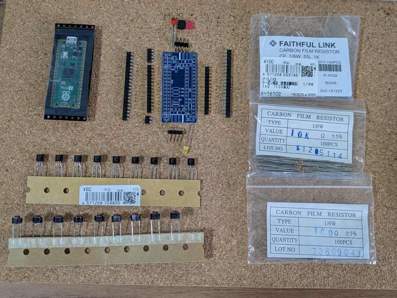
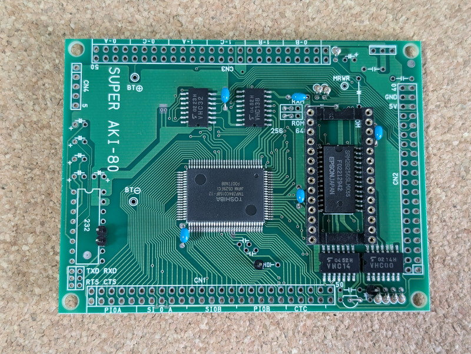
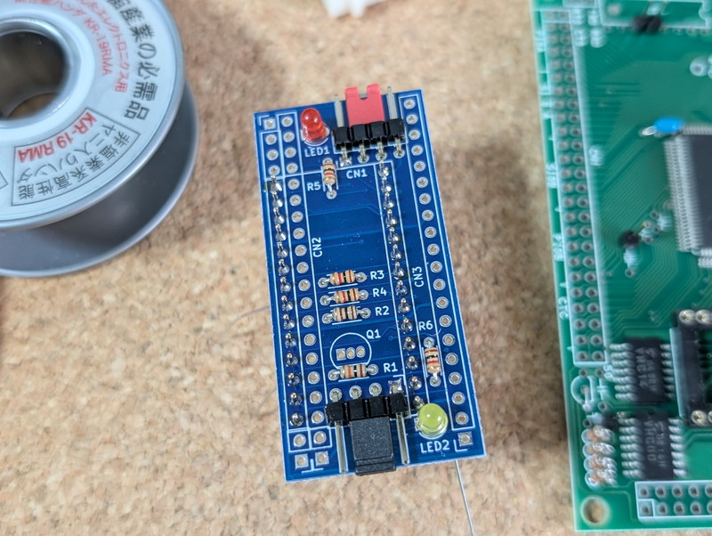
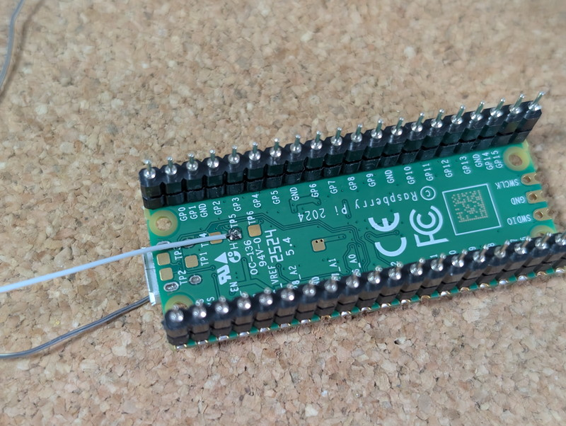
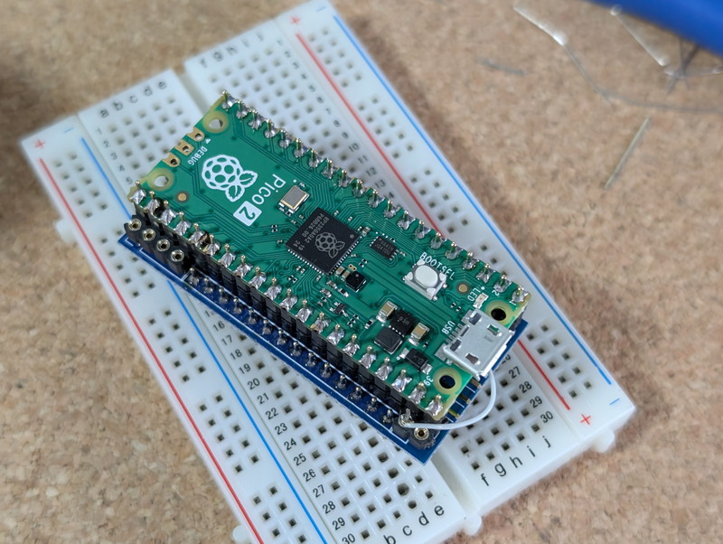
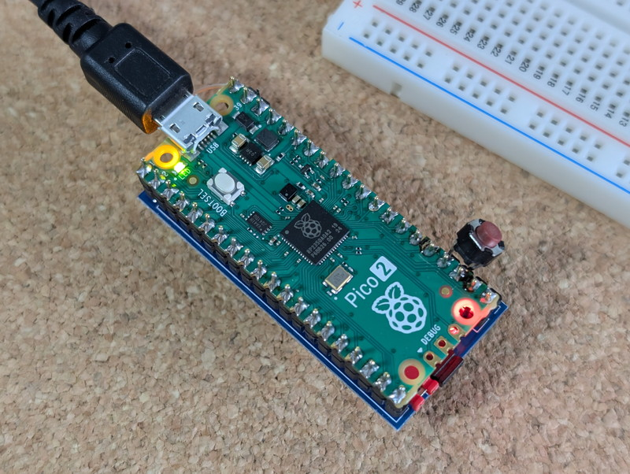
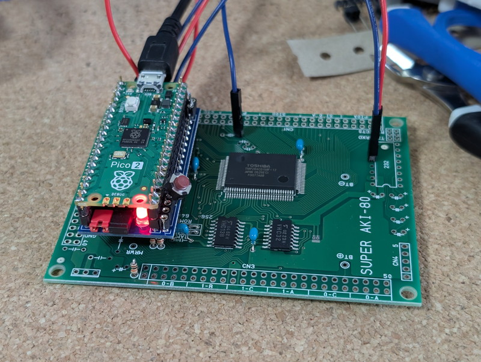

@DragonBallEZさんから、Pico2ROMEmuの基板があるので使ってみませんかというお話がありました。Xで見かけていて興味がある内容だったので、さっそくお願いして動かしてみることにしました。

## Pico2ROMEmuとは

Pico2ROMEmuは@DragonBallEZさんが開発されたもので、名前の通りRaspberry Pi Pico2を使ってROMの代わりにするものです。しかし、単なるROMエミュレーターではなくマイコンを動かすための便利な機能も実装されています。

- 高速ROMのエミュレーション（ROMライターが不要）

- Pico2のUSBを使用したUSBシリアル通信機能と5V電源の供給

- マイコンに供給するCLOCKの生成

- マイコンに供給するRESET信号の生成

これらの機能を使うことでSuper AKI-80のようにROMや周辺パーツ、5V電源が必要なマイコンボードを動かすことが容易になります。さらにSuper AKI-80は10MHzクロックなのでアクセススピードが100ns以下の高速なROMが必要ですが、その条件も満たしてくれます。

また、Super AKI-80以外のアーキテクチャでも動作実績があり、これからも応用範囲が広がりそうです。

Pico2ROMEmuのドキュメントは以下のGitHubにまとまっています。

https://github.com/kyo-ta04/Pico2ROMEmuBR

## Pico2ROMEmuの組み立て

### パーツの準備

@DragonBallEZさんから基板が届きました。コンパクトで青色でかっこいいです。

Raspberry Pi Picoは何個か持っているのですが、Raspberry Pi Pico2は持っていなかったので、MFTokyo2025の会場で買いました。他のパーツは手持ちで揃えることができました。

### Super AKI-80の組み立て

まずはターゲットとなるSuper AKI-80の製作から始めました。細かい製作手順は写真付きで以下のページに掲載されています。

https://note.com/quiet\_duck4046/n/n32906e1dfb96

必要なパーツはICソケット、抵抗、コンデンサ、信号引き出し用のピンヘッダ、ジャンパー線のみで、すべて手持ちのパーツで揃いました。組み立ても簡単です。

### Pico2ROMEmuの組み立て

次はPico2ROMEmuを組み立てます。こちらも細かい製作手順は写真付きで以下のページに掲載されています。

https://note.com/quiet\_duck4046/n/n425d6b7e8d55

組み立てで少し注意すべき点はトランジスタ（Q1）の取り付けです。Pico2と干渉しないようにトランジスタの背の高さを最低限にするために、トランジスタのパッケージの根本まで差し込めるようになっています。手持ちのトランジスタはすでに足が2.54mm間隔に加工されていたものだったので、ラジオペンチで足がまっすぐになるように調整してから実装しました。またこのトランジスタのパターンの間隔が狭い（ピン間 1.27mm）のでブリッジしないように注意しました。

あと、Pico2のTP5からワイヤーを引き出す必要がありますが、ここも細かいところなので注意してはんだ付けしました。私の場合はAWG30のラッピングワイヤーを使用しました。

完成したPico2ROMEmuです。

## ファームウェアの書き込み

Pico2のファームウェアは[Super AKI-80の組み立て方(最少部品編)](https://note.com/quiet_duck4046/n/n32906e1dfb96)に記載の通りGitHubからPico2ROME360MHz.uf2を入手し、BOOTSELとRUNスイッチを操作し、Drag&Dropで書き込み完了です。書き込み後は緑色のLEDが点灯しました。問題なさそうです。

## 動作確認

Pico2ROMEmuとSuper AKI-80との接続はブレッドボード用のメスーメスケーブルで接続します。接続方法は[Super AKI-80の組み立て方(最少部品編)](https://note.com/quiet_duck4046/n/n32906e1dfb96)に記載の通りです。

Super AKI-80との接続ができたところで、Pico2のUSBをPCに接続して電源を投入しました。熱くなっているチップも無く問題なさそうに見えます。

ターミナルソフトを起動してRUNスイッチを押してRESETをかけたところ、無事BASICまで動きました。

## 開発環境のセットアップ

8KB ROMの内容を変更したいとか、異なるマイコンボード用に修正して試してみる場合はRaspberry Pi Pico2のファームウェアをビルドする必要がありますが、VSCodeの機能拡張を使用するのがおすすめです。

GitHubからcloneしたフォルダをVSCodeで開いて、アクティビティバーにあるPicoのアイコンから、Compile Projectをクリックすればファームウェアが生成されます。これをPico2に書き込めば新しいファームウェアで動き始めます。

Pico2ROMEmuのソースを眺めてみましたがシンプルで、いろいろな改良ができそうです。Pico2の開発環境を理解する上でも取り組みやすい内容ではと思います。

## まとめ

今回Pico2ROMEmuを使用してSuper AKI-80を最小限のパーツで安定して動作させることができました。

なお、Pico2ROMEmuでROMが8KBしか無いのはPico2から出ているGPIOピンの数の制限から来ています。以前に[RP2040でFuzixを動かす](https://kanpapa.com/2025/08/ae-rp2040-fuzix-04.html)ときに使用した秋月電子の全ピンが引き出してある[RP2040マイコンボードキット](https://akizukidenshi.com/catalog/g/g117542/)のRP2350版があればROM空間がさらに広がる可能性はあります。こちらにはRUNスイッチも実装されているので使い勝手も便利になります。RP2350マイコンボードキットが欲しいなと秋月電子さんの「こんなパーツが欲しいのコーナー」にリクエストしておきました。

また、複数の8KB ROMを選択して動かす実装も@TororoLabさんが試しているので、この記事が出る頃にはさらに拡張されているかもしれません。

これはまだ構想中の段階ですが、[COSMAC](https://kanpapa.github.io/cosmac-lab/about/cosmac-cpu/)というCPUはアドレスバスが8本しかでていません。マルチプレクサで上位8bit、下位8bitで時分割で使っています。この仕様であればPico2のGPIOの本数でCOSMAC CPUはカバーできるのではないかとちょっと考えています。

最後に@DragonBallEZさんPico2ROMEmuの開発および基板のご提供ありがとうございました。
