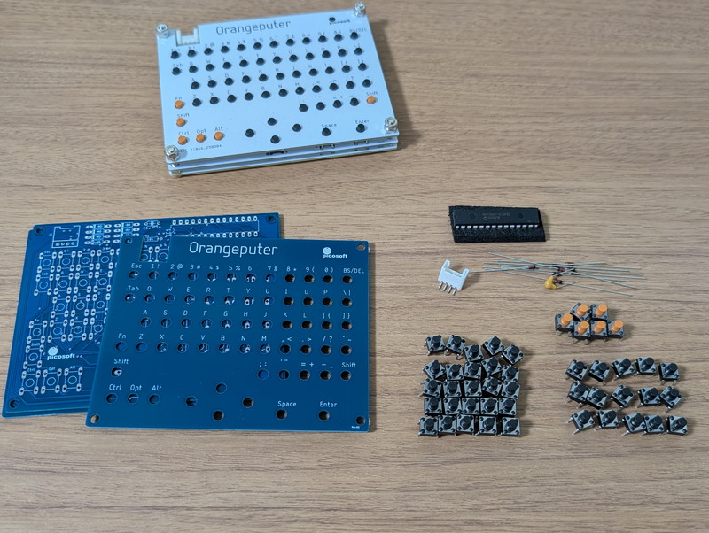
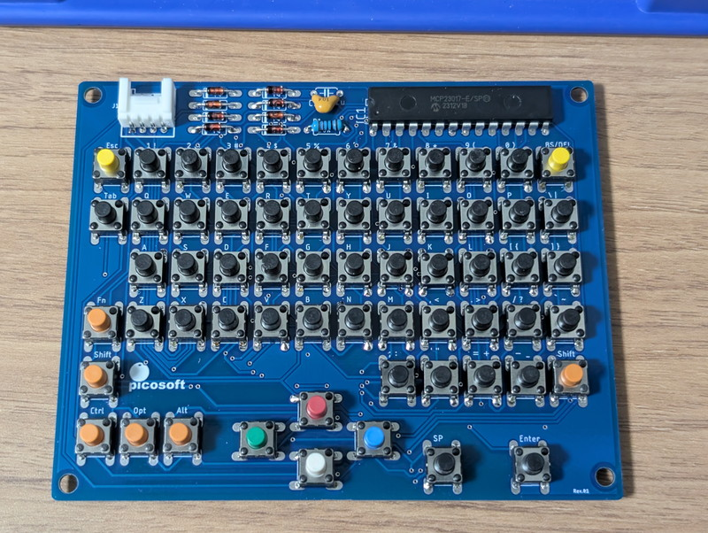
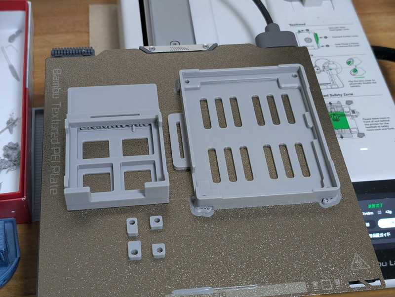
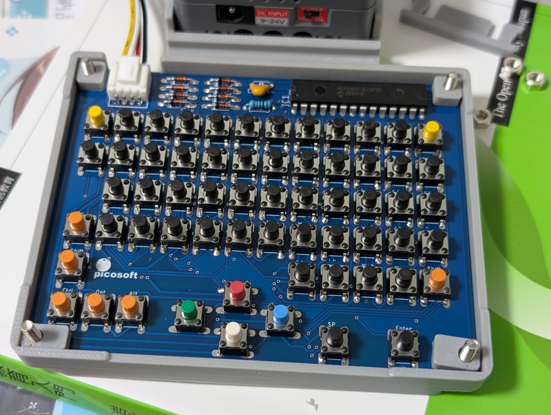
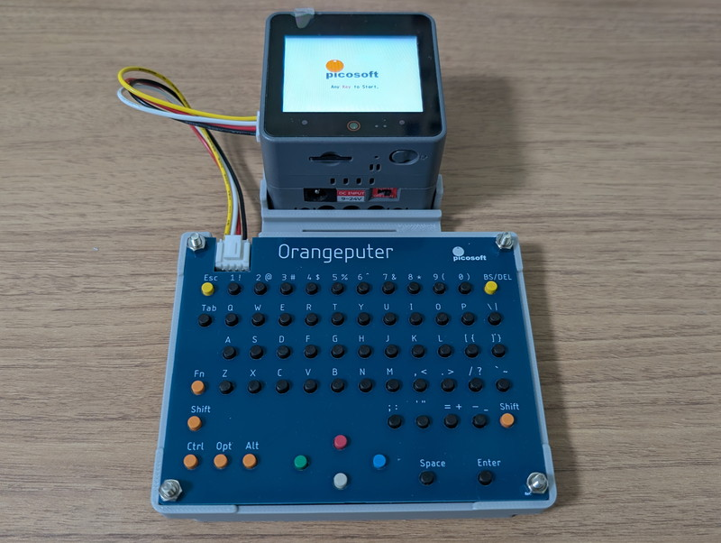
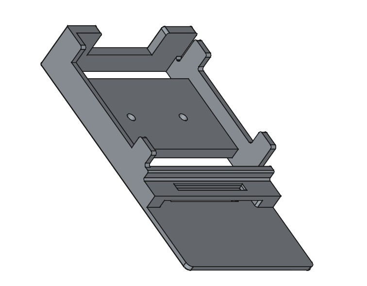
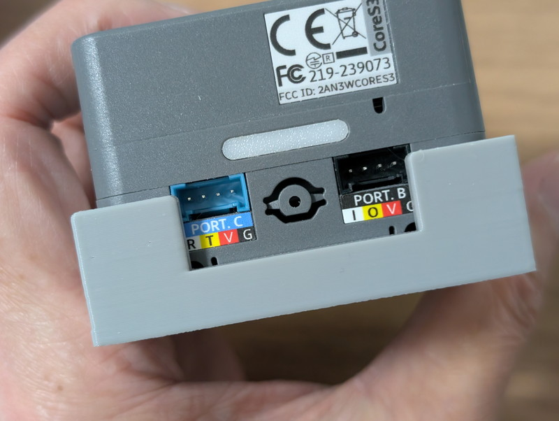

[前回の記事](https://kanpapa.com/2025/11/orangeputer-m5stacks3-japanese-editor1.html)ではM5Stack CoreS3にOrangeputer-KBを接続し、日本語入力ができることを確認しました。その後、M5Stack用日本語入力キーボード組立てキット用フレーム (Orangeputer-KB + M5StackS3 をハンディコンソール的な感じにするフレーム)が[@n602\_NA](https://x.com/n602_NA)さんから公開されましたので早速3Dプリンタで出力してみました。

## Orangeputer-KB ２号機の製作

M5Stack専用にOrangeputer-KB 2号機を組み立てました。色は青にしてみました。またタクトスイッチも標準とは異なる色を少し使ってみました。

完成したOrangeputer-KB 2号機です。

これをM5Stack用日本語入力キーボード組立てキット用フレームに組み込みます。

## M5Stack用日本語入力キーボード組立てキットのフレームの3Dパーツ準備

まずSTLデータを以下のサイトからダウンロードします。STEPデータもありますので改良もできそうです。

https://www.thingiverse.com/thing:7203251

あとはBambu A1 miniにお任せです。各パーツを並べて造形が完了しました。

3Dパーツが揃ったところで、Orangeputer-KBをフレームに組み込みます。

M5Stack CoreS3もフレームに取り付けました。お互いが固定されて使いやすくなりました。

## M5Stack DIN BASE用フレームの製作

このフレームに取り付けて使っているときに、本体を傾けるとM5Stackが外れてしまいました。私のM5Stack CoreS3には[LLM Module](https://docs.m5stack.com/ja/module/Module-LLM)と[DIN BASE](https://docs.m5stack.com/ja/base/DIN%20BASE)を接続しているので、高さが高くて重心がやや上になり傾けると外れやすいようです。

[DIN BASE](https://docs.m5stack.com/ja/base/DIN%20BASE)には固定するための仕掛けがいくつかあるのですが、ここでは底面埋め込み式真鍮インサートナット（2ヶ所）を活用してみます。

公開データに含まれていたSTEPファイルを利用して、ノギスで実物を計測しながらFreeCADでDIN BASE固定用のフレームを設計しました。

早速3Dプリンタで出力です。

このフレームにDIN BASEを固定してみましたが、やや取り付けにくかったのであと0.2mmぐらい余裕をもたせるのが良さそうです。また、Groveコネクタにちょっと被っているのでこれも調整が必要です。とりあえずDIN BASEをネジ止めで固定することで外れることはなくなりました。

このように少し課題は残っていますが、キーボードの使用には特に支障はないので、どこかのタイミングで調整してみようと思います。

## まとめ

[@n602\_NA](https://x.com/n602_NA)さんのM5Stack用日本語入力キーボード組立てキット用フレームでOrangeputer-KBとM5Stack CoreS3のセットが取り扱いやすくなりました。今後Orangeputer-KBに接続できる機器が増えてくると思いますので、今回製作したDIN BASE用フレームのように様々な機器ごとにフレームができていくのではないかと楽しみです。

3Dデータを設計・公開いただいた [@n602\_NA](https://x.com/n602_NA)さんありがとうございました。
