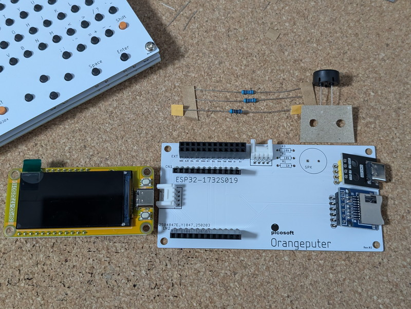
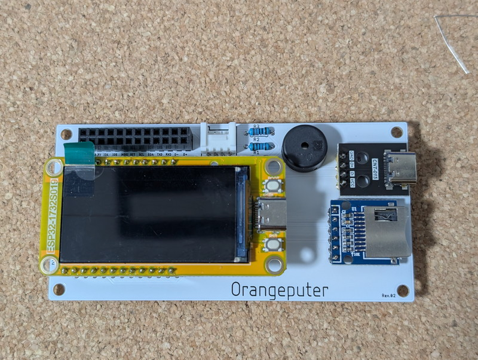
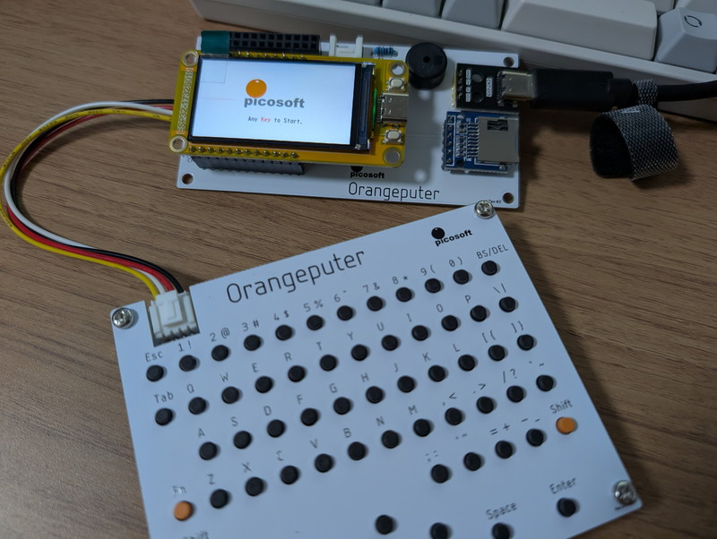
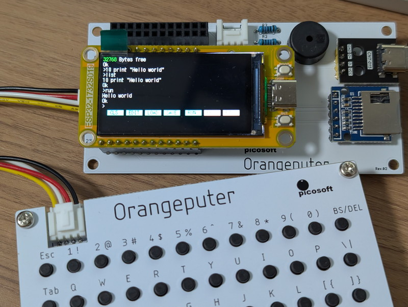
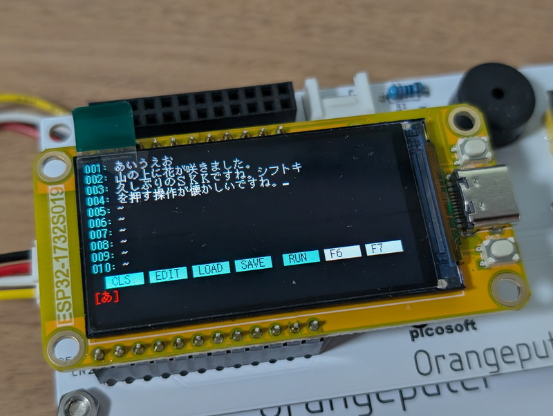
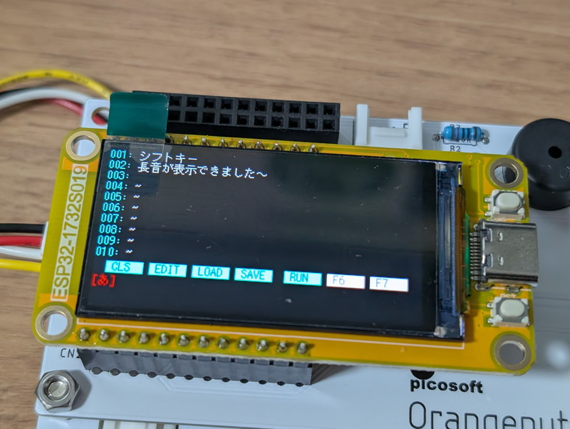
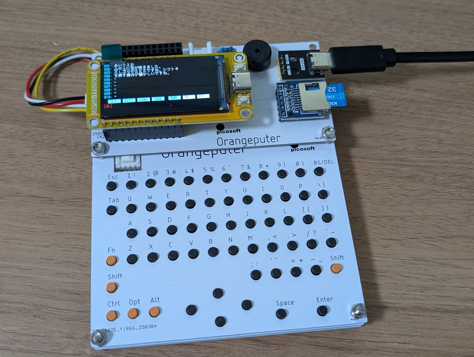

ピコソフトさんからOrangeputerという開発中のESP32ベースの液晶付きマイコンボード＋I2Cフルキーボードのキットを試用させていただく機会をいただきましたので、早速組み立ててみました。

## Orangeputerのマイコン

Orangeputerの頭脳は[1.9インチESP32-1732S019液晶モジュール](https://store.shopping.yahoo.co.jp/orangepicoshop/pico-m-065.html)です。この基板にはESP32-S3マイコンと液晶モジュール、USBコネクタなどが実装されており単体でも動作するものです。これをOrangeputer専用基板に取り付けることで圧電スピーカー、microSDカード、USB-Cコネクタ、Groveコネクタが使えるようになります。

パーツも少なく組み立ては容易です。完成したOrangeputer CPUボードです。

## Orangeputer-KB

Orangeputerのキーボードはタクトスイッチを62個使います。タクトスイッチはマトリクスとなっており16bit I2C I/Oエキスパンダー MCP23017に接続されています。マイコンとはI2Cで接続されます。

タクトスイッチの数が多く、足も曲がりやすいので注意が必要ですが、こちらも組み立ては容易です。

## OrangeputerとOrangeputer-KBの動作確認

Orangeputer-CPUとOrangeputer-KBはGrove用ケーブルで接続します。すでにESP32マイコンにファームウェアが書き込まれているとのことでしたので、USB-Cから電源を供給したところスタートアップ画面が表示されました。

この状態でキーボードのキーを押したところ、ORANGE-BASICが起動しました。

もちろんキーボードからプログラミングができます。やはりキーボードがあると操作性が良いですね。

## OrangeputerとOrangeputer-KBを固定する

動作は問題無いようなのでキットにあるネジで各基板を固定します。この固定のしかたは自由ですが、私はコネクタが当たらないようにネジを逆さに取り付けて固定しました。コネクタのストッパーをニッパーで切っても良いのですが、もったいないのでこのような取り付けにしています。

## 日本語入力エディタを動かす

Picosoftさんからは開発中の日本語入力エディタを提供いただいたので、これも触ってみることにしました。ソースコードからバイナリを作成してESP32に書き込みます。これはVSCODE＋PlathomeIOのESP32開発環境を使います。

日本語入力システムは[SKK](https://ja.wikipedia.org/wiki/SKK)というものを使っています。私はNEWSやSunとかのUNIXワークステーションを使っていた時に使ったことがあるのですんなりと入力することができました。漢字にしたい場合はShiftキーで大文字にして、候補の漢字はスペースキーで選択して、Enterで確定という操作方法です。他にも入力モードを切り替える方法がいくつか提供されています。

最初に試したら通常の文章は入力できたのですが、長音がどうしても入力できません。おかしいなと調べていたところで、アップデート版をご提供いただき長音も入力できるようになりました。

## まとめ

思ったより日本語が軽快に入力できるので、他のマイコンにも移植して活用できると思います。キーボードもI2Cと標準的なインターフェースですので、他のI2Cのキーボードにもある程度対応できるのではと思われます。現在M5Stackをホストにしたものも開発中だそうです。今後が楽しみなプロジェクトです。

