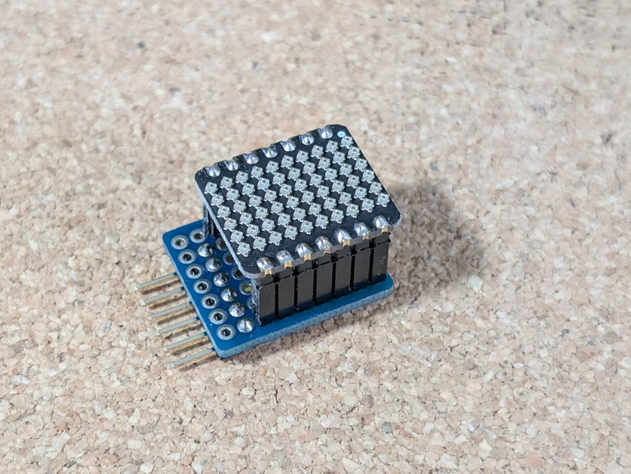

本記事はPDP-11の命令セットを持つ[DCJ11(Jaws)CPU](https://gunkies.org/wiki/J-11_chip_set)を動作させるためにRyo Mukaiさんが開発した[TangConsoleDCJ11MEM](https://github.com/ryomuk/TangConsoleDCJ11MEM)を使用しています。GitHubで公開されています。

[TangConsoleDCJ11MEMを組み立てて、PDP11GUIが動作するところまでは確認しました。](https://kanpapa.com/2025/10/pdp-11-tangconsole-dcj11-mem-1.html)次は様々なアプリケーションを動作させてみますが、その前にWS2812 LEDアレイをPmodコネクタに接続するとFPGAの状態が表示されるとのことなので、これをまず試してみました。

## WS2812 LEDアレイの選定

オリジナルではWS2812 LEDアレイで40個のLEDを制御しているようです。私はこのようなLEDアレイは持っていないので探してみたところ、XIAO用の6x10 RGBマトリクスを見つけました。6x10で60個のLEDアレイですので要件は満たせそうです。コンパクトで良さそうなので早速こちらを購入しました。

- [6x10 RGB WS2812 Matrix for Seeed Studio XIAO](https://www.seeedstudio.com/6x10-RGB-MATRIX-for-XIAO-p-5771.html)

## WS2812 LEDアレイの接続テスト

WS2812ですのでTangConsoleとは3本のワイヤーで接続します。本来はWS2812は5V用なのですが、Pmod端子から出力されている3.3Vでも動作しました。

https://youtu.be/ZY\_XLpOFet4

## 表示方向を変更する

WS2812 LED Arrayに情報の表示はできているのですが、表示方向が6桁10行となってしまいました。できれば8ビット毎に確認しやすいように10桁6行としたいところです。ソースコードのtop.vを参照したところ、WS2812に送信するデータがbitmap2stream配列として並んでいるのでこれを組み替えることで表示方向を変更できそうです。

なお、LEDの位置は以下のようになっています。

| 39 | 38 | 37 | 36 | 35 | 34 | 33 | 32 |
| --- | --- | --- | --- | --- | --- | --- | --- |
| 31 | 30 | 29 | 28 | 27 | 26 | 25 | 24 |
| 23 | 22 | 21 | 20 | 19 | 18 | 17 | 16 |
| 15 | 14 | 13 | 12 | 11 | 10 | 9 | 8 |
| 7 | 6 | 5 | 4 | 3 | 2 | 1 | 0 |

まずLEDの個数が60個になるように変数や配列を調整し、10桁6行で表示されるようにbitmap2stream配列の要素を変更しました。

なお、LEDには以下の内容が表示されています。なお、39～32のLEDはこの内容で固定ですが、31～0のLEDはsw1\_count(SW1を押す）の内容で変化するので、これがすべてではありません。

| LED No. | Red | Green | Blue |
| --- | --- | --- | --- |
| 39 | diag\_test\_failed | rx\_data\_ready | CLK\_monitor |
| 38 | HALT | ~tx\_ready | ALE\_monitor |
| 37 | ~INIT\_n | BUS\_RESET | event\_monitor |
| 36 | (sd\_error !=0) \| ~sd\_mosi | 未使用 | ~sd\_miso |
| 35 | (mt\_error !=0 ) \| ~mt\_mosi | 未使用 | ~mt\_miso & (sd2\_dev == DEV\_MT) |
| 34 | (pt\_error !=0 ) \| ~pt\_mosi | 未使用 | ~pt\_miso & (sd2\_dev == DEV\_PT) |
| 33 | IRQ2 | IRQ1 | IRQ0 |
| 32 | sw1\_count (3bit counter) |  |  |
| 31〜16 | address\[15:0\] |  |  |
| 15〜0 | d\_cpu\_to\_ram |  |  |

top.vを変更したあとにRerun Allを実行し、生成されたbitstreamをTangConsoleに書き込みました。電源を投入したところ予定通りに8桁×5行のビットマップとして表示できました。

https://youtu.be/RvS4ef8d938

左上のLEDが常時青点滅しているのでCLKは問題ないとか、HALTキーを押しっぱなしにするとそのLEDが赤になるなど動作を目で確認することができます。

## Pmod接続基板の製作

とりあえず3本のワイヤーで接続してテストを行いましたが、せっかくなので基板にまとめてみました。製作した基板は以下のようになりました。

残りのPmodコネクタをふさがないようにピンヘッダを基板の下側に実装しました。配線は3.3V、 GND、データの3本だけです。

## Pmodコネクタに基板を接続

完成したLEDアレイ基板をTangConsoleのPmodコネクタに接続して動かしてみました。

https://youtu.be/S2qACVMagRU

表示位置もマッチしており元気に光るのが楽しいです。

## まとめ

コンパクトなWS2812 LED Arrayを使うことで、様々な情報を一度に表示することができています。これまでですと、独立したLEDを何個か取り付けて状態をみることを考えてしまいがちですが、このようなWS2812 LEDアレイを使う発想はありませんでした。他のプロダクトでも活用できると思います。

WS2812 LED Arrayで強力なデバック手段を手に入れることができたので、引き続きTangConsoleDCJ11MEMで様々なアプリケーションを動かしてみます。
