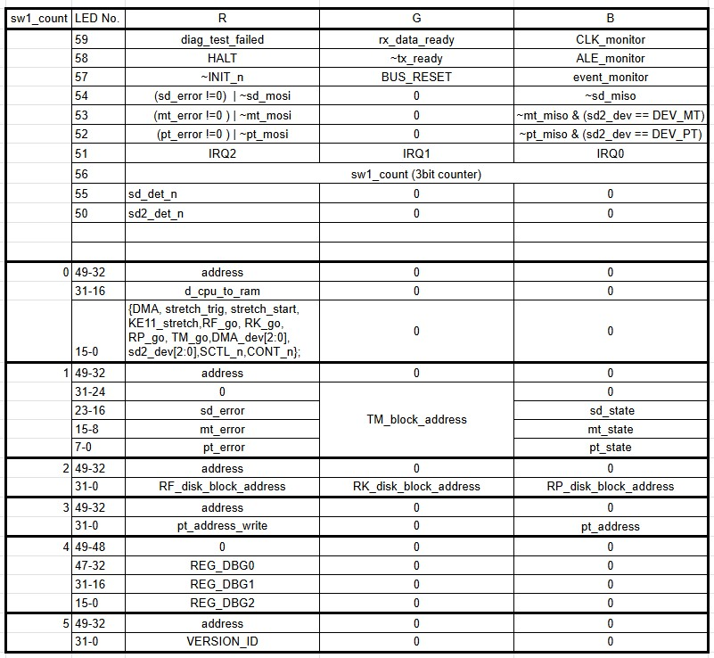

本記事はPDP-11の命令セットを持つ[DCJ11(Jaws)CPU](https://gunkies.org/wiki/J-11_chip_set)を動作させるためにRyo Mukaiさんが開発した[TangConsoleDCJ11MEM](https://github.com/ryomuk/TangConsoleDCJ11MEM)を使用しています。GitHubで公開されています。

[前回の記事](https://kanpapa.com/2025/11/pdp-11-tangconsole-dcj11-mem-ws2812-led-array.html)では入手したWS2812 10x6 RGBマトリクスをそのまま接続してデバック情報が表示されるようにしましたが、60個あるRGB LEDの20個が使用されていない状態です。せっかくなので残りの20個でデバック情報の表示を最適化してみます。

## 表示方法の設計

まずはLEDの配置を図にして考えてみます。10x6を横に使うとして、10個のLEDを8個と2個にわけて使い、さらに8ビットを2段組み合わせて16ビットを表現できるようにします。開発者のRyo Mukaiさんからの助言でアドレスは18ビット表示できるのが良いとのことでしたので最上段は2ビットを追加し18ビットの表示ができるようにしました。

このデバック情報の表示はTangConsoleボードのSW1を押すことで内容を切り替えて表示する仕様です。最初のLED 40個バージョンでは８種類の内容を切り替えて表示していました。この切り替える手間をへらすために、できるだけ詰め込んで表示できるように見直してみました。具体的には以下の表のようになりました。

これで８種類の表示を６種類まで減らし、アドレスはほぼ常に表示されるようにしました。

## 動作確認

これまで設計した内容をtop.vに反映して動作確認を行いました。



一応正しく動作しているように見えます。

## ２個使って全情報表示

開発者のRyo Mukaiさんはすでに一歩先のことを考えていて、この10x6 RGB マトリクスを２個使用して全情報を一度に表示するようにされていました。確かにそうすればSW1で切り替える手間はいりません。さすがです。

https://twitter.com/uCOM80/status/1987387003571478811

## まとめ

今回は40個のRGB LED表示から60個のRGB LED表示にしてデバック情報の最適化を行ってみました。まずはこの10x6 RGBマトリクスを１個使ったバージョンでしばらく使ってみて、拡張したくなったら２個目をつけてみようかと思います。
