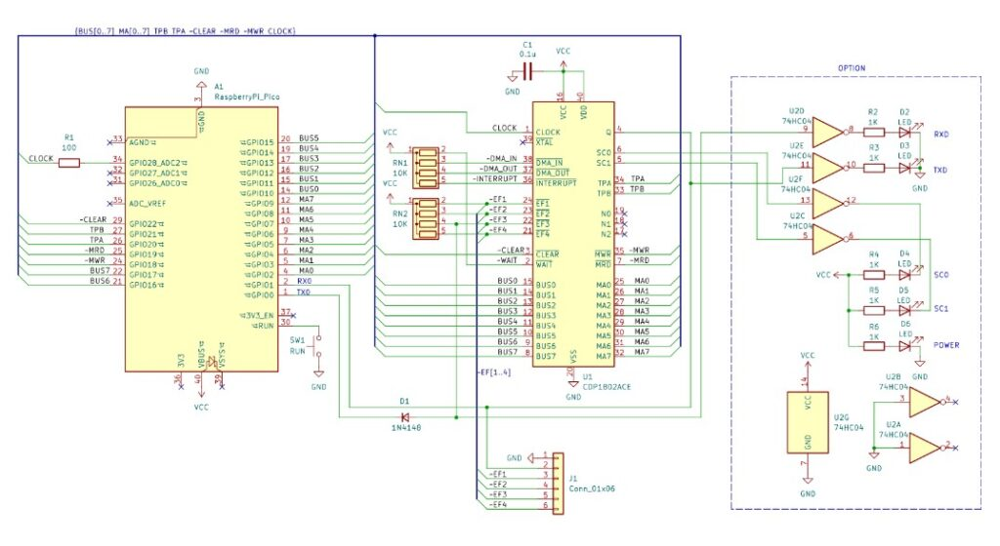

Raspberry Pi Pico2がCOSMAC CPUのメモリとして動作する[Pico2MEMEmuCosmac](https://kanpapa.com/2025/10/pico2mememu-cosmac-01.html)をブレッドボードで製作しましたが、このままだと大量の配線で扱いにくいので専用基板を製作してみることにしました。

## 回路図の見直し

基板化にむけて回路図は以下のように少し拡張し、[SBC1802](https://vintagechips.wordpress.com/2021/04/13/sbc1802fixed/)で実装されているインジケーター回路をオプションとして追加しました。またQ出力とEF1～4入力はコネクタに引き出しました。本来であればCPUの全ピンを引き出せるようにコネクタを実装したかったのですが、基板スペースの関係で今回は見合わせました。

## 専用基板の設計

この回路をC基板のサイズにまとめてみました。3Dイメージだと次のようになりました。

Raspberry Pi Pico2を表面実装できる基板にしてみたかったので、USBコネクタに干渉しないように切り込みをいれています。C基板としてのネジ穴は欲しかったのでこのような形になりました。

## 到着した基板

いつものようにJLCPCBさんに発注してから一週間程度で手元に到着しました。試作なので5枚です。面付をしようかと思ったのですが、また変更点もでてくると思い今回はそのまま発注しました。

## パーツの準備

製作に必要なパーツです。オプション回路のパーツはここには含まれていませんが、これだけあれば動かすことができます。COSMAC CPUの入手が少し難しいかもしれませんが、[オレンジピコショップ](https://store.shopping.yahoo.co.jp/orangepicoshop/?sc_i=shopping-pc-web-detail-item-bclst-_)さんで取り扱いがあるようです。

これらのパーツをハンダ付けして完成した基板です。C基板サイズでコンパクトに仕上がっています。

## 動作確認

Raspberry Pi Pico2にファームウェアを書き込み、USBシリアルにターミナルを接続します。Enterキーを叩くとRCA BASIC3が無事起動しました。

## オプション回路の実装

ここまで動けば基本機能は問題なく動作しているので、オプション回路のインジケータ部分も実装しました。1608サイズのパーツですので実装に注意が必要ですが、やはり何かが光っていると安心できます。

このLEDはRXD, TXD, SC0, SC1, POWERで[SBC1802](https://vintagechips.wordpress.com/2021/04/13/sbc1802fixed/)で実装されているものと同じ仕様にしています。

なお、TXDはQ出力の状態を示しますので、Lチカプログラムを動かすとこのLEDが点滅します。SC0とSC1はSTATE CODE信号で以下のようにCPUの状態を示します。

| SC0 | SC1 | CDP1802の状態 |
| --- | --- | --- |
| 消灯 | 消灯 | S0 (Fetch) |
| 点灯 | 消灯 | S1 (Execute) |
| 消灯 | 点灯 | S2 (DMA) |
| 点灯 | 点灯 | S3 (Interrupt) |

通常の状態であればSC0が点灯したままのように見えます。

## まとめ

今回基板化したのでひと段落ですが、もう少しファームウェアをいじってドキュメントにまとめてみようと考えています。

これらの回路図やKiCadの基板データは以下のGitHubにまとめる予定です。COSMACというユニークなCPUを手軽に体験できる良い材料になるのではと考えています。

https://github.com/kanpapa/Pico2MEMEmuCosmac

最後に[Pico2ROMEmu](https://kanpapa.com/2025/10/pico2romemu-super-aki-80.html)を製作するきっかけをいただいた@DragonBallEZさんありがとうございました。
