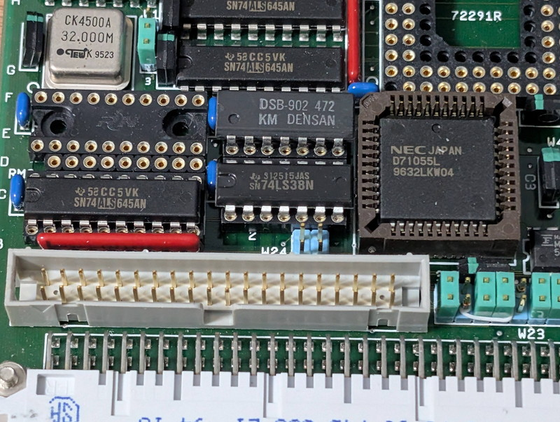
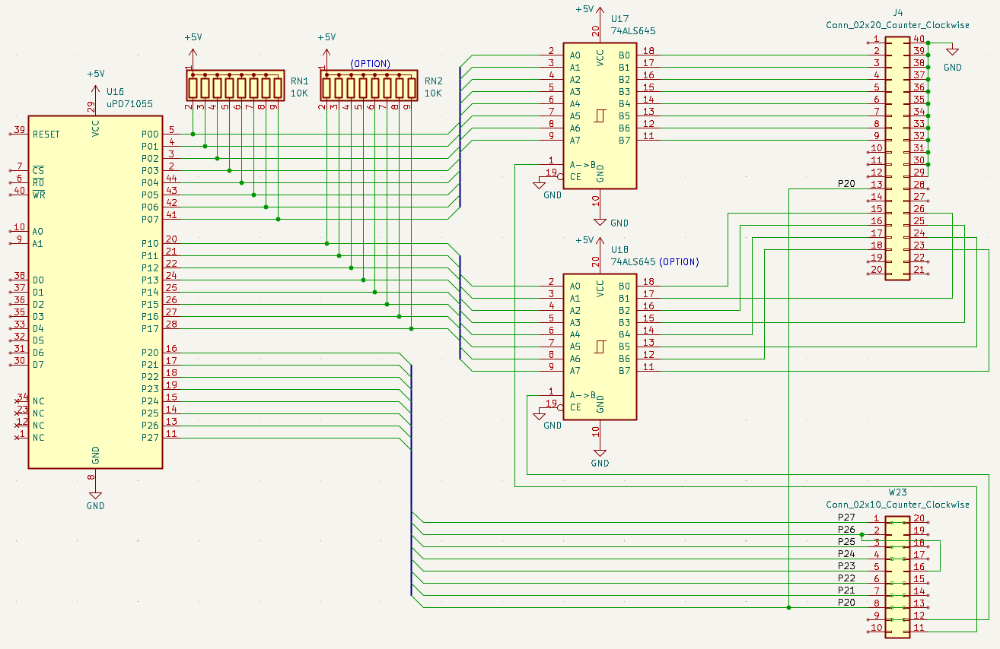

[前回](/2026/01/v53-vme-system-6.html)はCPUボードに実装されているuPD71051(USART)の動作確認を行いました。モニタコンソール以外にもシリアル出力ができるようになったので解析が捗りそうです。今回はuPD71055(PPI)の動作確認を行います。

## I/Oマップのまとめ

USARTの調査と同様に残りのペリフェラルのI/Oアドレスを調査したところ以下の結果となりました。SCSICについてはCSピンが判明していないので推測になります。

|I/Oアドレス|デバイス|機能|備考|
|:---|:---|:---|:---|
|0000|μPD72111 (SCSIC)|DF0|未確認|
|0001|μPD72111 (SCSIC)|DF1|未確認|
|0002|μPD72111 (SCSIC)|CST|未確認|
|0003|μPD72111 (SCSIC)|ADR|未確認|
|0004|μPD72111 (SCSIC)|WIN1|未確認|
|0005|μPD72111 (SCSIC)|WIN2|未確認|
|0006|μPD72111 (SCSIC)|TP/DID|未確認|
|0007|μPD72111 (SCSIC)|IST/CMD|未確認|
|00C8|μPD71059 (PIC)|IRR/ISR/IW1/PCFW/MCW| |
|00CA|μPD71059 (PIC)|IMR/IW2/IW3/IW4| |
|00CC|μPD71059 (PIC)|00C8Hのイメージ| |
|00CE|μPD71059 (PIC)|00CAHのイメージ| |
|00D8|μPD71051(USART)|データポート|動作確認済|
|00DA|μPD71051(USART)|コマンドポート|動作確認済|
|00DC|μPD71051(USART)|00D8Hのイメージ||
|00DE|μPD71051(USART)|00DAHのイメージ||
|00E0|μPD71055 (PPI)|Port A||
|00E2|μPD71055 (PPI)|Port B||
|00E4|μPD71055 (PPI)|Port C||
|00E6|μPD71055 (PPI)|Control||

おおむねScanコマンドの結果と一致したことがわかります。

## PPIの接続先を探る

μPD71055は8255と同じ機能を持っています。8255はよく使っていたデバイスで制御方法は知っているのですが、最初にどこにポートがつながっているかの確認が必要です。



怪しいのはPPIの近くにある40Pのコネクタ(J4)ですが、どこに接続されているのかテスターで確認しながら回路図を起こしてみました。



P00-07（8255ではポートA）は途中プルアップされ74ALS645を経由して、予想通りに40Pのコネクタに接続されていました。

なお、74ALS645はデータの方向をDIRピンで制御する必要がありますが、この電圧は5Vだったので、現在はPPI→コネクタになっているようです。

P10-17（8255ではポートB）は未実装のICソケットを経由して40Pのコネクタに接続されています。ポートAと同様に74ALS645とSIP抵抗を取り付ければP00-07と同様に利用できそうです。

P20-27（8255ではポートC）は40Pのコネクタではなく、その隣のピンヘッダW23に接続されていました。しかもここはジャンパーが多く取り付けられ、別の回路に接続されてVMEボード自体の制御を行う目的に見えます。この解析は時間がかかりそうなので別の機会に行うことにします。

## PPIを動かしてみる

すぐ使えそうなのはP00-07です。モニタのOコマンドを使って、PPIを制御してみました。まずはP00-07をHighにしてみます。

```
> o 00e6 80　←全ポート出力モードに設定
> o 00e0 ff　←P00-P07をHighにする
```

テスターでP00-P07に5Vが出ていることを確認しました。次にP00-P07をLowにしてみます。


```
> o 00e0 00　←P00-P07をLowにする
```

テスターでP00-P07が0Vになったことを確認できました。
P00-P07の出力については問題なく動作しているようです。

## Lチカをしてみる

Lチカをする単純なテストプログラムを動かしてみました。P00に抵抗を通してLEDを接続してみます。



見事にLチカを行うことができました。これでP00-07を使って信号を出力できることが確認できました。

テストプログラムはGitHubに登録しておきました。

* [blink.asm](https://github.com/kanpapa/VMEbus-V53/blob/main/blink/blink.asm)

## まとめ

残るはPICとSCSICです。PICはあまり使ったことがないので[8086ファミリハンドブック(CQ出版社 1989年)](https://www.cqpub.co.jp/hanbai/books/31/31651.htm)を見ながら実験してみます。

SCSICの動作確認はSCSIデバイスを接続する必要がありますが、5インチのSCSIドライブは持っているのでハーフピッチケーブルと電源とターミネーターを探さなくてはなりません。こちらは準備に少し時間がかかりそうです。

次の記事：[V53 VMEシステムで遊ぶ #8 NMIでレジスタを表示する](/2026/01/v53-vme-system-8.html)