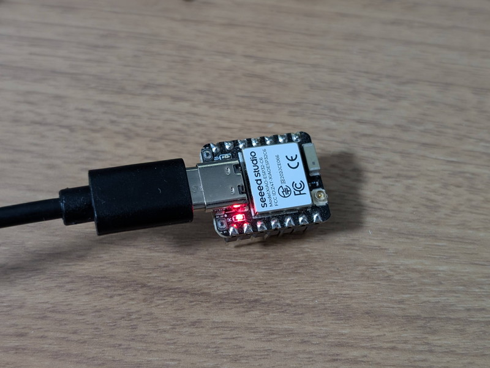
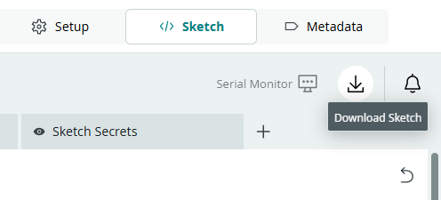
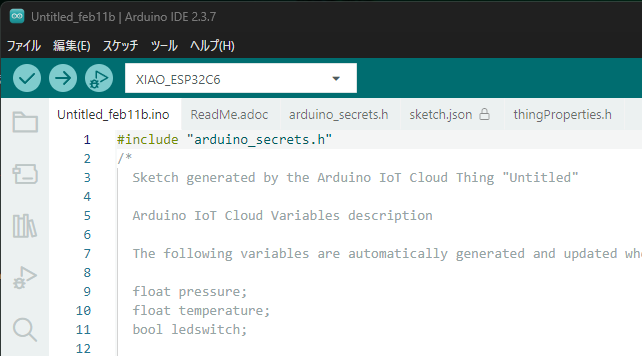
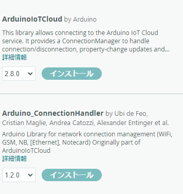
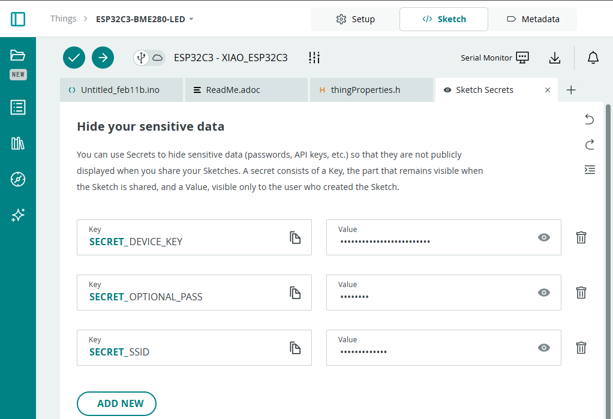
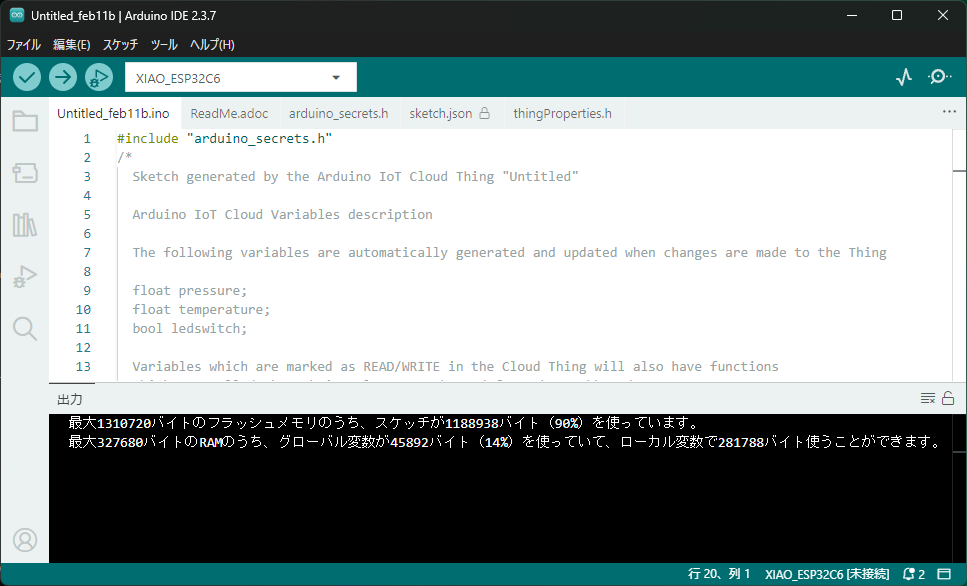
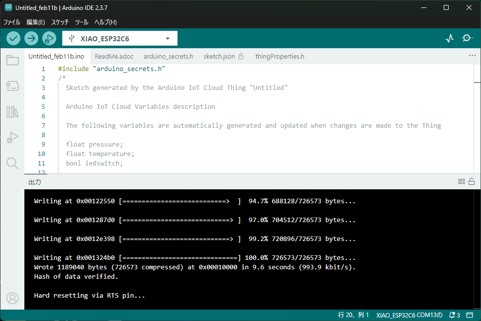
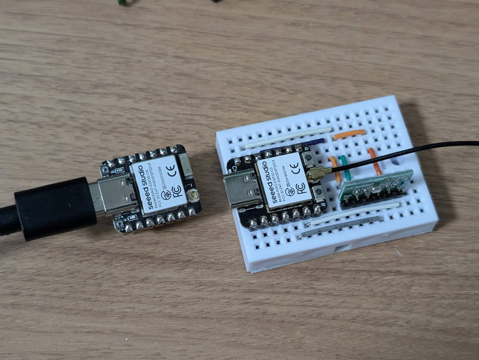
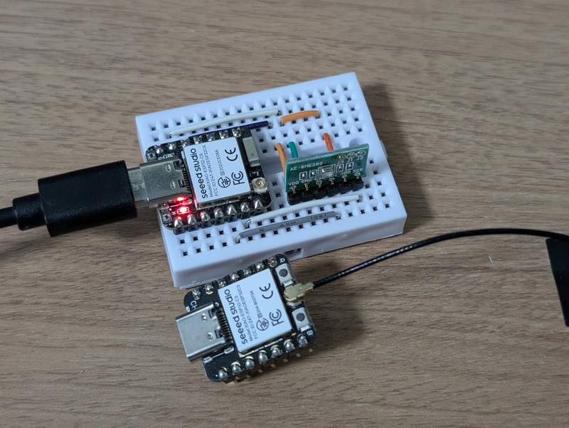
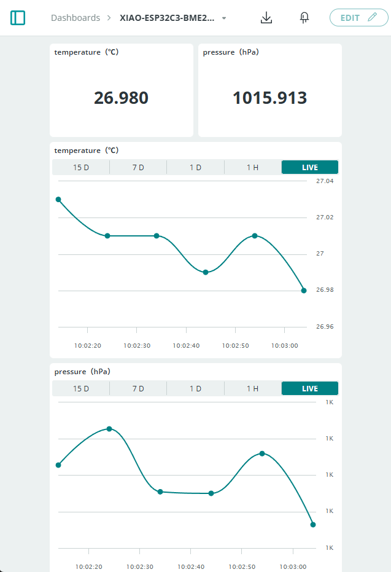

[おおたfab](https://ot-fb.com/event)さんでは電子工作初心者勉強会を定期的に開催しています。

[先日の勉強会](/2026/02/otafab-esp32-arduino-cloud-blink.html)でXIAO ESP32C3を使ってArduino CloudでLチカを行いました。その後、参加者のかたからArduino IDEを使えばXIAO ESP32C6でもArduino CloudでLチカができたという報告をいただきました。実際に私も検証を行ってみました。

## Arduino CloudではESP32C6は未対応

Arduino Cloudのデバイス登録画面ではESP32C6は表示されません。多分ESP32C6用のクラウド版コンパイル環境が準備されていないのではと思われます。  
それならば、Arduino Cloudで生成したスケッチをArduino IDEでコンパイルすればESP32C6でも使えるかもしれません。  
これまで[ミニカー製作](/2025/10/otafab-esp32-minicar6.html)で使用していた[XIAO ESP32C6](https://wiki.seeedstudio.com/ja/xiao_esp32c6_getting_started/)はXIAO ESP32C3の後発品でもあり、WiFiアンテナが内蔵されたり、利用できるポートが増えている等便利なのでできればこれを使いたいものです。



## Arduino Cloudでスケッチを作る

まずArduino CloudでXIAO ESP32C3用のスケッチをつくります。  
[前回の記事](/2026/02/otafab-esp32-arduino-cloud-blink.html)で作成したBME280を使用した気温・気圧・Lチカのスケッチを利用しました。
ESP32C3で動く状態にしたスケッチはZIPファイルでダウンロードできます。



## Arduino IDEでArduino Cloudのスケッチをコンパイルする

このZIPファイルを展開してArduino IDEで開き、ボードを`XIAO_ESP32C6`に設定します。



このままコンパイルをしたところ、以下のライブラリがないというエラーになりました。

```C
#include <ArduinoIoTCloud.h>
#include <Arduino_ConnectionHandler.h>
```

このライブラリをライブラリマネージャーで探してみると存在するので、これらをインストールします。



これでArduino Cloudのスケッチのコンパイルに必要なライブラリは揃いました。

## WiFi情報と秘密鍵を設定する

次に`arduino_secrets.h`を修正します。

```C
#define SECRET_DEVICE_KEY ""
#define SECRET_OPTIONAL_PASS ""
#define SECRET_SSID ""
```

このように空の状態になっているので、Arduino Cloudのスケッチ画面のSketch Secretsで設定されている３つの項目の内容を設定します。



これでコンパイルが正常に通ります。



## XIAO ESP32-C6にアップロードする

問題なくコンパイルができたら、XIAO ESP32C6をUSBでPCに接続してアップロードします。



ここまでは問題ありません。

## XIAO ESP32-C3をESP32-C6に交換する

XIAO ESP32-C3とXIAO ESP32-C6はピン互換なのでそのまま差し替えできます。



XIAO ESP32-C6に交換したブレッドボードです。



外付けのWiFiアンテナが無くなるので見栄えも良いです。

## ダッシュボードを確認する

XIAO ESP32C6に電源を接続したところ、ダッシュボードにセンサーの情報が表示されました。



XIAO ESP32C3の時と同様に表示されています。

## まとめ

今回試した範囲ではXIAO ESP32C6がArduino Cloudで利用できていますが、あくまでも実験ですので、他のESP32C6デバイスや機能が同じように動作するかはわかりません。しかし、ライブラリ自体はArduino IDEで準備されているので、動作する可能性は高いと思われます。今後ESP32C6もArduino Cloudで手軽にコンパイルできるように正式サポートいただけるのを期待します。
